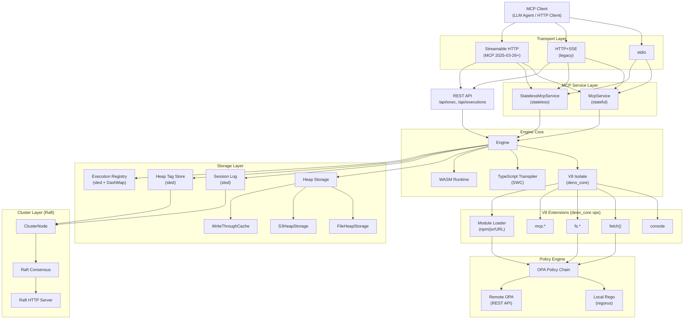
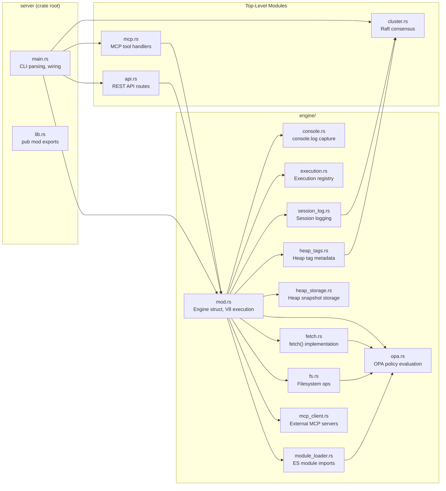
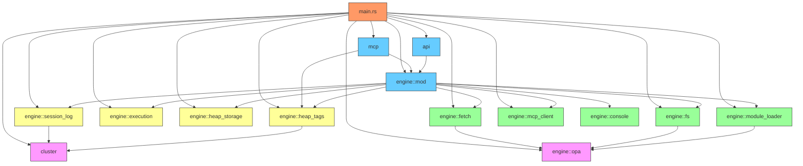
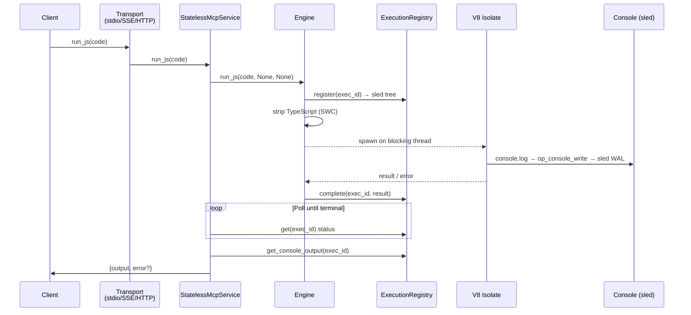
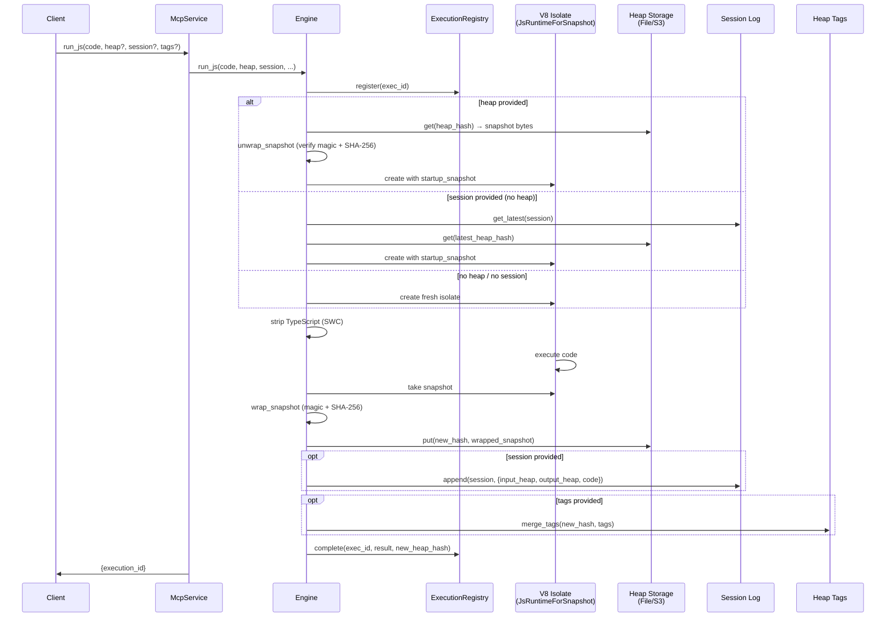
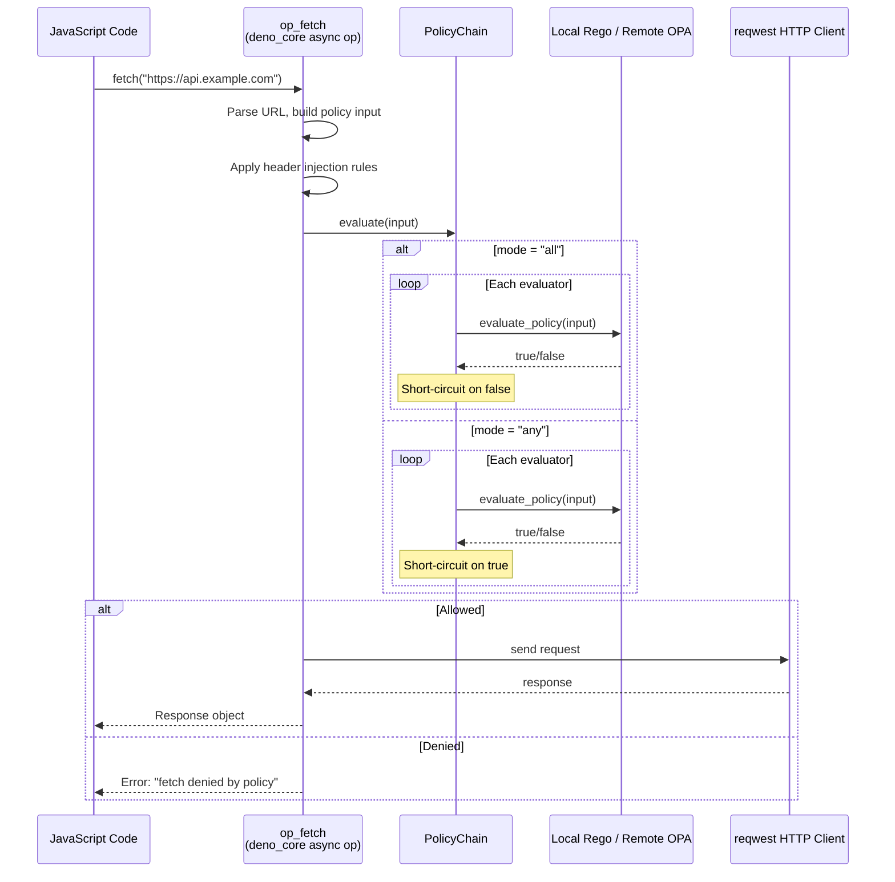
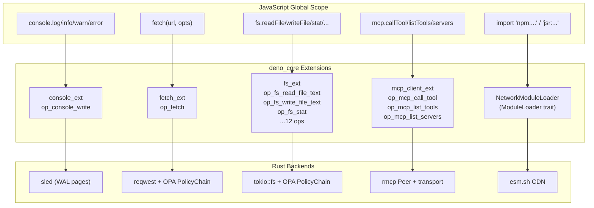
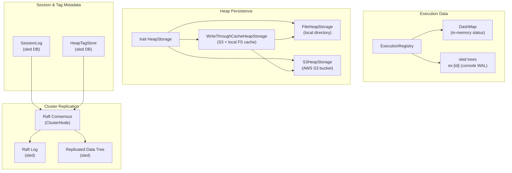
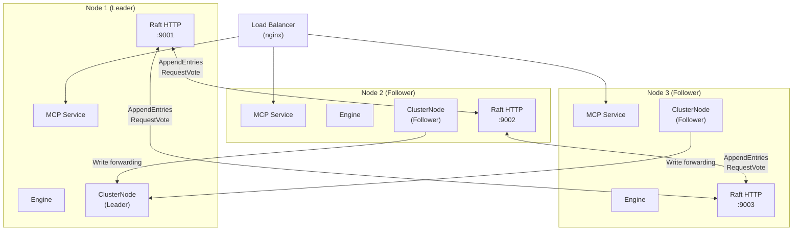

# Architecture

This document describes the architecture of **mcp-js** — an MCP (Model Context Protocol) server that provides a sandboxed JavaScript/TypeScript execution environment. The server is written in Rust, embeds a V8 engine via `deno_core`, and supports stateful heap persistence, clustering, WASM modules, policy-gated fetch/fs, and external MCP server integration.

## High-Level Overview

## Module Structure

The server is a single Rust crate with four top-level modules and ten engine submodules:

## Module Dependency Graph

## Module Descriptions

### Top-Level Modules

| Module | File | Description |
|--------|------|-------------|
| `main` | `main.rs` | Entry point. Parses CLI args (via `clap`), initializes V8, builds the `Engine`, configures policy chains, WASM modules, MCP clients, and starts the chosen transport (stdio/SSE/Streamable HTTP). |
| `mcp` | `mcp.rs` | MCP protocol handlers. Defines `McpService` (stateful, 11 tools) and `StatelessMcpService` (stateless, 1 tool) implementing `rmcp::ServerHandler`. |
| `api` | `api.rs` | REST API router (axum). Exposes `/api/exec`, `/api/executions`, `/api/executions/{id}`, `/api/executions/{id}/output`, `/api/executions/{id}/cancel`. Merged into the MCP transport when using HTTP. |
| `cluster` | `cluster.rs` | Raft-inspired cluster consensus. Implements leader election, log replication, and a replicated key-value store backed by sled. Each node runs an HTTP server for Raft RPCs. |

### Engine Submodules

| Module | File | Description |
|--------|------|-------------|
| `engine::mod` | `engine/mod.rs` | Core `Engine` struct. Manages V8 isolate creation, TypeScript transpilation (SWC), heap snapshot serialization, WASM module injection, concurrency limiting (semaphore), and the full execution lifecycle. |
| `engine::console` | `engine/console.rs` | Console output capture. Intercepts `console.log/info/warn/error` via a deno_core op and writes output as a byte stream into sled (WAL-style 4KB pages). |
| `engine::execution` | `engine/execution.rs` | Execution registry. Tracks in-flight and completed V8 executions in a `DashMap`, stores console output in per-execution sled trees, supports cancellation via `IsolateHandle::terminate_execution()`. |
| `engine::fetch` | `engine/fetch.rs` | OPA-gated `fetch()`. Implements a web-standard Fetch API via an async deno_core op. Requests are policy-checked before execution. Supports header injection rules. |
| `engine::fs` | `engine/fs.rs` | Policy-gated filesystem operations. Provides a Node.js-compatible `fs` API (readFile, writeFile, stat, mkdir, etc.) where every operation is evaluated against a PolicyChain. |
| `engine::heap_storage` | `engine/heap_storage.rs` | Heap snapshot persistence. Trait `HeapStorage` with implementations: `FileHeapStorage` (local disk), `S3HeapStorage` (AWS S3), `WriteThroughCacheHeapStorage` (S3 with local FS cache). |
| `engine::heap_tags` | `engine/heap_tags.rs` | Heap tag metadata store. Key-value tags on heap snapshots stored in sled. Supports cluster replication via Raft. |
| `engine::session_log` | `engine/session_log.rs` | Session logging. Records each execution's input/output heap hashes, code, and timestamps in sled. Supports cluster replication via Raft. |
| `engine::opa` | `engine/opa.rs` | OPA policy evaluation. Two backends: `RemotePolicyEvaluator` (OPA REST API) and `LocalPolicyEvaluator` (regorus for local Rego files). Composed into a `PolicyChain` with AND/OR modes. |
| `engine::module_loader` | `engine/module_loader.rs` | ES module loader. Resolves `npm:`, `jsr:`, and URL imports by rewriting them to esm.sh URLs. Supports policy-gated auditing and TypeScript transpilation of `.ts/.tsx` modules. |
| `engine::mcp_client` | `engine/mcp_client.rs` | MCP client manager. Connects to external MCP servers (via stdio or SSE) at startup and exposes their tools to JS code through `globalThis.mcp`. |

## Data Flow

### Stateless Execution

### Stateful Execution (with Heap Persistence)

### Policy-Gated Fetch

## V8 Extension Architecture

Each V8 isolate is configured with deno_core extensions that bridge JavaScript to Rust:

## Storage Architecture

## Cluster Architecture

The cluster layer implements a Raft-inspired consensus protocol for replicating session logs and heap tags across nodes.

Raft RPCs exposed on each node's cluster HTTP port:

| Endpoint | Method | Description |
|----------|--------|-------------|
| `/raft/append_entries` | POST | AppendEntries RPC (log replication + heartbeat) |
| `/raft/request_vote` | POST | RequestVote RPC (leader election) |
| `/raft/join` | POST | Dynamic peer join |
| `/data/{key}` | GET | Read from replicated KV store |
| `/data/{key}` | PUT | Write to replicated KV store (forwarded to leader) |
| `/data/scan/{prefix}` | GET | Prefix scan on replicated KV store |
| `/raft/status` | GET | Node role, term, leader info |

## Transport Modes

The server supports three transport modes, selected at startup via CLI flags:

| Transport | Flag | Protocol | Load-Balanceable |
|-----------|------|----------|------------------|
| stdio | *(default)* | JSON-RPC over stdin/stdout | No |
| SSE | `--sse-port PORT` | HTTP+SSE (legacy MCP) | With sticky sessions |
| Streamable HTTP | `--http-port PORT` | Streamable HTTP (MCP 2025-03-26+) | Yes |

When using HTTP or SSE transports, the REST API router is merged into the same axum server, making both the MCP protocol and the REST API available on the same port.

## Key Design Decisions

- **deno_core for V8 embedding**: Provides the V8 runtime, async op system, module loading, and snapshot support without the full Deno runtime overhead.
- **SWC for TypeScript**: Type stripping only (no type checking) for minimal latency. Applied to both inline code and fetched `.ts/.tsx` modules.
- **sled for local storage**: Embedded key-value store used for execution console output (WAL-style), session logs, heap tags, and Raft log persistence.
- **Snapshot-based heap persistence**: V8 heap snapshots enable stateful sessions — the entire JS heap is serialized, stored, and restored across executions.
- **Snapshot envelope with SHA-256**: Prevents V8 `abort()` on corrupted snapshot data by validating a magic header + checksum before reaching V8's deserializer.
- **Bounded ArrayBuffer allocator**: Custom V8 allocator that tracks allocations and returns null on limit, converting OOM into a catchable JS `RangeError` instead of `abort()`.
- **Concurrency semaphore**: Limits concurrent V8 executions to prevent resource exhaustion (defaults to CPU core count).
- **Policy chains (OPA/Rego)**: fetch(), fs operations, and module imports are gated by composable policy chains supporting both local Rego files and remote OPA servers.
