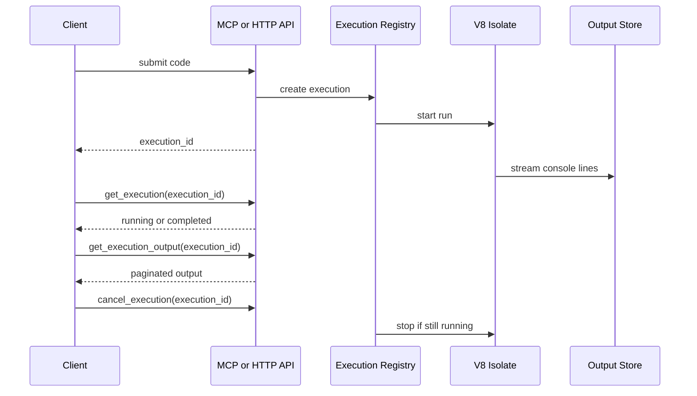
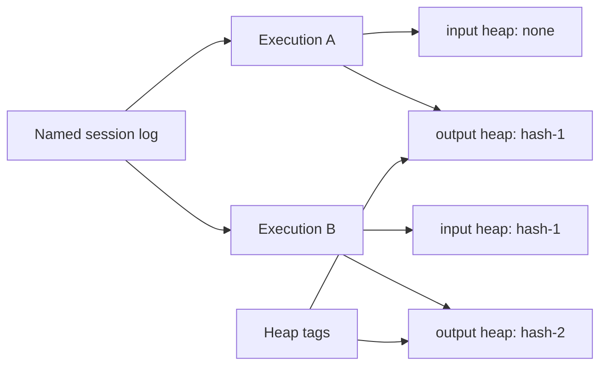
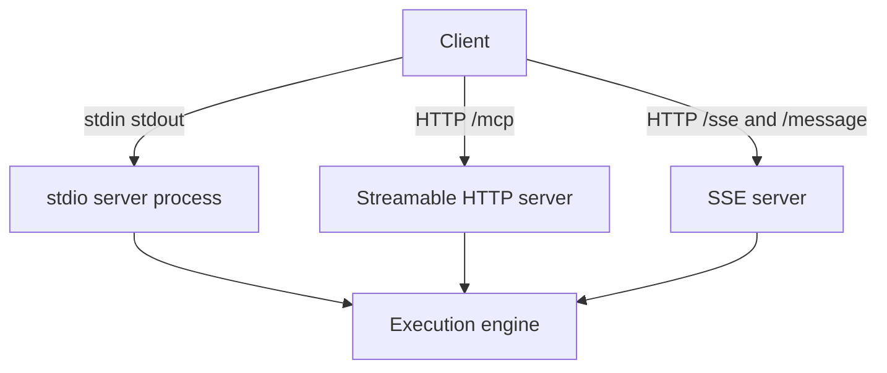
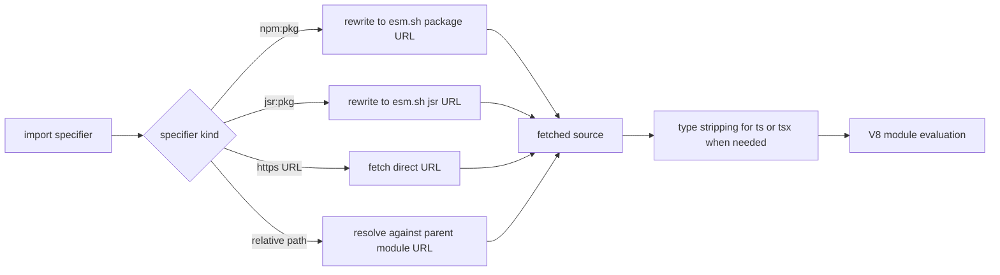
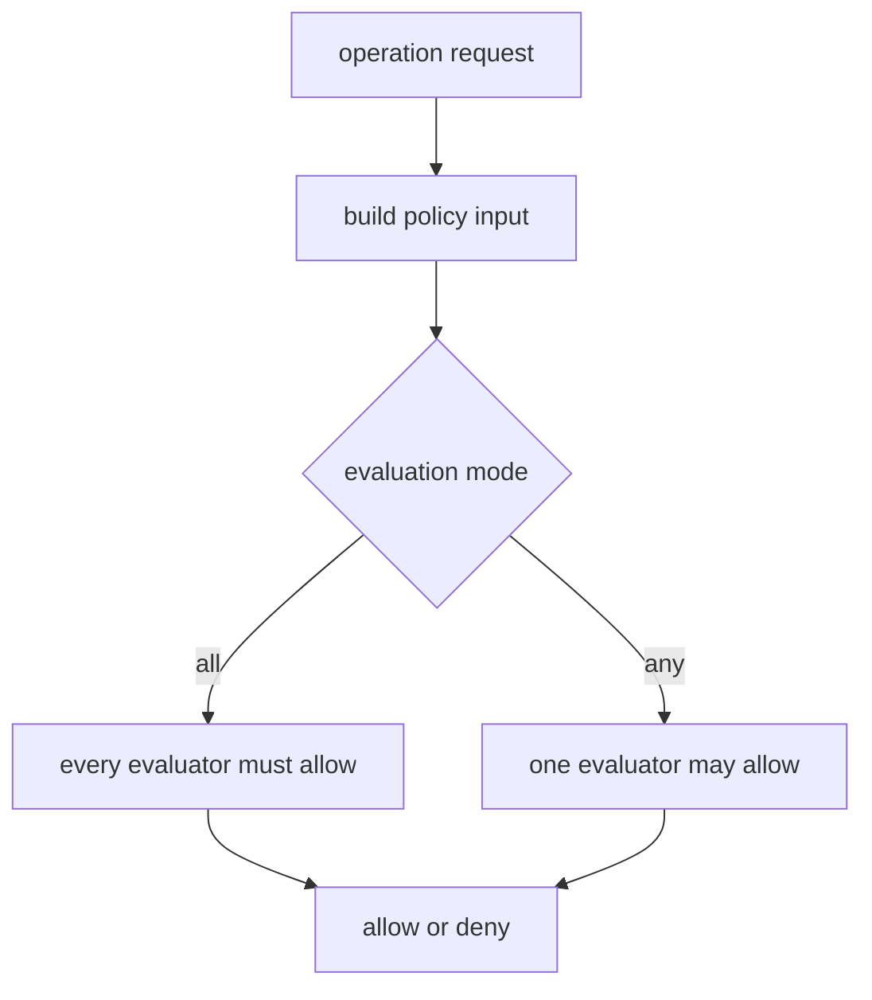
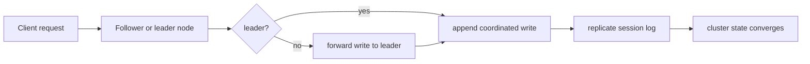
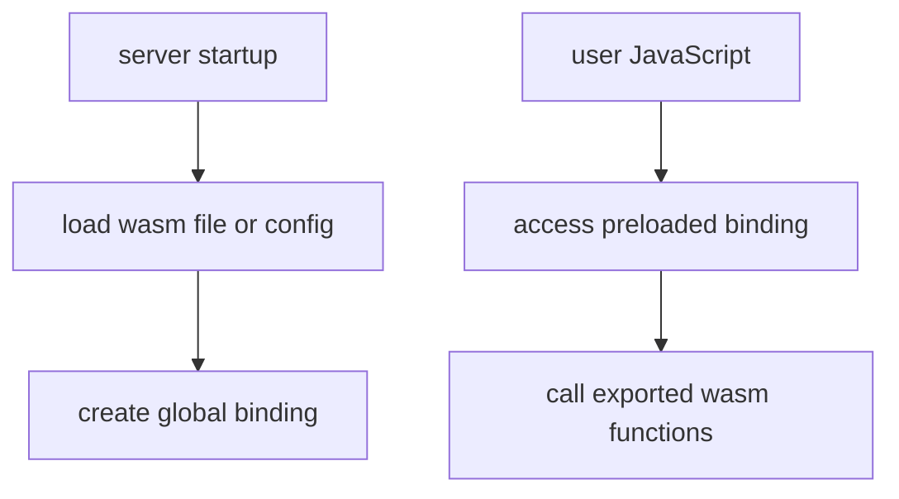
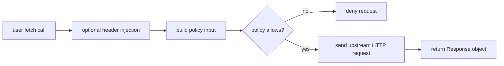
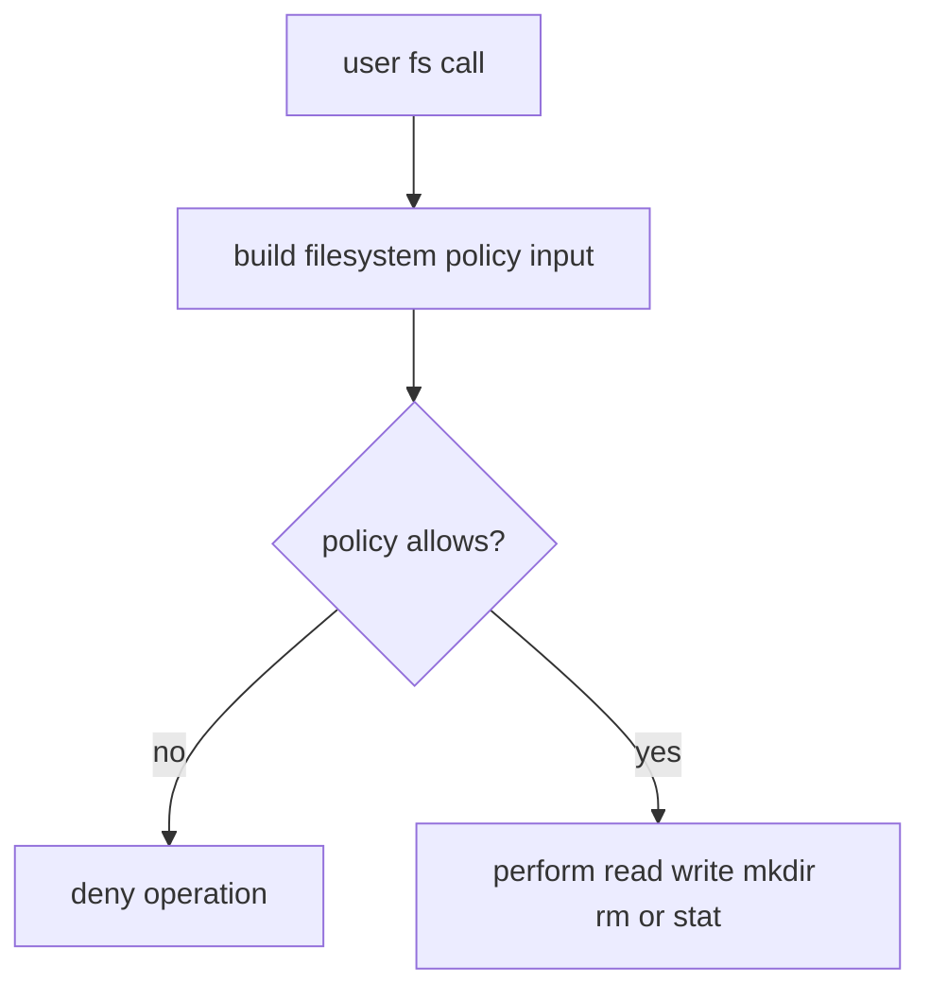
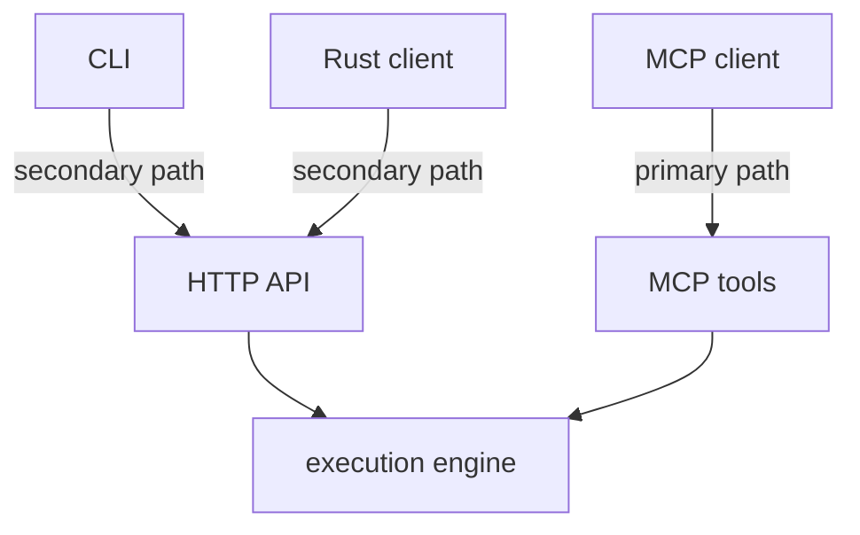

# MkDocs README Concepts Expansion Implementation Plan

> **For agentic workers:** REQUIRED SUB-SKILL: Use superpowers:subagent-driven-development (recommended) or superpowers:executing-plans to implement this plan task-by-task. Steps use checkbox (`- [ ]`) syntax for tracking.

**Goal:** Expand the MkDocs site so the feature areas called out in `README.md` have deeper concept pages, clearly present `mcp-v8` as an MCP server first, and add Mermaid diagrams where they clarify important flows.

**Architecture:** Keep the current `Home` / `Learn` / `How-to` / `Concepts` / `Reference` taxonomy intact, and make `Concepts` the main explanatory layer. Update existing concept pages, add new grouped concept pages where the README has distinct mental models, add MCP-first integration and CLI guidance, and wire Mermaid support into the MkDocs build so the diagrams render both locally and on GitHub Pages.

**Tech Stack:** MkDocs, Markdown, Mermaid, `mkdocs-mermaid2-plugin`, GitHub Actions, GitHub Pages

---

## File Structure

### New files and directories

- Create: `site-docs/concepts/wasm-and-native-modules.md`
- Create: `site-docs/concepts/network-access.md`
- Create: `site-docs/concepts/filesystem-access.md`
- Create: `site-docs/concepts/integration-surfaces.md`
- Create: `site-docs/how-to/connect-as-an-mcp-server.md`
- Create: `site-docs/how-to/use-cli.md`

### Existing files to modify

- Modify: `mkdocs.yml`
- Modify: `.github/workflows/deploy-docs.yml`
- Modify: `site-docs/concepts/execution-model.md`
- Modify: `site-docs/concepts/sessions-and-heaps.md`
- Modify: `site-docs/concepts/transports.md`
- Modify: `site-docs/concepts/module-loading.md`
- Modify: `site-docs/concepts/policy-system.md`
- Modify: `site-docs/concepts/clustering.md`
- Modify: `site-docs/index.md`
- Modify: `site-docs/learn/overview.md`
- Modify: `site-docs/learn/transport-walkthrough.md`
- Modify: `site-docs/how-to/enable-opa-policies.md`
- Modify: `site-docs/how-to/configure-fetch-header-injection.md`
- Modify: `site-docs/how-to/use-cli.md`
- Modify: `site-docs/how-to/use-rust-client.md`
- Modify: `site-docs/reference/mcp-tools.md`
- Modify: `site-docs/reference/http-api.md`
- Modify: `site-docs/reference/policy-files.md`

### Source files to mine while writing

- Read: `README.md`
- Read: `docs/http-api-and-client.md`
- Read: `tutorials/oauth-client-credentials-fetch-injection.md`
- Read: `tutorials/github-api-token-injection.md`
- Read: `server/src/main.rs`
- Read: `server/src/api.rs`
- Read: `server/src/mcp.rs`
- Read: `server/src/session.rs`
- Read: `server/src/cluster.rs`
- Read: `server/src/run_js_tool_description.md`
- Read: `server/src/run_js_tool_secure.md`
- Read: `server/src/run_js_tool_stateless.md`
- Read: `server/src/engine/execution.rs`
- Read: `server/src/engine/heap_storage.rs`
- Read: `server/src/engine/heap_tags.rs`
- Read: `server/src/engine/module_loader.rs`
- Read: `server/src/engine/fetch.rs`
- Read: `server/src/engine/fetch_auth.rs`
- Read: `server/src/engine/fs.rs`
- Read: `server/src/engine/opa.rs`
- Read: `server/tests/http_e2e.rs`
- Read: `server/tests/stdio_e2e.rs`
- Read: `server/tests/sse_e2e.rs`
- Read: `server/tests/fetch_header_injection.rs`
- Read: `server/tests/local_opa_policy.rs`
- Read: `server/tests/module_imports.rs`
- Read: `server/tests/write_through_cache.rs`
- Read: `server/tests/cluster_simulation.rs`
- Read: `mcp-v8-client/README.md`
- Read: `mcp-v8-client/src/lib.rs`
- Read: `mcp-v8-client/src/main.rs`

### Verification commands

- Run: `test -f site-docs/concepts/wasm-and-native-modules.md`
- Run: `python3 -m pip install --user --break-system-packages mkdocs mkdocs-mermaid2-plugin`
- Run: `/home/node/.local/bin/mkdocs build --strict`

## Task 1: Add Mermaid support and expand Concepts nav

**Files:**
- Modify: `mkdocs.yml`
- Modify: `.github/workflows/deploy-docs.yml`

- [ ] **Step 1: Verify the new concept pages are not present yet**

Run:

```bash
test -f site-docs/concepts/wasm-and-native-modules.md
```

Expected: exits non-zero because the new concept pages do not exist yet.

- [ ] **Step 2: Update `mkdocs.yml` to load Mermaid and add the new Concepts entries**

Replace the current file contents with:

```yaml
site_name: mcp-v8
site_description: JavaScript MCP server, transports, policies, and operational guidance
site_url: https://r33drichards.github.io/mcp-js/
docs_dir: site-docs
site_dir: site
theme:
  name: mkdocs
plugins:
  - search
  - mermaid2
nav:
  - Home: index.md
  - Learn:
      - Overview: learn/overview.md
      - First Run: learn/first-run.md
      - Transport Walkthrough: learn/transport-walkthrough.md
      - Client Walkthrough: learn/client-walkthrough.md
  - How-to:
      - Install the Server: how-to/install-server.md
      - Run with stdio: how-to/run-with-stdio.md
      - Run with HTTP: how-to/run-with-http.md
      - Run with SSE: how-to/run-with-sse.md
      - Use Local Storage: how-to/use-local-storage.md
      - Use S3 Storage: how-to/use-s3-storage.md
      - Enable OPA Policies: how-to/enable-opa-policies.md
      - Configure Fetch Header Injection: how-to/configure-fetch-header-injection.md
      - Connect as an MCP Server: how-to/connect-as-an-mcp-server.md
      - Use CLI: how-to/use-cli.md
      - Use Rust Client: how-to/use-rust-client.md
  - Concepts:
      - Execution Model: concepts/execution-model.md
      - Sessions and Heaps: concepts/sessions-and-heaps.md
      - Transports: concepts/transports.md
      - Integration Surfaces: concepts/integration-surfaces.md
      - Module Loading: concepts/module-loading.md
      - WASM and Native Modules: concepts/wasm-and-native-modules.md
      - Policy System: concepts/policy-system.md
      - Network Access: concepts/network-access.md
      - Filesystem Access: concepts/filesystem-access.md
      - Clustering: concepts/clustering.md
  - Reference:
      - CLI Flags: reference/cli-flags.md
      - HTTP API: reference/http-api.md
      - MCP Tools: reference/mcp-tools.md
      - Configuration and Environment: reference/configuration-and-environment.md
      - Rust Client API: reference/rust-client-api.md
      - Policy Files: reference/policy-files.md
markdown_extensions:
  - tables
  - toc:
      permalink: true
```

- [ ] **Step 3: Update the Pages workflow to install the Mermaid plugin**

Change the install line in `.github/workflows/deploy-docs.yml` from:

```yaml
      - run: python -m pip install mkdocs
```

to:

```yaml
      - run: python -m pip install mkdocs mkdocs-mermaid2-plugin
```

- [ ] **Step 4: Commit the MkDocs and workflow configuration**

```bash
git add mkdocs.yml .github/workflows/deploy-docs.yml
git commit -m "docs: add mermaid support for concepts pages"
```

## Task 2: Deepen execution, state, and transport concept pages

**Files:**
- Modify: `site-docs/concepts/execution-model.md`
- Modify: `site-docs/concepts/sessions-and-heaps.md`
- Modify: `site-docs/concepts/transports.md`

- [ ] **Step 1: Replace `site-docs/concepts/execution-model.md`**

Write this file:

```md
# Execution Model

`mcp-v8` runs JavaScript in an isolated V8 runtime, but it does not behave
like a browser or a general Node.js process. Code executes as ES modules,
supports top-level `await`, and uses an execution registry to track work after
submission.

The main split is between:

- **stateful execution**, where `run_js` queues work and returns an execution
  ID immediately
- **stateless execution**, where the server waits internally and returns
  output and result directly

In stateful mode, the normal flow is:



This design separates submission, status polling, and output retrieval. That
matters because JavaScript may run for long enough to produce streaming output,
consume memory, or be cancelled before it completes.

The primary client model is still MCP. The execution lifecycle is exposed most
naturally through MCP tools such as `run_js`, `get_execution`, and
`get_execution_output`. The HTTP API exposes the same lifecycle for fallback
clients, automation, and typed client generation, but it should be documented
as a secondary surface rather than the main integration story.

Console output is captured while the program runs. The server supports
`console.log`, `console.info`, `console.warn`, and `console.error`, and stores
output so clients can read it incrementally later through MCP tools or the
HTTP API.

Concurrency is also part of the execution model. The server limits how many V8
executions can run at once with `--max-concurrent-executions`. When demand is
higher than the configured limit, executions wait in the registry instead of
starting immediately.

See [MCP Tools](../reference/mcp-tools.md) for the exact tool names and
[HTTP API](../reference/http-api.md) for the REST endpoints that expose the
same lifecycle.
```

- [ ] **Step 2: Replace `site-docs/concepts/sessions-and-heaps.md`**

Write this file:

```md
# Sessions and Heaps

In stateful mode, `mcp-v8` persists JavaScript state by heap snapshot hash,
not by a mutable server-side session object. A completed execution can produce
an output heap key, and a later execution can resume from that exact snapshot.

That gives the system three useful properties:

- snapshots are immutable once written
- identical state can be reused by hash
- concurrent workflows do not need to coordinate around a single mutable
  session blob

The relationship between executions, heaps, and named sessions looks like
this:



Named sessions are related, but separate. Session logging records a history of
executions under a human-meaningful session name, including the code that ran
and the input and output heap hashes involved in each step.

Heap tags add another layer. They make snapshots easier to search and organize
without changing the underlying content-addressed storage model.

This also explains the stateless versus stateful tradeoff:

- **stateless mode** skips heap persistence entirely and starts from a fresh
  isolate every time
- **stateful mode** preserves state across runs and makes sessions, history,
  and heap reuse possible

See [Use Local Storage](../how-to/use-local-storage.md) and
[Use S3 Storage](../how-to/use-s3-storage.md) for storage setup, and
[MCP Tools](../reference/mcp-tools.md) for the stateful-only session and heap
tool surfaces.
```

- [ ] **Step 3: Replace `site-docs/concepts/transports.md`**

Write this file:

```md
# Transports

Transport changes how clients talk to `mcp-v8`, but not what the execution
engine does once code reaches V8.

The server supports three transport shapes:

- **stdio** for subprocess-oriented MCP clients
- **Streamable HTTP** for networked MCP clients and the plain REST API
- **SSE** for the older HTTP plus event-stream MCP transport



Stdio is the default. It is the best fit when an MCP host launches `mcp-v8`
as a local subprocess and keeps the connection inside one machine.

Streamable HTTP is the most operationally flexible mode. It exposes the MCP
endpoint at `/mcp`, the REST API under `/api/...`, and the OpenAPI document at
`/api-doc/openapi.json`. This mode fits remote deployments, load balancers,
and debugging workflows.

That distinction matters in the docs:

- the main integration story is still "connect an MCP client to `mcp-v8`"
- the REST API is a fallback and tooling surface layered on top of the HTTP
  transport

SSE remains useful for clients that still expect the older event-stream shape,
but it is conceptually older and operationally less central than Streamable
HTTP.

Cluster mode only applies to the network transports. Stdio is explicitly not a
cluster transport because it is process-local.

See [Run with stdio](../how-to/run-with-stdio.md),
[Run with HTTP](../how-to/run-with-http.md), and
[Run with SSE](../how-to/run-with-sse.md) for setup procedures.
```

- [ ] **Step 4: Commit the execution, state, and transport pages**

```bash
git add \
  site-docs/concepts/execution-model.md \
  site-docs/concepts/sessions-and-heaps.md \
  site-docs/concepts/transports.md
git commit -m "docs: deepen execution and transport concepts"
```

## Task 3: Deepen module, policy, and clustering concept pages

**Files:**
- Modify: `site-docs/concepts/module-loading.md`
- Modify: `site-docs/concepts/policy-system.md`
- Modify: `site-docs/concepts/clustering.md`

- [ ] **Step 1: Replace `site-docs/concepts/module-loading.md`**

Write this file:

```md
# Module Loading

`mcp-v8` runs user code as ES modules. External modules are disabled by
default, and become available only when the server is started with
`--allow-external-modules`.

When external loading is enabled, the system supports:

- `npm:` specifiers
- `jsr:` specifiers
- direct `http://` and `https://` URL imports
- relative imports that resolve against a fetched parent module



This is a networked runtime resolution model, not a local package-manager
model. There is no `npm install` phase inside the server. Modules are resolved
and fetched at execution time.

TypeScript support fits into this same model. Type annotations are stripped
before execution, but there is no type checking. Invalid types are removed, not
validated.

Policy can also sit in this path. If module policies are configured, imports
can be audited before the fetch happens.

See [Reference](../reference/cli-flags.md) for the enabling flags and
[Policy System](policy-system.md) for the gating model around imports.
```

- [ ] **Step 2: Replace `site-docs/concepts/policy-system.md`**

Write this file:

```md
# Policy System

Optional capabilities in `mcp-v8` are policy-gated instead of enabled by
default. This keeps powerful operations available when needed without making
network, filesystem, or subprocess access part of the baseline runtime.

The policy system is driven by `--policies-json`, which defines policy chains
for operation namespaces such as fetch, modules, filesystem access,
`mcp.callTool()`, and subprocess execution.



Each policy chain can be evaluated in one of two modes:

- **`all`** means every configured evaluator must allow the operation
- **`any`** means any one evaluator may allow it

Evaluators can be:

- **local Rego** loaded from `file://` paths and evaluated with Regorus
- **remote OPA** reached through `http://` or `https://` endpoints

Operation namespaces matter because each capability has its own default rule
path and policy input shape. A fetch request is evaluated differently from a
filesystem write or a subprocess launch.

This page is the conceptual umbrella. For concrete policy configuration, see
[Policy Files](../reference/policy-files.md). For capability-specific policy
behavior, see [Network Access](network-access.md) and
[Filesystem Access](filesystem-access.md).
```

- [ ] **Step 3: Replace `site-docs/concepts/clustering.md`**

Write this file:

```md
# Clustering

Cluster mode adds distributed coordination to `mcp-v8` for deployments that
need replicated session state and coordinated writes across multiple nodes.

It is not just a transport flag. Cluster mode changes how the server handles
leadership, write ownership, and operational topology.



The cluster layer is Raft-inspired. It handles:

- leader election
- replicated session logging
- write forwarding when a request lands on a follower
- peer discovery and node identity concerns

This matters most for stateful, networked deployments. It does not apply to
stdio, and it introduces configuration concerns such as `--cluster-port`,
`--node-id`, peer lists, advertise addresses, and timing parameters.

Cluster mode is an operational scaling feature. It helps preserve a coherent
view of state across nodes, but it also makes deployment and failure handling
more complex than single-node operation.
```

- [ ] **Step 4: Commit the module, policy, and clustering pages**

```bash
git add \
  site-docs/concepts/module-loading.md \
  site-docs/concepts/policy-system.md \
  site-docs/concepts/clustering.md
git commit -m "docs: deepen module and policy concepts"
```

## Task 4: Add the new feature-group concept pages

**Files:**
- Create: `site-docs/concepts/wasm-and-native-modules.md`
- Create: `site-docs/concepts/network-access.md`
- Create: `site-docs/concepts/filesystem-access.md`
- Create: `site-docs/concepts/integration-surfaces.md`

- [ ] **Step 1: Create `site-docs/concepts/wasm-and-native-modules.md`**

Write this file:

```md
# WASM and Native Modules

`mcp-v8` supports WebAssembly through the standard JavaScript `WebAssembly`
API and can also pre-load `.wasm` modules as globals when the server starts.

That gives the runtime two distinct WASM shapes:

- code that loads or compiles WebAssembly inside JavaScript
- modules preloaded by the server through `--wasm-module` or `--wasm-config`



The most important conceptual boundary is memory. WASM memory limits are
separate from the V8 heap limit. A page that talks about `--heap-memory-max`
is not automatically describing the ceiling for preloaded native memory.

This is why `--wasm-default-max-memory` and per-module limits matter. They
control native WASM memory, while the V8 heap limit controls JavaScript heap
allocation.

The SQLite WASM example in the README is a good illustration of the model:
WASM can be preloaded as a reusable runtime capability, then called from
ordinary JavaScript without rebuilding the concept of storage inside V8 itself.

See [Reference](../reference/cli-flags.md) for the exact WASM flags.
```

- [ ] **Step 2: Create `site-docs/concepts/network-access.md`**

Write this file:

```md
# Network Access

`mcp-v8` does not expose unrestricted network access by default. The
`fetch()` function becomes available only when the server is configured with
fetch policies.

Once enabled, the runtime follows the web-standard fetch model closely enough
for common HTTP workflows: requests produce `Response` objects, headers are
available through the standard accessors, and response bodies can be consumed
with `.text()` or `.json()`.



Header injection sits in this path. Rules can add static headers, or they can
acquire OAuth client-credentials tokens and inject them before the outbound
request is sent.

That makes network access more than a simple on or off capability. A request
may be shaped by:

- policy checks
- static or dynamic header injection
- precedence rules between injected headers and user-supplied headers

This page should help readers understand the runtime behavior. For setup, see
[Enable OPA Policies](../how-to/enable-opa-policies.md) and
[Configure Fetch Header Injection](../how-to/configure-fetch-header-injection.md).
```

- [ ] **Step 3: Create `site-docs/concepts/filesystem-access.md`**

Write this file:

```md
# Filesystem Access

`mcp-v8` can expose a Node.js-compatible `fs` module, but only when the server
is configured to allow filesystem operations through policy evaluation.

That means filesystem access is a capability boundary, not a default part of
the runtime.



The policy input model is operation-oriented. Different calls provide
different input fields, such as:

- `operation`
- `path`
- `destination` for rename or copy
- `recursive` for recursive mkdir or rm
- `encoding` for read operations

This design lets the runtime expose useful file operations while still making
access decisions explicit and configurable.

See [Policy System](policy-system.md) for the general evaluation model and
[Policy Files](../reference/policy-files.md) for configuration shape.
```

- [ ] **Step 4: Create `site-docs/concepts/integration-surfaces.md`**

Write this file:

```md
# Integration Surfaces

`mcp-v8` is primarily an MCP server. The main integration model is to expose
its tools to an MCP client such as Claude Desktop, Claude Code, or Cursor and
let that client drive JavaScript execution through the MCP tool surface.

The server also has secondary access paths:

- the plain HTTP API, which mirrors the execution lifecycle for fallback
  clients and generated SDKs
- the `mcp-v8-cli`, which is a convenience wrapper around the HTTP API
- the `mcp-v8-client` Rust crate, which is a typed client for the same HTTP
  surface



This distinction should guide the rest of the docs:

- use MCP-first language when explaining the product
- describe the HTTP API as a fallback, automation, and client-generation
  surface
- describe CLI and Rust client usage as convenience layers over the HTTP API
```

- [ ] **Step 5: Commit the new concept pages**

```bash
git add \
  site-docs/concepts/wasm-and-native-modules.md \
  site-docs/concepts/network-access.md \
  site-docs/concepts/filesystem-access.md \
  site-docs/concepts/integration-surfaces.md
git commit -m "docs: add grouped feature concept pages"
```

## Task 5: Add MCP-first integration and CLI docs

**Files:**
- Create: `site-docs/how-to/connect-as-an-mcp-server.md`
- Create: `site-docs/how-to/use-cli.md`
- Modify: `site-docs/how-to/use-rust-client.md`
- Modify: `site-docs/reference/mcp-tools.md`
- Modify: `site-docs/reference/http-api.md`

- [ ] **Step 1: Create `site-docs/how-to/connect-as-an-mcp-server.md`**

Write this file:

```md
# Connect as an MCP Server

The primary way to use `mcp-v8` is to run it as an MCP server and connect an
MCP client to it.

## Local stdio integration

Use stdio when the client launches `mcp-v8` as a subprocess:

```json
{
  "mcpServers": {
    "mcp-v8": {
      "command": "mcp-v8",
      "args": ["--directory-path", "/tmp/mcp-v8-heaps"]
    }
  }
}
```

## Remote HTTP integration

Use Streamable HTTP when the MCP client can connect to a remote endpoint:

```text
http://your-host:3000/mcp
```

This mode is better for load-balanced, containerized, or remotely hosted
deployments.

See [Run with stdio](run-with-stdio.md) and [Run with HTTP](run-with-http.md)
for the server-side startup commands, and [Transports](../concepts/transports.md)
for the connection model behind them.
```

- [ ] **Step 2: Create `site-docs/how-to/use-cli.md`**

Write this file:

```md
# Use CLI

`mcp-v8-cli` is a convenience client for the HTTP API. It is useful for shell
automation, quick testing, and environments where you do not need a full MCP
client.

Start the server in HTTP mode:

```bash
mcp-v8 --stateless --http-port 3000
```

Set the base URL once:

```bash
export MCP_V8_URL=http://localhost:3000
```

Submit code:

```bash
mcp-v8-cli exec 'console.log("hello"); 1 + 1'
```

Poll status:

```bash
mcp-v8-cli executions get <execution-id>
```

Read output:

```bash
mcp-v8-cli executions output <execution-id>
```

The CLI is not the primary integration surface. It is a practical wrapper for
the HTTP API when shell access is more useful than MCP integration.
```

- [ ] **Step 3: Replace `site-docs/how-to/use-rust-client.md`**

Write this file:

```md
# Use Rust Client

The Rust client is a typed client for the HTTP API. Use it when you want a
programmatic fallback or automation path outside MCP.

Add the dependency:

```toml
[dependencies]
mcp-v8-client = "0.1.0"
tokio = { version = "1", features = ["full"] }
```

Submit code through the generated client:

```rust
use mcp_v8_client::Client;

#[tokio::main]
async fn main() -> Result<(), Box<dyn std::error::Error>> {
    let client = Client::new("http://localhost:3000");
    let body = mcp_v8_client::types::ExecRequest {
        code: "1 + 1".to_string(),
        heap: None,
        session: None,
        heap_memory_max_mb: None,
        execution_timeout_secs: None,
        tags: None,
    };

    let resp = client.exec_handler(&body).await?;
    println!("{}", resp.into_inner().execution_id);
    Ok(())
}
```

This client targets the HTTP API, not the MCP transport. For the primary
integration model, use `mcp-v8` as an MCP server instead.
```

- [ ] **Step 4: Update `site-docs/reference/mcp-tools.md`**

Append:

```md
This MCP tool surface is the primary integration surface for `mcp-v8`. The
HTTP API and generated clients expose a fallback path for environments that are
not speaking MCP directly.
```

- [ ] **Step 5: Update `site-docs/reference/http-api.md`**

Append:

```md
The HTTP API is a fallback and tooling surface, not the primary product
integration model. The main integration story for `mcp-v8` is still the MCP
server and tool surface.
```

- [ ] **Step 6: Commit the MCP-first integration docs**

```bash
git add \
  site-docs/concepts/integration-surfaces.md \
  site-docs/how-to/connect-as-an-mcp-server.md \
  site-docs/how-to/use-cli.md \
  site-docs/how-to/use-rust-client.md \
  site-docs/reference/mcp-tools.md \
  site-docs/reference/http-api.md
git commit -m "docs: add mcp-first integration guidance"
```

## Task 6: Add cross-links from landing, learn, how-to, and reference pages

**Files:**
- Modify: `site-docs/index.md`
- Modify: `site-docs/learn/overview.md`
- Modify: `site-docs/learn/transport-walkthrough.md`
- Modify: `site-docs/how-to/enable-opa-policies.md`
- Modify: `site-docs/how-to/configure-fetch-header-injection.md`
- Modify: `site-docs/reference/policy-files.md`

- [ ] **Step 1: Update `site-docs/index.md`**

Append this section to the end of the file:

```md
## Core concepts

- [Execution Model](concepts/execution-model.md)
- [Sessions and Heaps](concepts/sessions-and-heaps.md)
- [Integration Surfaces](concepts/integration-surfaces.md)
- [Module Loading](concepts/module-loading.md)
- [WASM and Native Modules](concepts/wasm-and-native-modules.md)
- [Policy System](concepts/policy-system.md)
- [Network Access](concepts/network-access.md)
- [Filesystem Access](concepts/filesystem-access.md)
- [Clustering](concepts/clustering.md)
```

- [ ] **Step 2: Update `site-docs/learn/overview.md`**

Append this section:

```md
## Read next by topic

- Read [Integration Surfaces](../concepts/integration-surfaces.md) to
  understand the MCP-first model and the fallback HTTP and CLI paths.
- Read [Execution Model](../concepts/execution-model.md) to understand the
  async lifecycle and output model.
- Read [Sessions and Heaps](../concepts/sessions-and-heaps.md) to understand
  stateful versus stateless behavior.
- Read [Module Loading](../concepts/module-loading.md) if your code imports
  npm, JSR, or URL modules.
- Read [Policy System](../concepts/policy-system.md) if you plan to enable
  network or filesystem capabilities.
```

- [ ] **Step 3: Update `site-docs/learn/transport-walkthrough.md`**

Append:

```md
For the transport model behind these setup choices, see
[Transports](../concepts/transports.md).
```

- [ ] **Step 4: Update `site-docs/how-to/enable-opa-policies.md`**

Append:

```md
For the underlying evaluation model, see
[Policy System](../concepts/policy-system.md) and
[Policy Files](../reference/policy-files.md).
```

- [ ] **Step 5: Update `site-docs/how-to/configure-fetch-header-injection.md`**

Append:

```md
For the runtime behavior behind these rules, see
[Network Access](../concepts/network-access.md).
```

- [ ] **Step 6: Update `site-docs/reference/policy-files.md`**

Append:

```md
For the behavior model behind these configuration keys, see
[Policy System](../concepts/policy-system.md),
[Network Access](../concepts/network-access.md), and
[Filesystem Access](../concepts/filesystem-access.md).
```

- [ ] **Step 9: Commit the cross-link pass**

```bash
git add \
  site-docs/index.md \
  site-docs/learn/overview.md \
  site-docs/learn/transport-walkthrough.md \
  site-docs/how-to/enable-opa-policies.md \
  site-docs/how-to/configure-fetch-header-injection.md \
  site-docs/reference/policy-files.md
git commit -m "docs: cross-link concepts into public docs"
```

## Task 7: Verify the full MkDocs site with Mermaid enabled

**Files:**
- Verify: `mkdocs.yml`
- Verify: `.github/workflows/deploy-docs.yml`
- Verify: `site-docs/`

- [ ] **Step 1: Install the local docs toolchain**

Run:

```bash
python3 -m pip install --user --break-system-packages mkdocs mkdocs-mermaid2-plugin
```

Expected: both packages install successfully in the user-local Python path.

- [ ] **Step 2: Build the docs site in strict mode**

Run:

```bash
/home/node/.local/bin/mkdocs build --strict
```

Expected: build succeeds and writes the site to `site/`.

- [ ] **Step 3: Commit only if a docs fix was needed after verification**

If the strict build exposed a docs or config issue, commit the fix with:

```bash
git add mkdocs.yml .github/workflows/deploy-docs.yml site-docs
git commit -m "docs: fix mkdocs concepts build"
```
