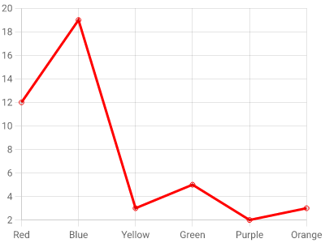

# Chart.js Example

Render a [Chart.js](https://www.chartjs.org/) chart inside an mcp-v8 isolate — the
[Using from Node.js](https://www.chartjs.org/docs/latest/getting-started/using-from-node-js.html)
example from the Chart.js docs, adapted to run with no native dependencies.



## What had to change

The upstream example draws onto a [skia-canvas](https://github.com/samizdatco/skia-canvas)
canvas. That is a native Node addon, and the isolate has no Node ABI — importing it
fails outright (`npm:skia-canvas` resolves to a browser shim that immediately hits
`window is not defined`). The same goes for `node-canvas`.

Chart.js itself is pure JavaScript and imports fine. It only needs an object with
`getContext("2d")` and pixel dimensions, and with no `window` present it selects its
`BasicPlatform` automatically. So the canvas is supplied in JavaScript instead:

| Piece | Provided by |
|-------|-------------|
| Canvas2D API → SVG | [`svgcanvas`](https://github.com/zenozeng/svgcanvas) (pure JS) |
| `document`, `XMLSerializer`, `DOMMatrix`, `DOMPoint` | ~90-line shim at the top of [`chart.js`](chart.js) |
| Text metrics | Approximated per-glyph — there is no font engine in the isolate |
| SVG → PNG (optional) | [`@resvg/resvg-wasm`](https://github.com/yisibl/resvg-js) via `WebAssembly`, with a TTF fetched at runtime |

Because there is no font engine, `measureText()` is an approximation, so label
positions can differ from a browser render by a pixel or two.

## Run it

### SVG output

Only external module imports are needed:

```bash
mcp-v8 --http-port 3000 --allow-external-modules

curl -s --data-binary @examples/chartjs/chart.js \
  -H 'Content-Type: application/javascript' \
  http://localhost:3000/api/exec
```

Then read the SVG from the execution's console output
(`GET /api/executions/<id>/output`).

### PNG output

Set `OUTPUT = "png"` at the top of [`chart.js`](chart.js). Rasterizing pulls the
resvg WASM binary and a font over `fetch`, and writes the file through `fs`, so both
capabilities need a policy:

```rego
# fetch.rego
package mcp.fetch
default allow = false
allow if {
  input.method == "GET"
  input.url_parsed.host == "unpkg.com"
}
```

```rego
# fs.rego
package mcp.filesystem
default allow = false
allow if { startswith(input.path, "/tmp/chart-out/") }
```

```bash
mkdir -p /tmp/chart-out
mcp-v8 --http-port 3000 --allow-external-modules \
  --policies-json '{"fetch":{"policies":[{"url":"file:///abs/path/fetch.rego"}]},
                    "filesystem":{"policies":[{"url":"file:///abs/path/fs.rego"}]}}'
```

The script prints the byte count and leaves the PNG at `/tmp/chart-out/output.png`
(`PNG_PATH` in the script).

## Notes

- Both modes run well inside the default 30s execution timeout; the first run is
  slower because the npm modules are fetched.
- `options.animation` is disabled and `responsive` is off: there is no DOM to resize
  against, and the chart must be fully drawn before the SVG is serialized.
- The same shim works for other Chart.js chart types — register the controllers and
  elements they need (`BarController`/`BarElement`, `ArcElement`, …).
