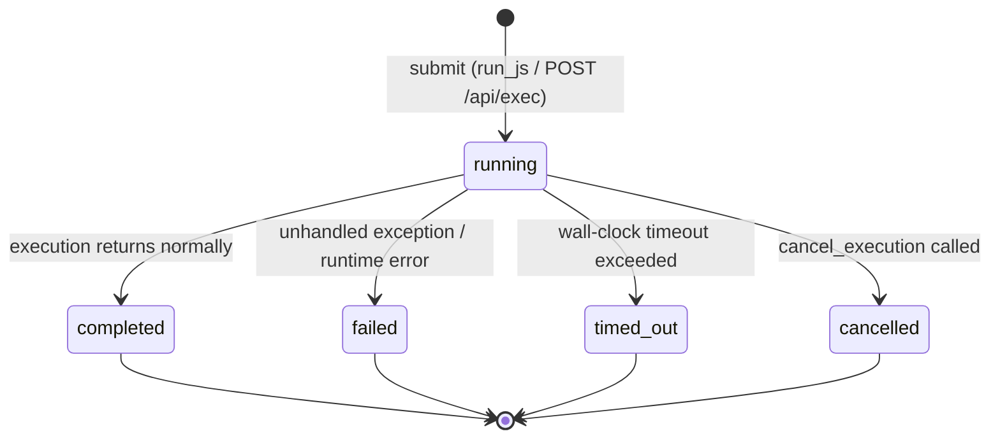

# Asynchronous execution & output

This page explains why execution in mcp-v8 is asynchronous, how the submit-poll model works, how output is stored and paginated, and how execution status transitions through its lifecycle.

## Why execution is asynchronous

V8 JavaScript execution can be long-running — a script might loop, await network I/O, or process large datasets over several seconds or minutes. Blocking an MCP tool call or an HTTP request for that duration is impractical: MCP clients have their own timeouts, and HTTP connections may close.

mcp-v8 therefore separates submission from observation. Every execution is queued and run on a dedicated Tokio task. The caller gets an `execution_id` immediately and polls for completion at its own pace.

## The submit-poll model

```
caller                   mcp-v8
  │                        │
  │── run_js / POST /api/exec ──▶│  register id, spawn task
  │◀── { execution_id } ──────── │
  │                        │ (V8 isolate running)
  │── get_execution ───────▶│
  │◀── { status: "running" }──── │
  │                        │ (V8 finishes)
  │── get_execution ───────▶│
  │◀── { status: "completed" }── │
  │── get_execution_output ─▶│
  │◀── { data, has_more } ───────│
```

The caller is free to poll as frequently or infrequently as it likes. Output can be fetched at any point — even before the execution finishes — because console output is written to persistent storage incrementally.

## The execution registry

All execution state is managed by `ExecutionRegistry` (in `server/src/engine/execution.rs`). It combines two storage layers:

- **In-memory `DashMap`** — holds the `ExecutionRecord` struct for each execution (status, isolate handle, result, timestamps). Lookups are O(1) and lock-free.
- **`sled` embedded database** — each execution gets a dedicated sled tree named `ex:{id}` that receives console output as it is written. This persists output across the lifetime of the server process and makes it readable before the execution completes.

When `register()` is called an entry is created in both stores with status `running`. When the execution finishes (via `complete`, `fail`, `timed_out`, or `cancel`) the status and terminal timestamps are written to the in-memory record.

## Max-concurrent executions

The server limits the number of V8 isolates that may run simultaneously via `--max-concurrent-executions` (default: CPU count). Submissions beyond this limit are queued. This prevents uncontrolled memory growth because each active isolate holds its own heap up to `heap_memory_max_mb` MB.

## Lifecycle and status transitions

An execution moves through the following states:



| Status | Meaning |
|---|---|
| `running` | The V8 isolate is active. |
| `completed` | The script returned without throwing. `result` holds the serialised return value (may be `null`). |
| `failed` | The script threw an unhandled exception or a runtime error occurred. `error` holds the message. |
| `timed_out` | The `execution_timeout_secs` wall-clock limit was reached. `error` is `"Execution timed out"`. |
| `cancelled` | `cancel_execution` was called while the execution was running. The V8 isolate was terminated immediately via its `IsolateHandle`. |

Cancellation is the only transition that is externally triggered. The other three terminal states are set by the execution task itself.

Once an execution reaches a terminal state it cannot transition again. Calling `cancel_execution` on a completed, failed, timed-out, or already-cancelled execution returns an error.

## Output pagination model

Console output (everything written via `console.log`, `console.error`, etc.) is stored in a sled tree as raw bytes. When a caller requests output, `get_console_output` reads the entire tree, reconstructs the byte sequence, and slices it according to the requested window.

Two pagination modes are available:

### Line-based pagination

- Parameters: `line_offset` (1-based, default 1), `line_limit` (default 100).
- The response includes `start_line`, `end_line`, `next_line_offset`, and `total_lines`.
- Use `next_line_offset` as `line_offset` on the next call.

Line numbers are 1-based: `line_offset = 1` returns the first line. The internal algorithm computes `start_idx = line_offset - 1` so the two modes (line and byte) share the same underlying byte slice.

### Byte-based pagination

- Parameters: `byte_offset` (default 0), `byte_limit` (default 4096).
- Takes precedence over line-based parameters when `byte_offset` is present.
- The response includes `start_byte`, `end_byte`, `next_byte_offset`, and `total_bytes`.
- Use `next_byte_offset` as `byte_offset` on the next call.

### Cross-referencing

Both modes return all six cursor fields (`start_line`, `end_line`, `next_line_offset`, `start_byte`, `end_byte`, `next_byte_offset`) regardless of which mode was requested. This lets callers switch between line and byte windows without losing position.

The `has_more` flag is `true` when more output exists beyond the current page. The `status` field in the output response reflects the execution status at query time, allowing a caller to detect completion in a single round trip.

## Stateless mode and the synchronous shortcut

In stateless mode (`--stateless`) the `run_js` MCP tool internally submits the code, polls every 50 ms for up to 6000 iterations (300 seconds), collects all console output in a single pass, and returns `{ "output": "…" }` directly. This is a convenience wrapper — no separate polling or output-fetching calls are needed, but the caller blocks for the full execution duration. The async tools (`get_execution`, `get_execution_output`, `cancel_execution`, `list_executions`) are not available in stateless mode.

## See also

- [Quick-start: Asynchronous execution & output](../tutorials/async-execution.md)
- [How-to: Asynchronous execution & output](../how-to/async-execution.md)
- [Reference: Asynchronous execution & output](../reference/async-execution.md)
- [Concepts: Running JavaScript & TypeScript](js-execution.md)
- [Concepts: Transports](transports.md)
- [Reference: HTTP API](../reference/http-api.md)
