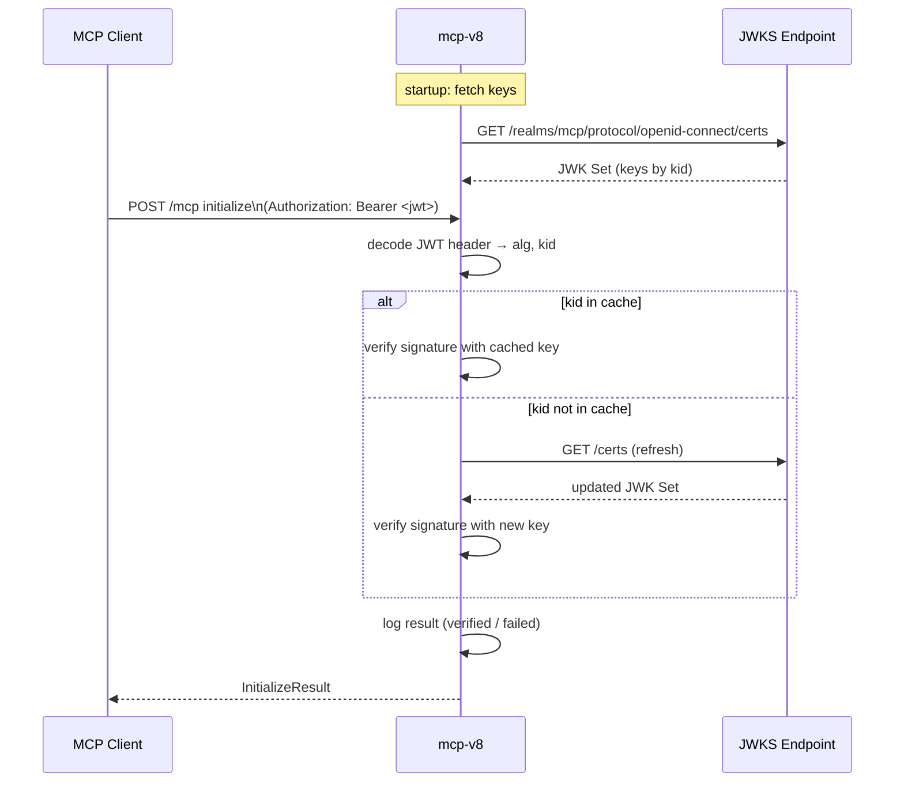

# Authentication (JWT/JWKS)

mcp-v8 can verify incoming JWTs against a JWKS endpoint. This page explains why the design is structured this way, what the verification actually checks, and how it relates to sessions, fetch token injection, and the overall trust model.

## Why JWKS

A JSON Web Key Set endpoint publishes public keys. The server never holds a shared secret; it verifies token signatures using the corresponding public key identified by the `kid` (key ID) field in the JWT header. This means:

- Tokens can be issued by any standard OAuth 2.0 / OpenID Connect provider (Keycloak, Auth0, Azure AD, etc.).
- Key rotation is handled automatically: if a token arrives with a `kid` not in the cache, mcp-v8 re-fetches the JWKS endpoint before failing.
- The mcp-v8 process itself never issues tokens.

## Where verification happens

Verification is performed exactly once per MCP connection, inside the `initialize` handler. It only runs on HTTP transports (Streamable HTTP via `--http-port`, or SSE via `--sse-port`). When mcp-v8 runs in stdio mode, there is no HTTP request context and no verification is attempted even if `--jwks-url` is set.

The same verification logic applies to both stateful and stateless service modes.

## Sequence diagram

## What the verification checks

`SessionVerifier::verify()` performs these steps in order:

1. **Decode the JWT header** — the token must be parseable as a JWT structure.
2. **Require a `kid`** — tokens without a `kid` field in the header are rejected immediately.
3. **Look up the key by `kid`** — if not cached, re-fetch the JWKS endpoint.
4. **Verify the signature** — uses the algorithm (`alg`) declared in the JWT header itself and the corresponding public key.

The following are **not** checked:

| Claim / field | Status |
|---|---|
| `aud` (audience) | Not validated (`validate_aud = false`) |
| `exp` (expiration) | Not required to be present (`required_spec_claims` is empty); if present, expiration is evaluated by the underlying library |
| `iss` (issuer) | Not required and not validated |
| `sub`, `azp`, custom claims | Not inspected |

The token payload is decoded as an opaque JSON value; no application-level claims are read or enforced.

## Current enforcement behavior

Verification is **informational in the current implementation**. The result is written to the structured log (`INFO JWT verified` or `WARN JWT present but failed verification`), but the `initialize` call returns a successful `InitializeResult` regardless of outcome. A missing token is also handled gracefully — a `DEBUG` log is emitted and the request proceeds.

This means:

- A token with an invalid signature does not block the connection; it produces a warning log entry.
- A request with no token at all is allowed through when `--jwks-url` is configured.
- Enforcement logic (rejecting connections on failed or missing tokens) is not present in the current code.

Applications that require hard enforcement should add a reverse proxy or API gateway layer in front of mcp-v8.

## Relationship to sessions

The JWT and the session identifier are independent:

- The JWT identifies **who** is connecting (authenticates the bearer).
- The session ID (`X-MCP-Session-Id` header, also captured at `initialize`) identifies **which heap chain** to attach to.

A single JWT can be reused across multiple session connections. The session ID is never read from the JWT payload.

## Relationship to fetch token injection

The `--fetch-header` / `--fetch-header-config` mechanism is entirely separate. It injects credentials into **outbound** HTTP requests made by user code running inside the V8 isolate. The JWKS authentication described on this page applies to **inbound** MCP connections from agents to mcp-v8 itself. The two mechanisms operate on different network edges and have no dependency on each other.

## Trust model

When `--jwks-url` is configured:

- mcp-v8 trusts any token whose signature can be verified by a key at that JWKS endpoint.
- The JWKS endpoint itself is fetched over plain HTTP or HTTPS; in production, the URL should point to an HTTPS endpoint to prevent key substitution.
- There is no issuer pinning: tokens issued by any party whose keys appear at that URL will pass signature verification.
- Because enforcement is currently advisory, JWKS verification functions as an audit/logging mechanism rather than an access control gate.

## See also

- [Quick-start: Authentication](../tutorials/authentication.md)
- [How-to: Authentication](../how-to/authentication.md)
- [Reference: Authentication](../reference/authentication.md)
- [Stateful sessions & heap snapshots](../concepts/sessions-and-heaps.md)
- [Network access with fetch](../concepts/fetch.md)
- [Transports: stdio, HTTP, SSE](../concepts/transports.md)
