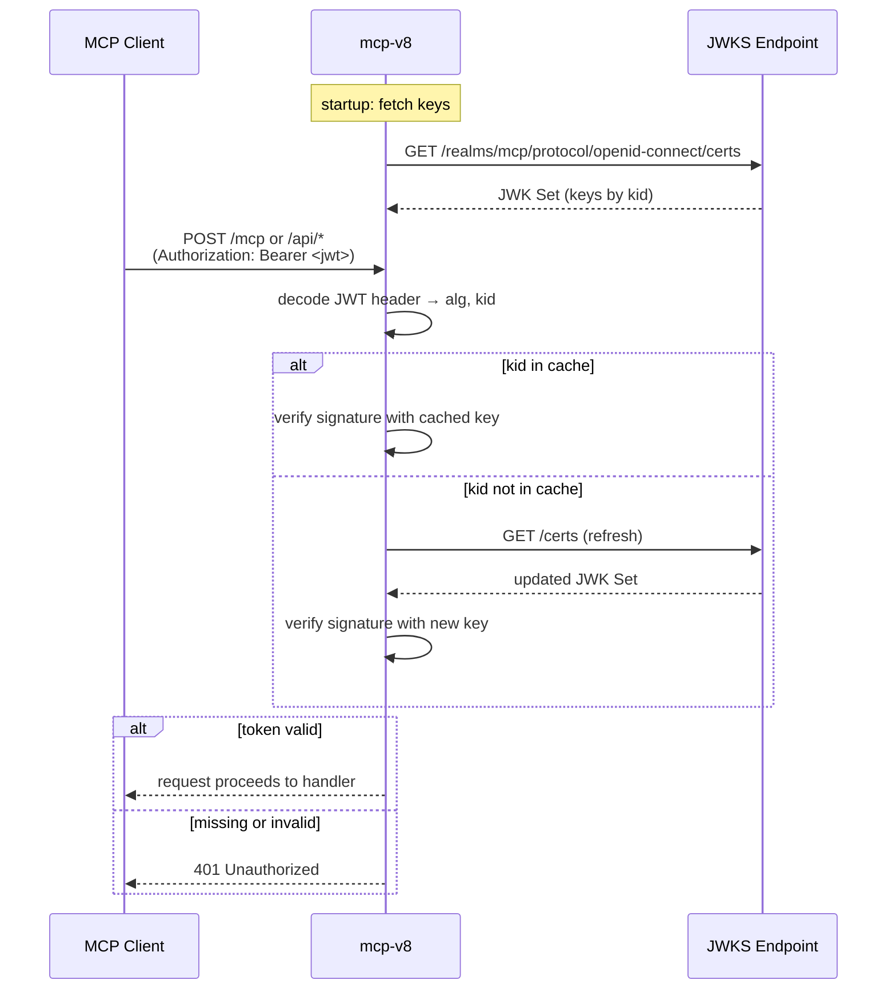

# Authentication (JWT/JWKS)

mcp-v8 can verify incoming JWTs against a JWKS endpoint. This page explains why the design is structured this way, what the verification actually checks, and how it relates to sessions, fetch token injection, and the overall trust model.

## Why JWKS

A JSON Web Key Set endpoint publishes public keys. The server never holds a shared secret; it verifies token signatures using the corresponding public key identified by the `kid` (key ID) field in the JWT header. This means:

- Tokens can be issued by any standard OAuth 2.0 / OpenID Connect provider (Keycloak, Auth0, Azure AD, etc.).
- Key rotation is handled automatically: if a token arrives with a `kid` not in the cache, mcp-v8 re-fetches the JWKS endpoint before failing.
- The mcp-v8 process itself never issues tokens.

## Where verification happens

When `--jwks-url` is set, a bearer-auth middleware wraps the HTTP transports
(Streamable HTTP via `--http-port` and legacy SSE via `--sse-port`) and verifies
every request to `/mcp` and the HTTP API (`/api/*`) before it reaches a handler.
The OpenAPI spec route and CORS preflight (`OPTIONS`) are exempt. When mcp-v8
runs in stdio mode, there is no HTTP request context and no verification is
attempted even if `--jwks-url` is set.

The same enforcement applies to both stateful and stateless service modes.

## Sequence diagram

```mermaid
sequenceDiagram
    participant C as MCP Client
    participant S as mcp-v8
    participant K as JWKS Endpoint

    note over S: startup: fetch keys
    S->>K: GET /realms/mcp/protocol/openid-connect/certs
    K-->>S: JWK Set (keys by kid)

    C->>S: POST /mcp or /api/* <br/>(Authorization: Bearer <jwt>)
    S->>S: decode JWT header → alg, kid
    alt kid in cache
        S->>S: verify signature with cached key
    else kid not in cache
        S->>K: GET /certs (refresh)
        K-->>S: updated JWK Set
        S->>S: verify signature with new key
    end
    alt token valid
        S-->>C: request proceeds to handler
    else missing or invalid
        S-->>C: 401 Unauthorized
    end
```

## What the verification checks

`SessionVerifier::verify()` performs these steps in order:

1. **Decode the JWT header** — the token must be parseable as a JWT structure.
2. **Require a `kid`** — tokens without a `kid` field in the header are rejected immediately.
3. **Look up the key by `kid`** — if not cached, re-fetch the JWKS endpoint.
4. **Verify the signature** — uses the algorithm (`alg`) declared in the JWT header itself and the corresponding public key.

The following are **not** checked:

| Claim / field | Status |
|---|---|
| `aud` (audience) | Not validated (`validate_aud = false`) |
| `exp` (expiration) | Not required to be present (`required_spec_claims` is empty); if present, expiration is evaluated by the underlying library |
| `iss` (issuer) | Not required and not validated |
| `sub`, `azp`, custom claims | Not inspected |

The token payload is decoded as an opaque JSON value; no application-level claims are read or enforced.

## Enforcement behavior

When `--jwks-url` (env `JWKS_URL`) is configured, verification is **enforced** on
the HTTP transports. A middleware in front of the routes checks every request
and rejects it with `401 Unauthorized` (and a `WWW-Authenticate: Bearer` header)
unless it carries a token that verifies against the JWKS:

- A request with **no token** is rejected.
- A token with an **invalid or unverifiable signature** is rejected.
- A **valid** token is admitted and the request proceeds.

This covers both `/mcp` (the MCP transport) and the plain HTTP API (`/api/*`),
since both run arbitrary JavaScript. Two things are intentionally exempt: the
OpenAPI spec route (`/api-doc/openapi.json`), which is public, and CORS
preflight (`OPTIONS`) requests, so a browser handshake is not blocked before the
real, authenticated request.

If `--jwks-url` is **not** set, no verifier is installed and the server does not
require a token — do not expose such a deployment publicly. For defense in depth
you may still place a reverse proxy or API gateway in front of mcp-v8, but it is
no longer required to get hard enforcement.

## Relationship to sessions

The JWT and the session identifier are independent:

- The JWT identifies **who** is connecting (authenticates the bearer).
- The session ID (`X-MCP-Session-Id` header, also captured at `initialize`) identifies **which heap chain** to attach to.

A single JWT can be reused across multiple session connections. The session ID is never read from the JWT payload.

## Relationship to fetch token injection

The `--fetch-header` / `--fetch-header-config` mechanism is entirely separate. It injects credentials into **outbound** HTTP requests made by user code running inside the V8 isolate. The JWKS authentication described on this page applies to **inbound** MCP connections from agents to mcp-v8 itself. The two mechanisms operate on different network edges and have no dependency on each other.

## Trust model

When `--jwks-url` is configured:

- mcp-v8 trusts any token whose signature can be verified by a key at that JWKS endpoint.
- The JWKS endpoint itself is fetched over plain HTTP or HTTPS; in production, the URL should point to an HTTPS endpoint to prevent key substitution.
- There is no issuer pinning: tokens issued by any party whose keys appear at that URL will pass signature verification.
- Verification is an access-control gate: a request without a valid token is rejected with `401` (see [Enforcement behavior](#enforcement-behavior)).

## See also

- [How-to: Authentication](../how-to/authentication.md)
- [Stateful sessions & heap snapshots](../concepts/sessions-and-heaps.md)
- [Network access with fetch](../concepts/fetch.md)
- [Transports: stdio, HTTP, SSE](../concepts/transports.md)
