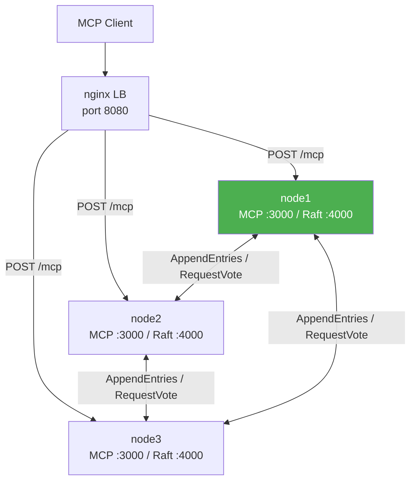

# Clustering & replication (Raft)

mcp-v8 can run as a Raft cluster of two or more nodes to provide high availability and fault tolerance for session metadata.

## Why Raft

Raft is a distributed consensus algorithm that guarantees that a replicated log is consistent across a cluster as long as a majority of nodes are healthy. For mcp-v8, this means that session history and heap tag metadata remain correct and available even when individual nodes crash or restart — without requiring a shared external database.

Raft was chosen over simpler replication schemes because it provides strong consistency (every committed write is linearizable), well-understood leader-election semantics, and automatic recovery when nodes rejoin.

## Architecture: three-node cluster with load balancer

The diagram below shows how the pieces fit together. Each node exposes two ports: an MCP HTTP port for clients and a separate Raft cluster port for inter-node communication.

`node1` is shown as the current leader (green). The load balancer routes client traffic to all three MCP ports; Raft traffic stays on port 4000 and never reaches external clients.

## Leader election

Every node starts as a **Follower**. If a follower does not receive a heartbeat from a leader within a randomised election timeout, it transitions to **Candidate**, increments its term, and sends `RequestVote` RPCs to all peers.

- A node votes for a candidate only if the candidate's log is at least as up to date as its own, and it has not already voted in this term.
- A candidate that collects votes from a strict majority (⌊N/2⌋ + 1) becomes the new **Leader**.
- The randomised timeout window (`--election-timeout-min` to `--election-timeout-max`) reduces the probability of split votes.

The leader then sends periodic `AppendEntries` heartbeats at `--heartbeat-interval` intervals. Followers reset their election timers on every received heartbeat, preventing unnecessary elections while the leader is alive.

## Log replication

When a write is committed (a session-log entry or a heap tag change), the leader:

1. Appends the entry to its own log.
2. Sends `AppendEntries` RPCs to all followers in parallel.
3. Waits until a majority acknowledge the entry.
4. Advances `commit_index` and applies the entry to the local key-value store.
5. Notifies followers of the new `commit_index` in the next heartbeat so they apply the entry too.

A follower that falls behind — due to a restart or network partition — is caught up automatically: the leader re-sends all log entries starting from `next_index` for that peer.

## What state is replicated

The Raft cluster replicates two stores:

| Store | Description |
|-------|-------------|
| **Session log** | Records of MCP session initializations and their associated metadata (session ID, heap reference, tags, execution history). |
| **Heap tags** | The key-value tag store used by `set_heap_tags`, `get_heap_tags`, and `query_heaps_by_tags`. |

Both stores call `.with_cluster(node)` at startup, which routes their writes through the Raft leader and waits for majority acknowledgment before returning.

## What state is NOT replicated

**V8 heap snapshots** are not replicated. Each heap is a content-addressed binary blob stored in whichever heap storage backend the node is configured to use (`--directory-path`, `--s3-bucket`, or the default local filesystem). Because heaps are content-addressed by their SHA-256 hash, the same heap content will have the same address on every node — but physically each node stores only the heaps it has created locally.

In practice, heaps are replicated at the storage layer by using a shared backend (S3 is the natural choice for multi-node deployments) rather than at the Raft layer. See [Heap storage backends](storage-backends.md) for details.

## Consistency model

Reads served by a follower may see slightly stale data (up to one heartbeat interval behind the leader's `commit_index`). Writes, however, always go through the leader: if a non-leader node receives a write request it forwards the request to the leader before returning. This means:

- **Writes are linearizable** — they complete only after a majority acknowledges the log entry.
- **Reads have eventual consistency** — followers apply committed entries asynchronously and may lag by a few milliseconds.

For most MCP use cases (session metadata and tag lookups) this trade-off is acceptable.

## Why HTTP or SSE transport is required

The Raft cluster port runs its own lightweight HTTP server (using `hyper`) to handle `AppendEntries`, `RequestVote`, `join`, and `leave` RPCs. This server is independent of the MCP transport, but the node's MCP transport must also be HTTP-based so it can run concurrently and share the same process.

stdio transport is a blocking single-connection protocol — it does not allow the node to concurrently serve cluster traffic. If `--cluster-port` is set without `--http-port` or `--sse-port`, the server exits with an error at startup.

## Cluster membership and peer discovery

Initial peer addresses are supplied via `--peers` using the format `id@host:port`. The leader propagates its current peer table to all followers in every `AppendEntries` RPC (in the `peer_addrs` field). Followers merge any new peers they learn from the leader, so a node added via `--join` is discovered by the whole cluster without restarting existing members.

Peer information is persisted to the local sled database under the key `raft_peers`, so a restarting node recovers its peer list without reconfiguration.

## Non-voting learners

A node can join as a **non-voting learner** with `--join-as-learner`. A learner participates in replication exactly like a voter — the leader sends it `AppendEntries` and it applies committed entries — but it is excluded from both quorums:

- It never starts an election and never grants a vote, so it cannot become leader or split a vote.
- The leader does **not** count it toward the commit majority, and candidates do not count it toward the election majority.

This matters for **ephemeral nodes**. With ordinary voters, the majority grows with the cluster (`⌊N/2⌋ + 1`), so a node that joins and then disappears can stall writes until it is removed — a real hazard when nodes are spawned and torn down frequently (for example, one worker per session). Learners sidestep this: a cluster of one voter plus any number of learners still commits as soon as the voter has the entry, and a learner crashing or leaving never affects availability.

The leader tracks which members are learners and propagates that set to followers (alongside `peer_addrs`) so every node computes the same voting membership; the classification is persisted under `raft_learners`. A learner is promoted or removed through the same dynamic-membership path as any other peer (`POST /raft/leave`, or `remove_peer` on the leader).

## See also

- [How-to: Clustering & replication (Raft)](../how-to/clustering.md)
- [Reference: Clustering & replication (Raft)](../reference/clustering.md)
- [Concepts: Heap storage backends](storage-backends.md)
- [Concepts: Transports](transports.md)
- [Concepts: Stateful sessions & heap snapshots](sessions-and-heaps.md)
- [Reference: CLI flags](../reference/cli-flags.md)
