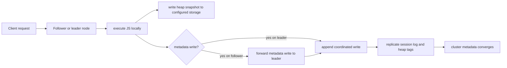

# Clustering

Cluster mode adds distributed coordination to `mcp-v8` for deployments that
need replicated session metadata and coordinated writes across multiple nodes.

It is not just a transport flag. Cluster mode changes how the server handles
leadership, write ownership, and operational topology.

The cluster layer is Raft-inspired. It handles:

- leader election
- replicated session logging
- replicated heap tag updates
- metadata write forwarding when a request lands on a follower
- peer discovery and node identity concerns

The important implementation detail is that JavaScript execution still happens
on the node that received the request. In stateful mode, that node also writes
the resulting heap snapshot through its configured heap storage directly.

What goes through Raft is the metadata layer around that execution:

- session log entries
- heap tag writes

So the cluster is coordinating state metadata, not shipping V8 execution itself
to the leader.

This matters most for stateful, networked deployments. It does not apply to
stdio, and it introduces configuration concerns such as `--cluster-port`,
`--node-id`, peer lists, advertise addresses, and timing parameters.

Cluster mode is an operational scaling feature. It helps preserve a coherent
view of session history and heap metadata across nodes, but it also makes
deployment and failure handling more complex than single-node operation.

For a concrete three-node setup on localhost, see
[Run a Cluster](../how-to/run-a-cluster.md).
