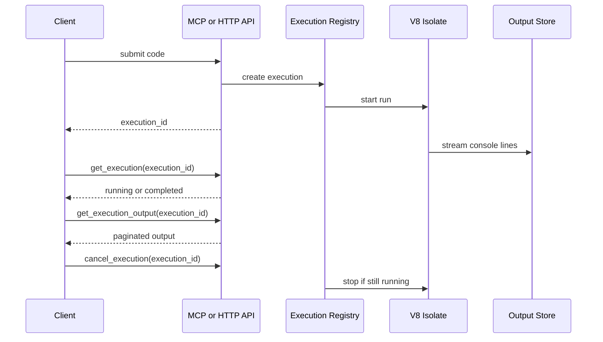

# Execution Model

`mcp-v8` runs JavaScript in an isolated V8 runtime, but it does not behave
like a browser or a general Node.js process. Code executes as ES modules,
supports top-level `await`, and uses an execution registry to track work after
submission.

The main split is between:

- **stateful execution**, where `run_js` queues work and returns an execution
  ID immediately
- **stateless execution**, where the server waits internally and returns
  output and result directly

In stateful mode, the normal flow is:

This design separates submission, status polling, and output retrieval. That
matters because JavaScript may run for long enough to produce streaming output,
consume memory, or be cancelled before it completes.

The primary client model is still MCP. The execution lifecycle is exposed most
naturally through MCP tools such as `run_js`, `get_execution`, and
`get_execution_output`. The HTTP API exposes the same lifecycle for fallback
clients, automation, and typed client generation, but it should be documented
as a secondary surface rather than the main integration story.

Console output is captured while the program runs. The server supports
`console.log`, `console.info`, `console.warn`, and `console.error`, and stores
output so clients can read it incrementally later through MCP tools or the
HTTP API.

Concurrency is also part of the execution model. The server limits how many V8
executions can run at once with `--max-concurrent-executions`. When demand is
higher than the configured limit, executions wait in the registry instead of
starting immediately.

See [MCP Tools](../reference/mcp-tools.md) for the exact tool names and
[HTTP API](../reference/http-api.md) for the REST endpoints that expose the
same lifecycle.
