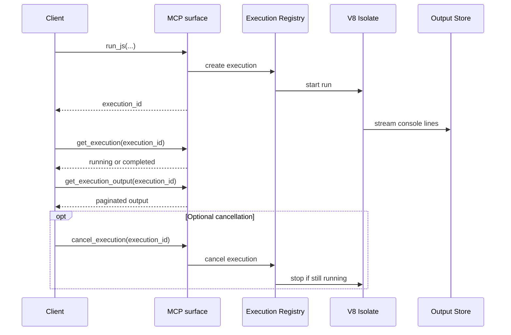
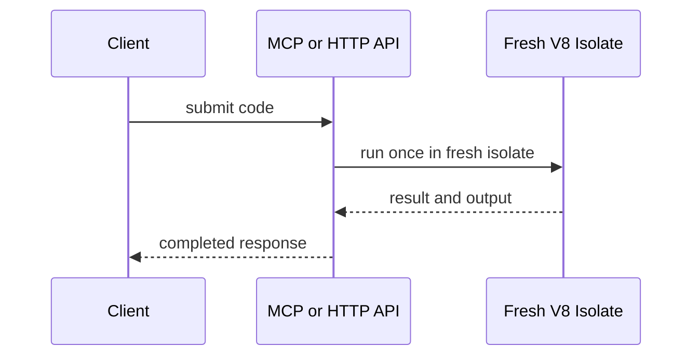

# Execution Model

`mcp-v8` runs JavaScript in an isolated V8 runtime, but it does not behave
like a browser or a general Node.js process. Code executes as ES modules,
supports top-level `await`, and uses an execution registry to track work after
submission.

The main split is between:

- **stateful execution**, where `run_js` queues work and returns an execution
  ID immediately
- **stateless execution**, where the server waits internally and returns
  output and result directly

## Stateful execution

In stateful mode, the lifecycle looks like this:

This design separates submission, status polling, and output retrieval. That
matters because JavaScript may run for long enough to produce streaming output,
consume memory, or be cancelled before it completes.

An agent session in this mode usually looks like:

- the agent asks `run_js` to start a longer job
- the server returns an execution ID immediately
- the agent checks status, reads output as it streams, and decides whether to
  wait, continue polling, or cancel
- if the run completes with a new heap snapshot, the next step can resume from
  that state

This is the primary MCP-facing execution model. It fits interactive agent
work, where a caller may want to observe progress, inspect logs before the run
finishes, or build up state across multiple steps.

## Stateless execution

In stateless mode, the interface collapses into one request-response step:

There is no heap restoration or follow-up polling step. Each execution starts
clean, runs to completion inside the request, and returns its output directly.

An agent session in this mode usually looks like:

- the agent sends one self-contained computation
- the server runs it in a fresh isolate
- the agent gets the result and output in the same interaction
- the next call starts over without carrying forward in-memory state

This mode is a better fit for one-off calculations, stateless automations, and
environments where persistence is unnecessary or undesirable.

## Shared behavior

Console output is captured while the program runs. The server supports
`console.log`, `console.info`, `console.warn`, and `console.error`, and stores
output so clients can read it incrementally later through MCP tools or the
HTTP API when the chosen execution mode exposes that lifecycle.

Concurrency is also part of the execution model. The server limits how many V8
executions can run at once with `--max-concurrent-executions`. When demand is
higher than the configured limit, executions wait in the registry instead of
starting immediately.

The same execution engine is exposed through MCP, the plain HTTP API, the CLI,
and generated clients. The lifecycle is shared even when the calling surface
changes.

See [MCP Tools](../reference/mcp-tools.md) for the exact tool names and
[HTTP API](../reference/http-api.md) for the REST endpoints that expose the
same lifecycle.
