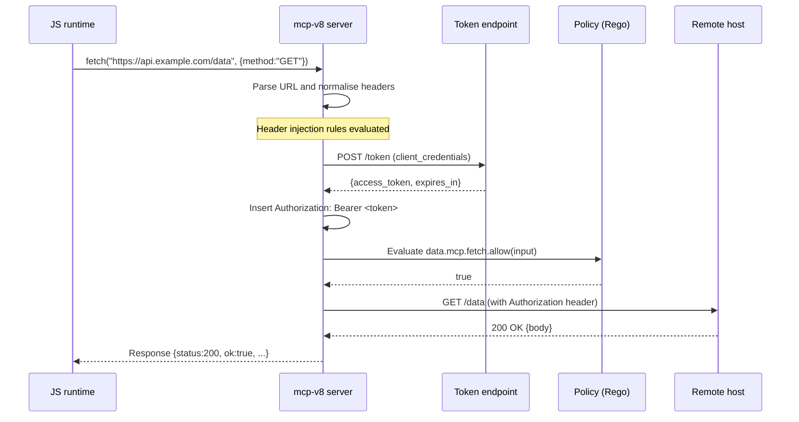

# Network access with fetch

How the `fetch()` capability works, why it is off by default, and the security
model that governs it.

## fetch is off unless a fetch policy is configured

The `globalThis.fetch` function exists in the V8 runtime only when the server
is started with a `--policies-json` configuration that contains a `fetch`
section. If that section is absent — or if `--policies-json` is not supplied at
all — `fetch` is not injected into the runtime. JS code that calls `fetch()`
will receive an error.

The requirement for an explicit policy is intentional: it forces operators to
declare the intended network surface before any code can use it. There is no
implicit "allow all" mode.

## Policy gating model

Every `fetch()` call is evaluated against a Rego policy chain before the
server performs the actual HTTP request. The evaluation sequence is:

1. JS calls `fetch(url, init)`.
2. The server parses the URL and normalises the request headers.
3. Any matching header-injection rules run (see below).
4. The server evaluates the policy chain with the **final** request state,
   including any injected headers.
5. If every evaluator in the chain (mode `all`, the default) returns
   `allow = true`, the request proceeds. If any evaluator returns `false`, the
   request is rejected and JS receives an error.

The policy entry point is `data.mcp.fetch.allow`. The policy input is a JSON
object with these fields:

| Field | Type | Description |
|---|---|---|
| `operation` | string | Always `"fetch"`. |
| `url` | string | The full request URL. |
| `method` | string | HTTP method, upper-cased. |
| `headers` | object | All request headers after injection (lowercase keys). |
| `url_parsed.scheme` | string | URL scheme, e.g. `"https"`. |
| `url_parsed.host` | string | Hostname without port. |
| `url_parsed.port` | number or null | Port if explicit in URL, else null. |
| `url_parsed.path` | string | URL path. |
| `url_parsed.query` | string | Query string (empty string if none). |

Because header injection runs before policy evaluation, a Rego rule can
condition access on the presence or value of an injected credential. For
example, a policy can require that `input.headers.authorization` matches a
known pattern, while the secret value is never written into the JS code.

Policy sources can be local Rego files (`file://`), directories of Rego files,
or a remote OPA instance (`http://` or `https://`). Multiple sources may be
chained; the chain mode (`all` or `any`) controls whether all or any evaluator
must allow the request.

## Server-side header injection keeps secrets out of JS

Operators can configure header-injection rules that attach credentials to
outbound requests. These rules are evaluated entirely within the server process:

- For **static injection**, a fixed header value (e.g., an API key or static
  bearer token) is inserted into the request before the policy sees it.
- For **OAuth client-credentials injection**, the server holds the
  `client_secret` and exchanges it for an access token at the token endpoint.
  The resulting token is placed in the configured header.

In both cases, the JS runtime never receives the raw credential value. JS code
simply calls `fetch(url)` and the server appends the necessary headers. If JS
code explicitly sets the same header that a rule would inject, the JS-supplied
value wins and the injected value is skipped — this prevents a rule from
silently overriding an application-level header.

## OAuth token lifecycle

When an OAuth client-credentials rule is active, the token source manages the
token lifecycle automatically:

1. On the first request that matches the rule, the server performs a
   `client_credentials` token-endpoint POST.
2. The resulting token (access token, token type, and optional refresh token)
   is cached in memory.
3. The `expires_in` field from the token endpoint sets the expiry. If
   `expires_in` is absent, the server attempts to read the `exp` claim from
   the JWT.
4. The token is considered expired `refresh_buffer_secs` seconds before its
   stated expiry (default: 30 s). This allows the server to proactively refresh
   before the token actually expires.
5. If the token endpoint returns a `refresh_token`, the server uses the
   `refresh_token` grant on renewal. If the refresh grant fails, the server
   falls back to a fresh `client_credentials` request.
6. Concurrent requests that arrive while a refresh is in flight are coalesced:
   only one token-endpoint call is made, and all waiting callers receive the
   same result.

The `client_secret` is never logged or included in error messages surfaced to
JS code.

## Request flow with policy gating and header injection



If the policy evaluates to `false`, the request stops at that step and JS
receives an error. The remote host is never contacted.

## Why injection runs before policy evaluation

This ordering has an important security property: policies can enforce that an
injected credential is present. An operator can write a rule such as:

```rego
allow if {
    startswith(input.headers.authorization, "Bearer ")
}
```

Because injection runs first, this rule is only satisfied when the server
successfully obtained and attached a valid token. If token acquisition fails,
the header is absent and the policy rejects the request — preventing the
request from proceeding with no credential.

## See also

- [Quick-start: Network access with fetch](../tutorials/fetch.md)
- [How-to: Network access with fetch](../how-to/fetch.md)
- [Reference: Network access with fetch](../reference/fetch.md)
- [Concepts: Security policies](../concepts/policies.md)
- [Reference: CLI flags](../reference/cli-flags.md)
