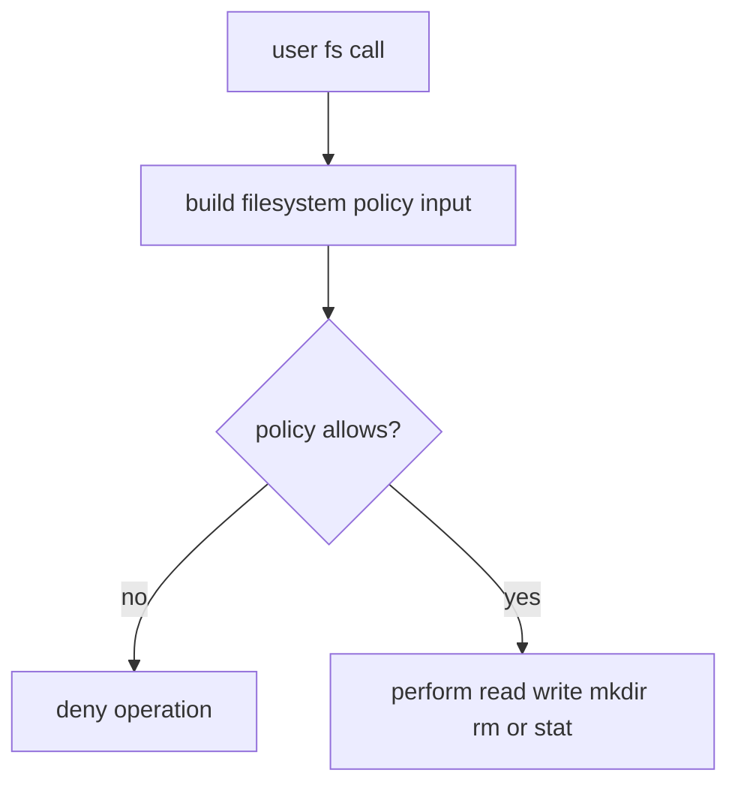

# Filesystem Access

`mcp-v8` can expose a Node.js-compatible `fs` module, but only when the server
is configured to allow filesystem operations through policy evaluation.

That means filesystem access is a capability boundary, not a default part of
the runtime.

The policy input model is operation-oriented. Different calls provide
different input fields, such as:

- `operation`
- `path`
- `destination` for rename or copy
- `recursive` for recursive mkdir or rm
- `encoding` for read operations

This design lets the runtime expose useful file operations while still making
access decisions explicit and configurable.

See [Policy System](policy-system.md) for the general evaluation model and
[Policy Files](../reference/policy-files.md) for configuration shape.
