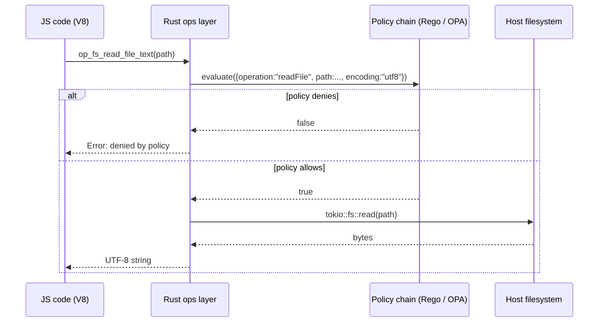

# Filesystem access

An explanation of how `mcp-v8` gates filesystem operations, why the `fs` global only exists when a policy is present, and what the security implications are.

## The capability model

`mcp-v8` follows an opt-in capability model for host access. Filesystem access is **entirely disabled by default**: if the server starts without a `filesystem` entry in `--policies-json`, the `fs` global is never injected into the V8 isolate and user code cannot interact with the host filesystem at all.

When a `filesystem` policy chain is configured the server calls `inject_fs()` at runtime setup, which installs `globalThis.fs` as a collection of async methods backed by native Rust ops. The JS global is thin — it validates argument types and dispatches to `deno_core` ops; the actual I/O and policy evaluation happen on the Rust side.

## Per-operation policy evaluation

Every `fs.*` call — not just the first one — is individually evaluated by the policy chain before any I/O is performed. The evaluation input is a JSON object with these fields:

| Field | Type | Present for |
|---|---|---|
| `operation` | string | all calls |
| `path` | string | all calls |
| `destination` | string | `rename`, `copyFile` |
| `recursive` | boolean | `mkdir`, `rm` |
| `encoding` | string | `readFile` text (`"utf8"`) and buffer (`"buffer"`) |
| `mcp_headers` | object | all calls when MCP session headers are forwarded |

The policy chain evaluates to `true` (allow) or `false` (deny). Denial throws a JavaScript error with the message `fs.<operation> denied by policy: <path> is not allowed`. The I/O syscall is never invoked when a call is denied.

The chain supports multiple evaluators. In `"all"` mode (the default) every evaluator must allow; in `"any"` mode a single allow is sufficient.

## Call flow for a gated `fs.readFile`

## Sandboxing and security considerations

**No chroot or namespace isolation.** The policy is the only sandbox. There is no OS-level restriction on which paths the process can reach — `mcp-v8` runs with whatever filesystem permissions the host process has. The Rego policy is therefore the critical control point; a permissive `default allow = true` policy grants access to every file the process user can read or write.

**Path strings are not normalized before policy evaluation.** The `path` value passed to the policy is the exact string the JS code provides. A policy checking `startswith(input.path, "/safe/dir/")` can be bypassed with `"/safe/dir/../../etc/passwd"` if the Rego does not also normalise or disallow `..` sequences. Production policies should validate that paths do not contain `..` components, or resolve paths to canonical form at the application layer before calling `fs.*`.

**Two-path operations.** `rename` and `copyFile` supply both `path` (source) and `destination` (target) in the policy input. A policy that checks only `input.path` leaves the destination unconstrained. The example policy in `policies/filesystem.rego` demonstrates the correct pattern: a `check_destination` helper validates the destination with the same prefix check as the source.

**`fs.unlink` shares the `rm` policy operation.** Internally `fs.unlink(path)` delegates to the same Rust op as `fs.rm(path)` with `recursive = false`. Policies see `operation = "rm"` for both, not `"unlink"`.

**UTF-8 enforcement.** `fs.readFile` without `"buffer"` encoding validates that the file content is valid UTF-8 and throws if it is not. Reading arbitrary binary files requires the `"buffer"` argument.

**MCP session headers.** When the server is configured to forward MCP session headers, the header map is included as `mcp_headers` in the policy input. This lets a policy tie filesystem access to the authenticated session identity — for example, confining each session to its own directory subtree (see `policies/filesystem.rego`).

## See also

- [Quick-start: Filesystem access](../tutorials/filesystem.md)
- [How-to: Filesystem access](../how-to/filesystem.md)
- [Reference: Filesystem access](../reference/filesystem.md)
- [Concepts: Security policies](../concepts/policies.md)
- [How-to: Subprocess execution](../how-to/subprocess.md)
