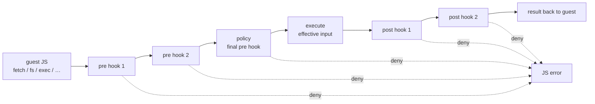

# Hooks: the programmable effect boundary

JavaScript inside the sandbox has no host access of its own. Every effect it can cause — a `fetch()`, an `fs.writeFile`, a subprocess, a module import, an upstream MCP tool call — crosses the isolate boundary through exactly one place: an **operation**. Hooks make that crossing programmable.

For each operation category, an ordered **hook chain** runs around execution:

- **Pre hooks** see the operation's input and may **deny** it or **rewrite** it.
- **Post hooks** see the input and the output and may **deny** the result or **rewrite** the output.

Policies — the allow/deny gates documented in [Security policies](policies.md) — are not a separate mechanism. Internally a policy chain *is* a pre hook: it is appended as the **last** pre hook, so it always evaluates the effective (post-mutation) input. The `policies` config key is the compatibility spelling of a gate-only hook, and the long-term direction is for hooks to be the primary vocabulary.



Each hook receives what the previous hook produced, so chains compose left to right: a rewrite made by `pre[0]` is the input `pre[1]` sees, and the policy — running last — approves what will actually execute. A pre hook can rewrite a request *into* compliance; nothing can rewrite one out from under an approval.

## Configuration

Hooks are configured per operation in `--policies-json`, alongside (or instead of) `policies`:

```json
{
  "fetch": {
    "policies": [{"url": "file:///etc/policies/fetch.rego"}],
    "pre":      [{"url": "file:///etc/policies/fetch_hooks.js"},
                 {"url": "file:///etc/policies/fetch_hooks.rego"}],
    "post":     [{"url": "http://opa:8181", "policy_path": "mcp/fetch/post"}]
  },
  "filesystem": {
    "pre": [{"url": "file:///etc/policies/audit_fs_hooks.js",
             "capabilities": ["fs"]}]
  }
}
```

Each hook source is:

| Field | Meaning |
|---|---|
| `url` | `file://*.js` → JavaScript hook; other `file://` → Rego (regorus) file or directory; `http(s)://` → OPA-style REST endpoint |
| `rule` | Rego: the eval rule (default derives from the operation's policy rule, `.allow` → `.pre`/`.post`). JS: the global function name (default `pre`/`post`) |
| `policy_path` | Remote: the REST data path (default: the operation's policy path + `/pre` or `/post`, e.g. `mcp/fetch/pre`; note `mcp_tools` → `mcp/tools/pre`) |
| `timeout_ms` | JS: per-call bound, default 5000; expiry terminates the script and fails the operation closed |
| `capabilities` | JS: guest APIs granted to the hook isolate (`"fs"`, `"fetch"`) — see [Hook capabilities](#hook-capabilities) |

## The hook contract

A hook evaluates to one of three shapes, in any backend:

| Result | Meaning |
|---|---|
| *nothing* (undefined Rego rule, JS `undefined`/`null`, absent remote result) | **Abstain** — allow, change nothing |
| bare `true` / `false` | Allow / deny (pure policy behavior) |
| `{"allow": bool, "reason": "...", "input"\|"output": {...}}` | Deny with a reason, or replace the input (pre) / output (post) |

Abstention is what makes partial hooks compose: a hook only speaks when its condition matches, and silence costs nothing. Denials surface in the guest as thrown errors carrying the reason — `denied by pre hook (credentials in query string)` — and the first denial short-circuits the rest of the chain.

Pre hooks receive the same input document the operation's policies see (for fetch: `{url, method, headers, url_parsed}`; for filesystem: `{operation, path, destination, …}`). Post hooks receive `{"input": <effective input>, "output": <operation output>}` — Rego reads `input.input`/`input.output`; JS gets them as two arguments.

The same hook, in the two local backends:

```rego
package mcp.fetch

pre := {"input": object.union(input, {"url": u})} if {
    startswith(input.url, "http://")
    u := concat("", ["https://", substring(input.url, 7, -1)])
}
```

```js
function pre(input) {
    if (input.url.startsWith("http://")) {
        return { input: { ...input, url: "https://" + input.url.slice(7) } };
    }
}
```

## JavaScript hooks

A `file://*.js` source runs in its own V8 isolate on a dedicated worker thread — never a sandbox's isolate thread. The isolate is created lazily and kept **warm**, so top-level state in the hook file persists across calls (deliberately: counters, caches, circuit breakers); calls through one evaluator are serialized.

By default the isolate is **bare**: no `fetch`, no `fs`, no ops — a hook is pure computation over its arguments, exactly like a Rego rule. Hooks may be `async` (or return a Promise): the worker drives the isolate's event loop until the result settles.

Every call is bounded by `timeout_ms` and **fails closed** on expiry: running script is terminated through V8's thread-safe handle, and a call parked on pending I/O is abandoned by the worker's event-loop timeout. A gate that cannot produce a verdict denies — otherwise slowing a hook down would switch it off.

### Hook capabilities

A JS hook source can opt into pieces of the guest environment via `capabilities`, expressed with the **same APIs the sandbox sees**: `"fs"` installs the `fs.*` wrapper, `"fetch"` installs `fetch()` (plus `atob`/`btoa`). This is how observing hooks get side effects — the shipped `policies/audit_fs_hooks.js` audits every filesystem write to a log file:

```js
const LOG = "/var/log/mcp-js/fs-audit.log";
async function pre(input) {
    if (["writeFile", "appendFile", "rename", "remove"].includes(input.operation)) {
        await fs.appendFile(LOG, input.operation + " " + input.path + "\n");
    }
    // no return value: observe and abstain
}
```

Hook-issued operations are **ungated** — they run through no hook chain and no policy. The hook file is operator-trusted configuration (the same trust level as the policy files themselves), and gating its operations would recurse into the very chain the hook runs inside: the audit hook above would trigger itself on every `appendFile`, forever.

## Per-operation capabilities

Mutation is honored only where the executor can apply it; everywhere else the system fails closed rather than silently ignoring a hook:

| Operation | Input mutation applied | Post hooks |
|---|---|---|
| `fetch` | `url`, `method`, `headers` (`url_parsed` re-derived after every rewrite) | response `{status, headers, body, …}` |
| `filesystem` | `path`, `destination` (a hook that drops a required `destination` errors) | — |
| `subprocess` | `command`, `args`, `cwd`, `env` | `{code, stdout, stderr}` |
| `mcp_tools` | `server`, `tool`, `arguments` | tool result |
| `run_js_file` | `path` (re-canonicalized after rewrite) | — |
| `websocket`, `http2`, `modules`, `fs_snapshot` | gate-only — a mutating hook fails the operation | rejected at startup |

Operations with derived input fields keep them consistent through mutation: fetch re-parses `url_parsed` from a rewritten `url` before the next hook runs, and `run_js_file` re-canonicalizes a rewritten path — so the policy, which runs last, never sees a stale derivation.

The `operation` discriminator is likewise pinned: the executor performs the operation it was invoked for regardless of the JSON field, so a hook that rewrites `operation` (say `writeFile` → `readFile`) could only make the policy evaluate something other than what will run. Such a mutation fails the operation closed.

Credential injection is itself a hook: fetch's `--fetch-header` rules (static and OAuth) run as a native pre hook inserted after every configured pre hook and before the policy. The position does the security work — injection keys off the *effective* request, so a hook rewrite can never carry a credential to a destination its rule doesn't match; the policy validates the headers that will actually be sent; and user hooks never see operator credentials at all (a capability-bearing hook cannot exfiltrate a token it never receives). It is the first built-in boundary behavior realized as a chain member rather than a special case.

## Policies are hooks

The `policies` key is implemented *in terms of* hooks: `build_hook_chain` wraps the configured `PolicyChain` in a `Hook::Policy` variant and appends it as the final pre hook. A policy is precisely a pre hook that only ever answers with a boolean and never mutates. These two configurations gate identically:

```json
{"fetch": {"policies": [{"url": "file:///etc/policies/fetch.rego"}]}}
```

```json
{"fetch": {"pre": [{"url": "file:///etc/policies/fetch.rego",
                     "rule": "data.mcp.fetch.allow"}]}}
```

(The one behavioral difference today: multiple entries under `policies` combine under the chain's `mode` — `all`/`any` — while `pre` hooks always run in order with first-denial short-circuit. An `any`-mode policy chain has no direct `pre` spelling yet.)

The direction of travel is to phase out the separate policies vocabulary: `policies` remains supported as the compatibility spelling, but new gating, rewriting, and observing behavior should be written as hooks, and the deny messages already distinguish `denied by policy` from `denied by pre hook (reason)` only for continuity.

## Layered stacks

Because every sandbox effect crosses through exactly one operation seam, the hook system generalizes to the model SQLite uses for its VFS layer: each shim implements the same interface, wraps the next one down, and the real executor is just the default innermost layer. This is implemented today for **fetch** via the `stack` config key:

```json
{
  "fetch": {
    "policies": [{"url": "file:///etc/policies/fetch.rego"}],
    "stack": [
      {"url": "file:///etc/hooks/cache_layer.js"},
      "@inject",
      "@policy",
      "@execute"
    ]
  }
}
```

A stack replaces `pre`/`post` (mutually exclusive) with one explicit, ordered list. Built-ins are addressable: `"@inject"` places header injection, `"@policy"` places the `policies` chain (auto-appended before `@execute` when policies are configured but not placed), and `"@execute"` is the real executor — required, and last, because the executor is the innermost layer and nothing can run "after" it.

### The layer contract

A JS source in a stack exports `handle(input, next)` (name overridable via `rule`; default timeout 30 s, wall clock including time inside `next`). `next(input')` runs the rest of the stack — inner layers, then the executor — and resolves to the output. A layer may call it **zero, one, or many** times:

```js
async function handle(input, next) {
    if (cache.has(input.url)) return cache.get(input.url);      // zero: short-circuit
    const t0 = Date.now();
    let out = await next(input);                                 // one: pass through
    if (out.status >= 500) {
        out = await next({ ...input, url: FALLBACK });           // many: retry/fallback
    }
    out = { ...out, headers: { ...out.headers, "x-ms": String(Date.now() - t0) } };
    return out;                                                  // paired both sides
}
```

A rejected `next` (an inner deny, a failed request) is an ordinary exception the layer may catch — that is what makes fallback expressible. Throwing out of `handle` fails the operation; returning nothing is an error, not an abstain (a layer that wants to pass through returns `next(input)`'s result). Rego and remote sources may also appear in a stack: they join as gate/rewrite layers with pre-hook semantics (abstain/deny/rewrite wrapping the descent).

### Guarantees

- **Every descent is re-checked.** `normalize` re-derives computed fields (`url_parsed`) and the `operation` discriminator is pinned on every `next` — a retry cannot slip a different operation past the layers below, and `@policy` gates *each* input that reaches it, including retries.
- **Credentials stay inside.** With `"@inject"` placed after user layers, a layer never sees operator credentials, and injection keys off exactly the input the layer passed down.
- **Timeout is per layer call**, terminating runaway script and abandoning hung descents (fail closed).
- **One worker per file.** Calls through one JS file are serialized on its warm isolate; the same file may appear only once per stack (a nested self-call would deadlock — enforced at startup).

The flat `pre`/`post` chain remains fully supported; a stack is opt-in per operation, and `stack` is currently accepted for `fetch` only. Extending it to the remaining operations — and swapping `@execute` itself for a virtual executor (recorded network, in-memory fs) — is the design direction the contract was shaped for: every flat hook maps mechanically onto a layer, so the migration cannot break a configured hook.

## Worked examples

The repository ships three tested example hook files:

- `policies/fetch_hooks.rego` — https upgrade, query-string credential refusal, response-header scrubbing, in Rego
- `policies/fetch_hooks.js` — the same hooks in JavaScript
- `policies/audit_fs_hooks.js` — capability-bearing write-audit logging

and an end-to-end test suite (`server/tests/hooks_e2e.rs`) that drives real guest `fetch()`/`fs.*` calls through mutating, denying, and auditing chains.
