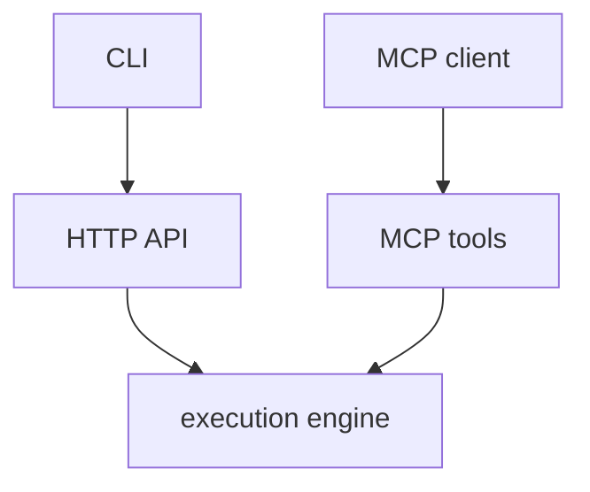

# Integration Surfaces

`mcp-v8` can be used through several integration surfaces:

- MCP clients such as Claude Desktop, Claude Code, or Cursor
- the plain [HTTP API](../reference/http-api.md)
- the [`mcp-v8-cli`](../reference/cli-flags.md)

These surfaces share the same underlying execution engine, but they present it
in different forms:

- MCP exposes the runtime as [MCP tools](../reference/mcp-tools.md)
- the [HTTP API](../reference/http-api.md) exposes request and response endpoints directly
- the CLI wraps the HTTP API for shell use
- the Rust client provides typed access to the same HTTP endpoints

`mcp-v8` can also connect to upstream MCP servers and expose their tools
inside the JavaScript runtime, with optional stub tools on its own MCP surface
for discovery. See [MCP Pass-Through](mcp-pass-through.md).

For transport-level setup, see [Transports](transports.md),
[Run with stdio](../how-to/run-with-stdio.md), and
[Run with HTTP](../how-to/run-with-http.md).
