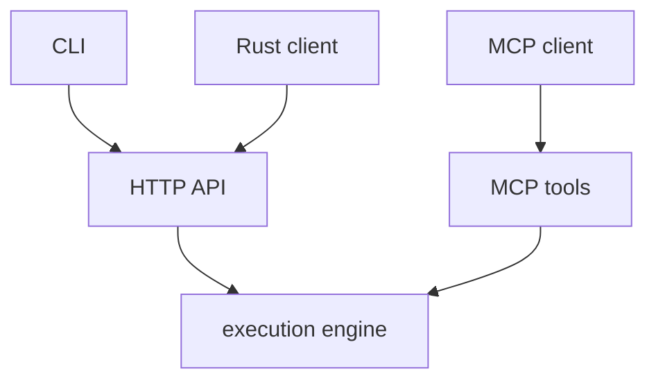

# Integration Surfaces

`mcp-v8` can be used through several integration surfaces:

- MCP clients such as Claude Desktop, Claude Code, or Cursor
- the plain HTTP API
- the `mcp-v8-cli`
- the `mcp-v8-client` Rust crate

These surfaces share the same underlying execution engine, but they present it
in different forms:

- MCP exposes the runtime as tools
- the HTTP API exposes request and response endpoints directly
- the CLI wraps the HTTP API for shell use
- the Rust client provides typed access to the same HTTP endpoints
