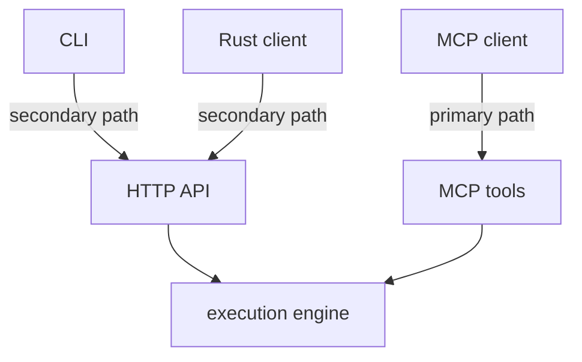

# Integration Surfaces

`mcp-v8` is primarily an MCP server. The main integration model is to expose
its tools to an MCP client such as Claude Desktop, Claude Code, or Cursor and
let that client drive JavaScript execution through the MCP tool surface.

The server also has secondary access paths:

- the plain HTTP API, which mirrors the execution lifecycle for fallback
  clients and generated SDKs
- the `mcp-v8-cli`, which is a convenience wrapper around the HTTP API
- the `mcp-v8-client` Rust crate, which is a typed client for the same HTTP
  surface

This distinction should guide the rest of the docs:

- use MCP-first language when explaining the product
- describe the HTTP API as a fallback, automation, and client-generation
  surface
- describe CLI and Rust client usage as convenience layers over the HTTP API
