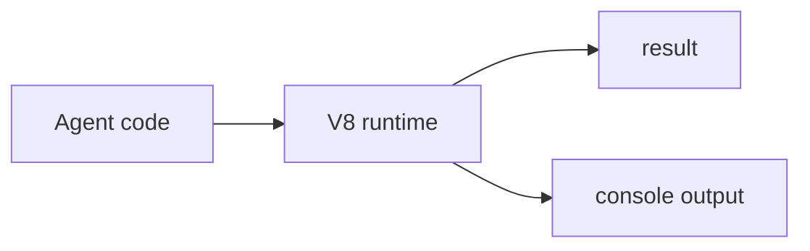
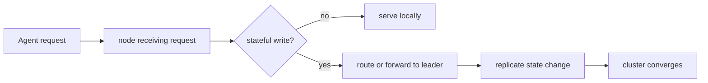
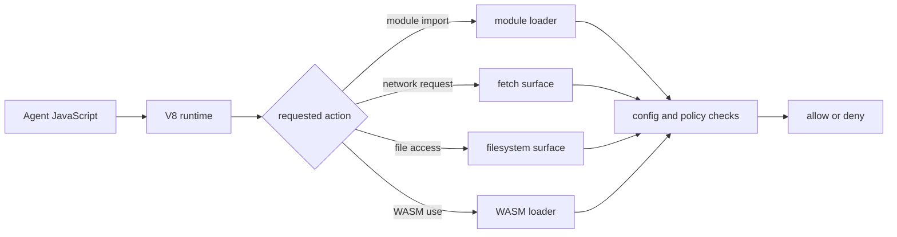

# JavaScript Runtime

`mcp-v8` runs agent code inside an isolated V8 runtime built on
[`deno_core`](https://github.com/denoland/deno_core), the core engine used by
the [Deno project](https://deno.com/). It is not a full Deno runtime, and it
is not a full Node.js runtime. It is a controlled JavaScript runtime with a
subset of Node.js-compatible host surfaces added where the server chooses to
expose them.

This page introduces the runtime in the order most users meet it:

1. run JavaScript once
2. preserve state across runs
3. store that state somewhere durable
4. organize it with sessions and tags
5. coordinate it across a cluster

## What this runtime is

The simplest way to think about `mcp-v8` is:

- JavaScript runs inside V8
- `deno_core` provides the runtime foundation and event loop behavior
- the server decides which host capabilities exist
- some APIs are Node.js-compatible, but only as a subset and only when enabled

That means the runtime is closer to a sandboxed JavaScript compute surface than
to a normal shell session or a general Node.js process.

At a high level, code can rely on:

- ES modules
- top-level `await`
- captured console output
- execution limits such as timeouts and heap caps

Code should not assume:

- a full Node.js standard library
- a full Deno runtime surface
- arbitrary filesystem access
- arbitrary subprocess access
- unrestricted network access

## Start with one execution

At its most basic, the runtime executes one piece of JavaScript in an isolated
environment.

This is the starting point for understanding everything else. An agent sends
JavaScript, the runtime executes it, and the server captures the result and
output.

Conceptually:

If you use the runtime this way, each execution can be treated as independent.
This is the stateless model.

See [Execution Model](execution-model.md) for the exact lifecycle and the
difference between stateful and stateless execution.

## Persist state with heaps

The runtime becomes much more useful when it can resume from prior JavaScript
state.

In stateful mode, a completed execution can produce a heap snapshot. A later
execution can start from that heap instead of from a blank runtime.

That changes the model from:

- run one isolated program

to:

- run a step
- capture the resulting state
- resume from that state in the next step

Conceptually:

This is the foundation for iterative agent workflows. The runtime is no longer
only an evaluator. It becomes a resumable environment.

See [Sessions and Heaps](sessions-and-heaps.md) for the full state model.

## Track work with sessions

Heap snapshots preserve runtime state. Sessions preserve runtime history.

A session gives a human-meaningful way to group related executions. Instead of
thinking only in heap hashes, you can think in terms of:

- this task
- this conversation
- this workflow
- this user operation

The useful distinction is:

- heaps capture **state**
- sessions capture **history**

In practice, this helps agents and operators answer different questions:

- which state should I resume from?
- which executions were part of the same workflow?
- what happened before this runtime reached its current state?

Sessions do not replace heaps. They make long-running stateful work easier to
understand.

See [Sessions and Heaps](sessions-and-heaps.md) and
[MCP Tools](../reference/mcp-tools.md) for the stateful surfaces.

## Store heaps locally or in S3

Once the runtime can preserve heaps, those heaps have to live somewhere.

The server supports:

- local filesystem storage
- S3-backed storage
- S3 with a local write-through cache

This is not only an operational detail. Storage changes what the runtime can
do across calls.

Without storage, stateful execution has nowhere durable to keep its output.
With storage, the runtime can preserve and resume work across multiple steps,
process restarts, or deployments.

The tradeoff is simple:

- local storage is the easiest way to start
- S3 is better when you need durable or shared storage
- cached S3 helps balance durability with performance

See:

- [Use Local Storage](../how-to/use-local-storage.md)
- [Use S3 Storage](../how-to/use-s3-storage.md)

## Organize heaps with tags

As soon as the runtime starts producing many heaps, raw hashes stop being
enough.

Heap tags solve that problem. They add searchable metadata around snapshots
without changing the snapshot contents.

That makes the runtime easier to use for iterative work:

- mark a heap as a checkpoint
- associate heaps with a task or environment
- find the latest useful state without remembering only hashes

So the progression becomes:

- execute code
- persist state
- organize that state

This is how the runtime grows from a sandboxed evaluator into a practical
stateful system for agents.

See [Sessions and Heaps](sessions-and-heaps.md) for the storage model and
[MCP Tools](../reference/mcp-tools.md) for tagging and query operations.

## Scale stateful execution across a cluster

On one node, the runtime preserves and resumes state locally.

In a cluster, the runtime still executes JavaScript the same way, but the
state layer becomes coordinated across nodes.

That matters most for:

- session history
- replicated writes
- leader-owned coordination
- a consistent view of state across the cluster

Conceptually:

The teaching point is: clustered execution is not a different JavaScript
language model. It is the same runtime with a distributed state layer.

See [Clustering](clustering.md) and [Run a Cluster](../how-to/run-a-cluster.md)
for the operational model.

## Host capabilities are attached selectively

The runtime does not inherit all host features automatically. The server
attaches specific capabilities into the JavaScript environment.

That is why the runtime can stay lightweight while still being controlled.

Conceptually:

Some of these surfaces are intentionally familiar. For example, filesystem
operations can be exposed through a Node.js-compatible `fs` surface. But the
important qualifier stays the same: it is a subset, and it exists only when
enabled.

See:

- [Module Loading](module-loading.md)
- [Network Access](network-access.md)
- [Filesystem Access](filesystem-access.md)
- [WASM and Native Modules](wasm-and-native-modules.md)
- [Policy System](policy-system.md)

## What agents should assume

When using this runtime, agents should assume:

- JavaScript is the primary compute surface
- persistence is explicit, not automatic
- host access is capability-based
- some familiar Node.js-style APIs may exist, but only as a bounded subset
- scaling to multiple nodes changes state coordination, not the language model

Agents should not assume:

- "this is just Node"
- "this is just Deno"
- "I can use the host like a full shell"
- "my state always carries forward unless I ask for it to"

The best way to use `mcp-v8` is to start with one execution, add persistence
when you need it, add storage when you want durable state, add tags and
sessions when you need organization, and add clustering when you need
coordinated distributed state.

## Related concepts

- [Execution Model](execution-model.md)
- [Sessions and Heaps](sessions-and-heaps.md)
- [Module Loading](module-loading.md)
- [Network Access](network-access.md)
- [Filesystem Access](filesystem-access.md)
- [WASM and Native Modules](wasm-and-native-modules.md)
- [Policy System](policy-system.md)
- [Clustering](clustering.md)
