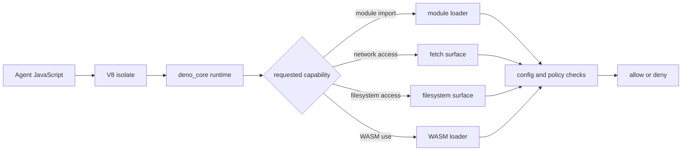
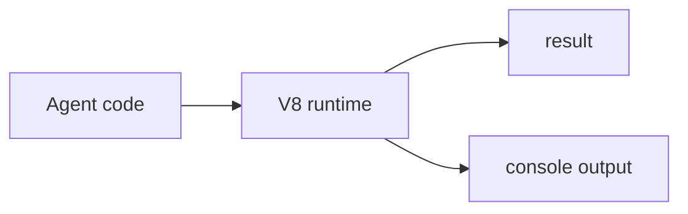
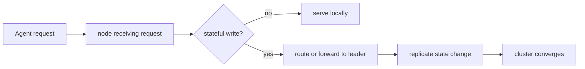

# JavaScript Runtime

`mcp-v8` runs agent code inside an isolated V8 runtime built on
[`deno_core`](https://github.com/denoland/deno_core), the core runtime crate
used by the [Deno project](https://deno.com/). It is not a full Deno runtime,
and it is not a full Node.js runtime. It exposes a controlled JavaScript
environment with a subset of Node.js-compatible surfaces when the server
chooses to provide them. It can execute both JavaScript and TypeScript, but
TypeScript support is type stripping only, not type checking. It also supports
`async`/`await` and Promises through the `deno_core` event loop.

The simplest way to learn the runtime is in layers:

1. run one piece of JavaScript
2. keep the resulting state as a heap
3. group related executions into sessions
4. store heaps durably
5. organize heaps with tags
6. coordinate state across a cluster

## Runtime internals

At the implementation level, the runtime is:

- a V8 isolate for JavaScript execution
- a `deno_core` event loop and op system underneath that isolate
- a server-controlled set of host capabilities attached to the runtime
- a bounded environment with time, memory, and policy limits

That combination matters because it gives `mcp-v8` a smaller and more
controlled execution surface than a Linux VM or a full developer shell.

Conceptually:

Some interfaces will feel familiar if you know Node.js, but the right mental
model is "selected compatibility," not "full Node." The runtime may expose
Node-style modules such as `fs`, but only as a subset and only when enabled.

See:

- [Module Loading](module-loading.md)
- [Network Access](network-access.md)
- [Filesystem Access](filesystem-access.md)
- [WASM and Native Modules](wasm-and-native-modules.md)
- [Policy System](policy-system.md)

## Start with one execution

At its simplest, `mcp-v8` runs one piece of JavaScript in an isolated runtime
and returns the result and captured output.

This is the stateless model. Each execution starts fresh unless you explicitly
resume from a prior heap.

The same entry point also accepts TypeScript. Before execution, the runtime
strips type syntax with SWC and then runs the resulting JavaScript. That means
TypeScript is useful for authoring convenience, but the runtime does not act
as a type checker.

Async JavaScript is fully supported. Code can `await` Promises, schedule
asynchronous work, and rely on the runtime's `deno_core` event loop to drive
those tasks to completion within the configured execution limits.

See [Execution Model](execution-model.md) for the exact lifecycle.

## Persist state with heaps

Stateful execution begins when one run produces a heap snapshot and a later
run resumes from it.

This is the first big shift in how to think about the runtime. It is no longer
only a JavaScript evaluator. It becomes a resumable environment that can carry
state forward across steps.

See [Sessions and Heaps](sessions-and-heaps.md).

## Track work with sessions

Heaps preserve runtime state. Sessions preserve runtime history.

A heap answers: "what state should I resume from?" A session answers: "which
executions belong to the same piece of work?"

That distinction makes long-running agent workflows easier to inspect and
operate. You can follow a session as a task timeline while still resuming from
specific heap snapshots.

See [Sessions and Heaps](sessions-and-heaps.md) and
[MCP Tools](../reference/mcp-tools.md).

## Store heaps locally or in S3

Once state matters, storage matters too. The server can persist heaps in:

- local filesystem storage
- S3-backed storage
- S3 with a local write-through cache

Local storage is the easiest way to start. S3 is better when state needs to
survive node replacement or be shared across a wider deployment.

See:

- [Use Local Storage](../how-to/use-local-storage.md)
- [Use S3 Storage](../how-to/use-s3-storage.md)

## Organize heaps with tags

Heap hashes are precise, but they are not a good way to navigate a large body
of saved state. Tags make heaps easier to search and reason about without
changing the content-addressed storage model.

That lets you move from "resume this exact hash" to more usable workflows such
as:

- find the latest checkpoint for a task
- label a heap as a milestone or recovery point
- attach human-meaningful metadata to saved state

See [Sessions and Heaps](sessions-and-heaps.md) and
[MCP Tools](../reference/mcp-tools.md).

## Scale stateful execution across a cluster

On one node, stateful execution is a local concern. In a cluster, the runtime
is still the same JavaScript runtime, but the state layer becomes distributed.

The important teaching point is that clustering changes how state is
coordinated, not how JavaScript itself runs. You are scaling the stateful
execution model, not switching to a different runtime.

See [Clustering](clustering.md) and
[Run a Cluster](../how-to/run-a-cluster.md).

## Agent-facing model

From an agent's point of view, the runtime should be treated as:

- JavaScript-first compute
- isolated by default
- resumable when you opt into heaps
- organized through sessions and tags
- durable when you configure storage
- scalable when you coordinate state across a cluster

Agents should assume:

- some familiar Node.js-style APIs may exist, but only as a bounded subset
- TypeScript works, but only through type removal before execution
- `async`/`await` and Promises work as normal JavaScript control flow
- host access is capability-based, not implicit
- persistence is explicit, not automatic
- cluster mode changes state coordination, not the language model

Agents should not assume:

- "this is just Node"
- "this is just Deno"
- "I can use the host like a full shell"
- "state always carries forward unless I ask for it to"

## Related concepts

- [Execution Model](execution-model.md)
- [Sessions and Heaps](sessions-and-heaps.md)
- [Module Loading](module-loading.md)
- [Network Access](network-access.md)
- [Filesystem Access](filesystem-access.md)
- [WASM and Native Modules](wasm-and-native-modules.md)
- [Policy System](policy-system.md)
- [Clustering](clustering.md)
