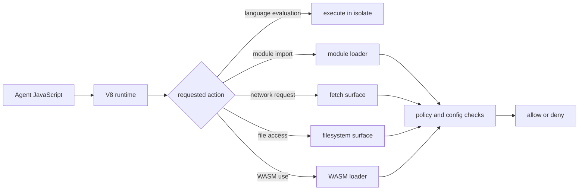

# JavaScript Runtime

`mcp-v8` runs agent code inside an isolated V8 JavaScript runtime. That
runtime is intentionally smaller and more controlled than a general Node.js
process or a browser tab.

This page covers two views of the same system:

- the **agent-facing model**, which describes what code can assume at runtime
- the **runtime internals**, which describe how the server enforces that model

## Agent-facing model

From an agent's point of view, `mcp-v8` provides a JavaScript execution
environment with these core properties:

- code runs as ES modules
- top-level `await` works
- console output is captured
- state may be preserved across executions when the selected mode supports it
- access to network, filesystem, modules, subprocesses, or WASM depends on
  explicit server configuration

The important mental model is: this is a **sandboxed JavaScript runtime with
host capabilities attached selectively**, not a full operating-system session.

That means agent code should not assume:

- a writable working directory by default
- unrestricted `fetch`
- a Node.js package manager or local `node_modules`
- arbitrary local file access
- arbitrary subprocess access

Instead, an agent should treat the runtime as:

- JavaScript first
- capability-driven
- policy-gated where configured
- execution-mode dependent for persistence and lifecycle

## What code can do

At baseline, the runtime is good at self-contained JavaScript execution:

- transform data
- evaluate logic
- manipulate JSON and text
- use modern language features supported by V8

When enabled, the runtime can also extend into:

- external module loading
- network access through `fetch`
- filesystem access
- subprocess execution
- WebAssembly

Those are not one feature. They are separate host surfaces that can be enabled,
disabled, and governed independently.

See:

- [Module Loading](module-loading.md)
- [Network Access](network-access.md)
- [Filesystem Access](filesystem-access.md)
- [WASM and Native Modules](wasm-and-native-modules.md)
- [Policy System](policy-system.md)

## What code should not assume

The runtime is deliberately not "just Node in a container."

That matters because agent-authored JavaScript often carries assumptions from:

- browser environments
- local Node.js development
- serverless runtimes

In `mcp-v8`, those assumptions need to be checked explicitly.

Examples:

- imports may resolve through configured external loaders, not through a local
  dependency install step
- filesystem access may be denied entirely, or restricted to a sandbox path
- network access may be denied or filtered by policy
- long-running work may be queued and tracked instead of returning immediately
- state may or may not persist, depending on the execution mode and storage
  configuration

## Runtime internals

Under the hood, the runtime is built around V8 isolates and server-managed
execution control.

The main implementation ideas are:

- each execution runs inside controlled V8 state
- the server sets timeout and memory boundaries around that execution
- host features are attached by the server rather than inherited from the host
  operating system automatically
- execution bookkeeping is handled outside user code by the registry and
  surrounding services

This creates a clear split:

- **user code** decides what computation to perform
- **the server runtime** decides what capabilities exist and how long the code
  can run

## Isolation and limits

The runtime is isolated, but that isolation has multiple layers:

- V8 execution isolation
- heap and timeout limits
- optional policy checks around host actions
- optional persisted state through heaps and sessions

In practice, the most important limits are:

- execution timeout
- JavaScript heap limit
- configured concurrency

Those are part of the runtime contract, not just deployment details. A program
that would be acceptable in an unconstrained local environment may time out or
run out of memory here by design.

See [Execution Model](execution-model.md) for execution lifecycle details and
[Sessions and Heaps](sessions-and-heaps.md) for persisted state behavior.

## Host capability attachment

The runtime does not receive all host capabilities automatically. The server
attaches specific capabilities into the JavaScript environment.

Conceptually, the flow looks like this:

This is why the runtime feels lightweight compared with a full VM while still
being safer than "just run code on the host." The server mediates the
connection between the JavaScript runtime and the underlying machine.

## Why this matters for agents

For agents, the runtime model affects how tasks should be decomposed.

Good fits:

- incremental multi-step workflows
- structured transformations
- sandboxed execution with explicit host capabilities
- repeatable computation with controlled persistence

Poor assumptions:

- "I can just install tools and use them like a normal shell"
- "I can read any path on disk"
- "I can fetch any URL"
- "my in-memory state always carries forward"

The best results come from treating `mcp-v8` as a **JavaScript compute surface
with explicit resource access**, then selecting the relevant integrations
deliberately.

## Related concepts

- [Execution Model](execution-model.md)
- [Sessions and Heaps](sessions-and-heaps.md)
- [Module Loading](module-loading.md)
- [Network Access](network-access.md)
- [Filesystem Access](filesystem-access.md)
- [WASM and Native Modules](wasm-and-native-modules.md)
- [Policy System](policy-system.md)
