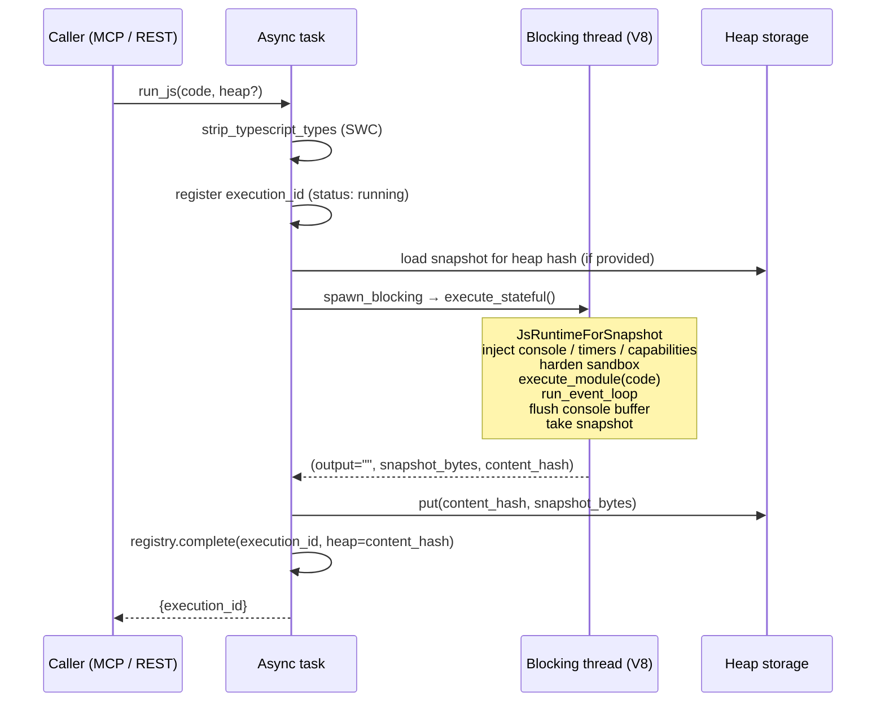

# Running JavaScript & TypeScript

An explanation of how mcp-v8 executes JavaScript and TypeScript: the V8 isolate model, TypeScript transpilation, console capture, timers, and enforcement of memory and timeout limits.

## The V8 isolate model

mcp-v8 embeds V8 through [`deno_core`](https://crates.io/crates/deno_core). Every call to `run_js` creates a fresh V8 runtime — a `JsRuntimeForSnapshot` in stateful mode or a `JsRuntime` in stateless mode. Code is loaded as an **ES module** (`file:///main_<n>.js`) so top-level `await` works without any wrapper.

Isolates do not share memory. Any JavaScript state that must survive across calls must be captured in a **heap snapshot** (stateful mode). In stateless mode the isolate and all its state are discarded when the execution finishes.

A Tokio semaphore limits simultaneous active isolates to `--max-concurrent-executions` (default: logical CPU count). Calls that arrive while the semaphore is full are queued, not rejected.

## TypeScript transpilation

Before code reaches V8, the function `strip_typescript_types()` parses it with the SWC TypeScript parser configured with `TsSyntax { tsx: false }`. The transformation pipeline applies the resolver, the TypeScript type-strip transform (`strip`), hygiene normalization, and a fixer pass, then emits plain JavaScript.

JSX/TSX is intentionally **not** supported: the pipeline only strips TypeScript types and does not transform JSX, so source containing JSX elements fails fast with a TypeScript parse error rather than emitting code V8 cannot run. With JSX disabled, angle-bracket type assertions (`<T>value`) are permitted alongside the `as` form.

Pure JavaScript passes through the same pipeline unchanged — it is valid TypeScript.

Type errors are **not** reported. Only syntax errors (malformed TypeScript tokens) cause a transpilation failure, which is surfaced as a `failed` execution with a message of the form `TypeScript parse error: ...`.

## Console capture

The sandbox replaces `globalThis.console` with a custom object backed by the Rust op `op_console_write`. Console output is buffered in 4096-byte pages and persisted to a per-execution tree in the sled metadata database. It is never written to stdout or stderr, which would corrupt the JSON-RPC stream in stdio mode.

The six available console methods and the prefixes they add:

| Method | Prefix in captured output |
|---|---|
| `console.log` | _(none)_ |
| `console.debug` | _(none)_ |
| `console.trace` | _(none)_ |
| `console.info` | `[INFO] ` |
| `console.warn` | `[WARN] ` |
| `console.error` | `[ERROR] ` |

Arguments are formatted: string values are used as-is; all other values are passed through `JSON.stringify`. Multiple arguments are joined with a single space. A `\n` is appended to every call. At the end of execution, any bytes remaining in the 4096-byte buffer are flushed.

The captured output is read back through `get_execution_output` (MCP) or `GET /api/executions/{id}/output` (REST), both of which support line-based and byte-based pagination.

## Timers

`setTimeout(callback, delayMs)` and `clearTimeout(id)` are provided. They are backed by `tokio::time::sleep` via the async Rust op `op_timer_sleep`. The delay is clamped to 0 ms minimum. Timer IDs are sequential integers starting at 1. A cancelled timer's callback is never called.

`setInterval` is not available. Periodic work should use a loop with `await`-ed `setTimeout` calls.

Because code runs as an ES module inside `deno_core`'s event loop (`run_event_loop`), timer callbacks and other async continuations resolve correctly without any special configuration.

## Memory limits

A per-isolate memory cap is enforced at two independent levels:

1. **V8 heap limit** — `v8::CreateParams::heap_limits(0, max_bytes)` caps V8's garbage-collected heap.
2. **Array buffer allocator** — a custom bounded allocator (`BoundedAllocatorState`) tracks all off-heap allocations (TypedArrays, WASM linear memory) against the same byte budget.

When the isolate approaches the configured limit, a `near_heap_limit_callback` fires: it sets an OOM flag, calls `terminate_execution()` on the isolate handle, and returns double the current limit (a required V8 idiom to give the engine time to unwind). After the isolate terminates, the error is classified by inspecting the OOM flag:

> Out of memory: V8 heap limit exceeded. Try increasing heap_memory_max_mb.

The cap is configured by `--heap-memory-max` (in MB; server default 8 MB) and can be overridden per call with `heap_memory_max_mb`. Both the server flag and the per-call override are clamped to a minimum of 8 MB (`MIN_HEAP_MEMORY_MB`).

## Timeout enforcement

Execution runs on a Tokio blocking thread (`spawn_blocking`) to avoid blocking the async runtime. A `tokio::select!` races that blocking task against a sleep future of `execution_timeout_secs` duration. When the sleep wins:

1. `terminate_execution()` is called via the isolate's thread-safe handle.
2. The blocking task is joined to allow the isolate to unwind cleanly.
3. The execution record is marked `timed_out`.

The server default is 30 seconds (`DEFAULT_EXECUTION_TIMEOUT_SECS`). The per-call override `execution_timeout_secs` accepts values in the range 1–300 s.

## Stateful vs. stateless execution paths

The two paths share the same TypeScript transpilation, console capture, timer injection, and enforcement logic. They diverge at the runtime type and heap lifecycle:

- **Stateless** — uses `JsRuntime`. No snapshot is loaded before execution; no snapshot is taken after. The isolate is discarded on completion.
- **Stateful** — uses `JsRuntimeForSnapshot`. If a `heap` parameter is given, the stored snapshot is loaded as the `startup_snapshot` before execution. After execution, `runtime.snapshot()` captures the full V8 heap into a byte buffer, which is wrapped with a SHA-256 checksum and written to heap storage. The content hash of the new snapshot becomes the `heap` field of the completed execution record.

A snapshot mutex serializes all stateful executions on a single server node, because `JsRuntimeForSnapshot` is not re-entrant.

The diagram below traces a stateful `run_js` call end-to-end:

For stateless calls, the heap load/save steps are absent and `JsRuntime` + `execute_stateless()` are used instead.

## Sandbox hardening

After all capability extensions are injected (console, fetch, filesystem, timers, etc.), a hardening pass runs:

1. Replaces `op_get_proxy_details`, `op_memory_usage`, and `op_is_terminal` with no-ops to prevent information leakage.
2. Freezes `Deno.core.ops` so user code cannot replace or intercept any op.
3. Deletes `globalThis.__bootstrap`, which exposes internal deno_core event-loop hooks and primordials.
4. Deletes `globalThis.SharedArrayBuffer` and `globalThis.Atomics` to remove a prerequisite for Spectre-style timing attacks.

`op_print` (the deno_core internal print op) is neutralized to route through the console capture op rather than writing directly to stdout, which would corrupt the JSON-RPC protocol stream.

## See also

- [How-to — execution recipes](../how-to/js-execution.md)
- [Reference — parameters and return shapes](../reference/js-execution.md)
- [Asynchronous execution & output](../concepts/async-execution.md)
- [Stateful sessions & heap snapshots](../concepts/sessions-and-heaps.md)
