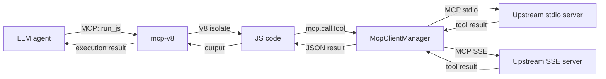

# Calling upstream MCP servers

mcp-v8 is simultaneously an MCP server (it exposes `run_js` and related tools to LLM agents) and an MCP client (it connects to other MCP servers and makes their tools callable from JavaScript running inside the V8 isolate).

## mcp-v8 as both server and client

An LLM agent calls mcp-v8's `run_js` tool to execute JavaScript. Inside that JavaScript the code can call `mcp.callTool("server", "tool", args)`, which crosses a process or network boundary to an upstream MCP server and returns the result as a JavaScript value. From the agent's perspective, a single `run_js` invocation can orchestrate arbitrarily complex sequences of upstream MCP tool calls.



## Why route upstream calls through JavaScript

mcp-v8 could proxy upstream tool calls directly — receive an MCP request from the agent, forward it to an upstream server, and return the response. Instead, upstream tools are exposed only to JavaScript running in the V8 isolate. There are several reasons for this design:

**Composition.** JavaScript can call multiple upstream tools in sequence or in parallel (`Promise.all`), combine results from different servers, and apply arbitrary transformation logic — all within a single `run_js` invocation. A direct proxy cannot do this.

**Heap persistence.** In stateful mode the JavaScript heap is saved as a content-addressed snapshot between executions. Results of expensive upstream calls can be stored in heap variables and reused across many `run_js` calls on the same session without hitting the upstream server again.

**Policy enforcement.** Every `mcp.callTool` invocation is evaluated against the `mcp_tools` OPA policy chain before the upstream server is contacted. The policy receives the server name, tool name, and arguments and can deny the call. A direct proxy would bypass this control point.

**Single execution model.** The agent always interacts with a single tool (`run_js`) regardless of how many upstream servers are connected. This simplifies the agent's decision space.

## The stub/proxy model

Upstream tool discoverability is handled through *stub tools*. When stubs are enabled (the default), mcp-v8 adds an entry to its own `list_tools` response for every upstream tool it knows about. The stub tool name follows this pattern:

```
{prefix}{server}__{tool}
```

The default prefix is `runjs__`. For a server named `github` and a tool named `create_issue`, the stub name is:

```
runjs__github__create_issue
```

The stub tool carries the same input schema as the upstream tool, but its description is rewritten to include a note that it is a stub and instructions on how to invoke the real tool via `run_js`. Calling a stub directly from the MCP protocol never executes the upstream tool; instead mcp-v8 returns a text response with code the agent can paste into a `run_js` call:

```
This tool is a stub. Execute it from JavaScript via the `run_js` tool, e.g.:

const result = await mcp.callTool("github", "create_issue", { ... });
console.log(JSON.stringify(result));
```

This design serves two purposes:

1. **Discoverability.** Agents can find upstream tools through ordinary `list_tools` enumeration without needing prior knowledge of mcp-v8's architecture.
2. **Enforcement.** The actual execution path always runs through JavaScript, ensuring heap persistence, composition, and policies apply unconditionally.

Stubs can be disabled entirely with `--mcp-stubs false`. The prefix can be changed with `--mcp-stub-prefix`. Changing the prefix does not affect the JavaScript `mcp` API, which always uses the original server and tool names.

## Connecting multiple servers

mcp-v8 connects to all configured upstream servers at startup and keeps those connections alive. Each server has a unique logical name (a duplicate name causes a startup error). All tools from all servers are accessible in the JavaScript global `mcp` object simultaneously:

```js
mcp.servers           // ["github", "jira", "db"]
mcp.listTools("github")   // tools on the github server
mcp.listTools()           // tools across all servers
```

## Composing MCP servers

Because JavaScript running in the isolate can call multiple upstream servers, mcp-v8 acts as a composable hub:

```js
// Fetch an open GitHub issue and create a matching Jira ticket
const issues = await mcp.callTool("github", "list_issues", { owner: "acme", repo: "api", state: "open" });
const first = JSON.parse(issues.content[0].text)[0];
await mcp.callTool("jira", "create_issue", {
  project: "ACME",
  summary: first.title,
  description: first.body,
});
```

A single `run_js` call from the agent orchestrates two upstream MCP servers, with the JavaScript code handling the data mapping between them.

## Policy and security

Each `mcp.callTool` invocation is checked against the `mcp_tools` OPA policy chain (if configured) before reaching the upstream server. The policy input is:

```json
{
  "operation": "mcp_call_tool",
  "server": "<server-name>",
  "tool": "<tool-name>",
  "arguments": { ... }
}
```

If the policy returns `false`, `mcp.callTool` throws a JavaScript error and the upstream server is never contacted. This lets operators enforce per-server and per-tool access control independently of the JavaScript code the agent submits.

## See also

- [How-to guide](../how-to/mcp-client.md)
- [Reference](../reference/mcp-client.md)
- [Security policies](../concepts/policies.md)
- [MCP tools reference](../reference/mcp-tools.md)
