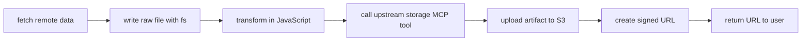

# MCP Pass-Through

`mcp-v8` can register MCP servers as function calls in the v8 runtime. When combined with stubs, this provides a robust surface for progressive tool disclosure, and composability of toolc calls.

## Register sub-servers

You register upstream MCP servers with `--mcp-server` or `--mcp-config`.
Those definitions tell `mcp-v8` which external servers to connect to at
startup.

At the conceptual level, each configured sub-server becomes another capability
source for the JavaScript runtime.

See [Connect as an MCP Server](../how-to/connect-as-an-mcp-server.md) and
[CLI Flags](../reference/cli-flags.md) for configuration details.

## Call upstream tools from JavaScript

Inside the runtime, upstream tools are exposed through `globalThis.mcp`.

The important pieces are:

- `mcp.servers` for connected server names
- `mcp.listTools()` for discovery
- `mcp.callTool(server, tool, args)` for execution

Conceptually, that means an agent can use JavaScript as the orchestration
layer while still reaching out to other MCP systems when needed.

```js
const tools = mcp.listTools("github");
const result = await mcp.callTool("github", "create_issue", {
  owner: "acme",
  repo: "roadmap",
  title: "Document MCP pass-through",
});

console.log(JSON.stringify(result, null, 2));
```

The tool call still happens through `run_js`, not as a separate direct tool
dispatch from the outer MCP client.

## Expose stub tools for discovery

`mcp-v8` can also publish optional stub tools on its own MCP surface. These
stubs mirror the upstream tools with names like
`runjs__github__create_issue`.

This is useful because it preserves native MCP tool discovery for downstream
agents:

- the agent can see the tool in `tools/list`
- the tool carries the upstream input schema
- the agent can reason about the tool as if it were locally available

But the stub is intentionally not a direct proxy. Calling it returns
instructions telling the agent to invoke the tool through `run_js` and
`mcp.callTool(...)`.


## Compose tools without pushing data through the context window

One of the main benefits of pass-through is that JavaScript can compose local
runtime capabilities and upstream MCP tools in one workflow.

For example, an agent might:

1. fetch structured data from an external API
2. write the raw response to the sandboxed filesystem
3. transform it into a smaller report
4. call an upstream storage MCP server to upload the result to S3
5. call another upstream tool to create a signed URL
6. return only the signed URL and a short summary to the user

Conceptually:



The key advantage is that the large payload never has to be copied into the
agent's context window. The runtime can fetch, store, transform, and hand off
artifacts in place, then return only the useful result.

That is a good fit for:

- large API responses
- multi-step document generation
- binary or structured artifacts
- workflows where the user only needs a link, summary, or final status

## Policy and control boundaries

Pass-through does not mean "anything connected is automatically trusted."

`mcp.callTool()` can still be gated by policy. That lets operators control
which upstream servers and tools the runtime may use, and with what arguments.

So the control chain becomes:

- discover or select an upstream tool
- invoke it from JavaScript
- evaluate policy
- call the upstream MCP server only if allowed

See [Policy System](policy-system.md) for the broader policy model.

## When to use pass-through

Use MCP pass-through when:

- JavaScript should orchestrate several steps around an upstream tool call
- the agent benefits from heaps, sessions, or captured output
- you want discovery to stay visible through MCP stubs
- you want one runtime to coordinate both local code and remote MCP tools

Call an upstream server directly from the outer client instead when the
runtime adds no value and you do not need `run_js` as the execution layer.

## Related concepts

- [Integration Surfaces](integration-surfaces.md)
- [JavaScript Runtime](javascript-runtime.md)
- [Policy System](policy-system.md)
- [MCP Tools](../reference/mcp-tools.md)
