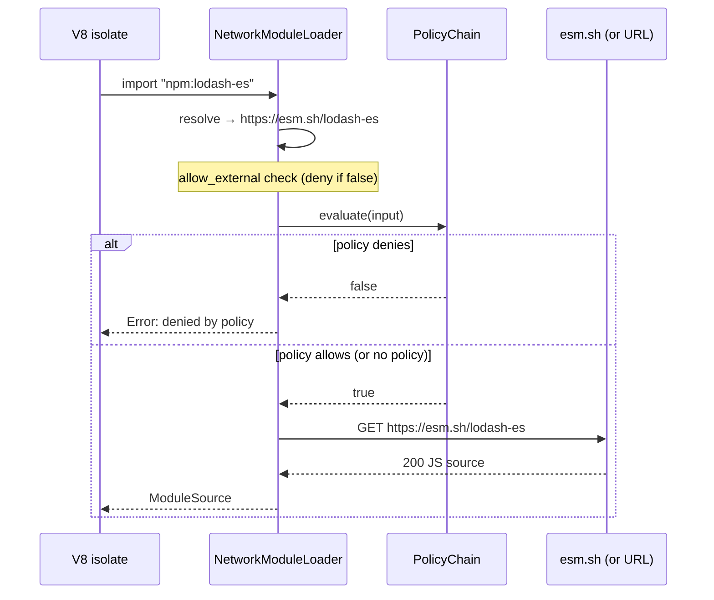

# ES module imports

An explanation of how mcp-v8 resolves and fetches ES modules, why external imports are off by default, and how policy gating reduces supply-chain risk.

## Why imports are disabled by default

Every ES module import is a network request to an external host. In the context of an AI-agent workload, code is generated dynamically — the server operator may not know in advance what packages an agent will try to import. Allowing unrestricted network fetches at import time creates two related problems:

- **Data exfiltration**: a crafted `import` URL can be used to send data to an attacker-controlled host via the URL itself or the HTTP headers of the request.
- **Supply-chain compromise**: a typosquatted or malicious package fetched live can execute arbitrary code inside the V8 isolate.

Setting `allow_external` to `false` by default means the server is safe out of the box. An operator who needs module imports explicitly opts in with `--allow-external-modules`, and can immediately further restrict what can be imported with a policy.

## Specifier resolution

The module loader handles four specifier forms, checked in order during the `resolve` phase:

| Specifier form | `allow_external` gate | Resolves to |
|---|---|---|
| `npm:<rest>` | yes — blocked if disabled | `https://esm.sh/<rest>` |
| `jsr:<rest>` | yes — blocked if disabled | `https://esm.sh/jsr/<rest>` |
| `https://…` or `http://…` | yes — blocked if disabled | URL as-is |
| Relative (`./foo.js`) | no gate applied | resolved against referrer URL |

`npm:` and `jsr:` specifiers are a developer-convenience layer: they are translated to `https://esm.sh/…` before any network activity occurs. The `esm.sh` CDN serves ES-module-compatible builds of npm and JSR packages. This means that at the policy and network level, all external imports ultimately appear as `https://esm.sh/…` URLs, regardless of the specifier form used in source code.

Relative specifiers are resolved using standard URL-relative resolution (`resolve_import` from `deno_core`) against the URL of the importing module. They do not trigger the `allow_external` gate and are not subject to policy evaluation; they are resolved and fetched as part of the same HTTP module graph.

## Module loading and fetch

After resolution, the loader's `load` phase fetches the module source over HTTP. Only `https` and `http` schemes are supported; attempts to load from any other scheme (e.g. `file://`) are rejected with a synchronous error.

Fetch parameters are fixed:

- Connect timeout: **10 seconds**
- Total request timeout: **30 seconds**

If the HTTP response is a redirect, the loader records the final URL. If the final URL path ends in `.ts` or `.tsx`, the response body is passed through the same swc-based TypeScript transpiler used for inline code before being handed to V8 as JavaScript.



## Policy gating

When a `modules` policy chain is configured, it is evaluated inside the `load` phase, after `allow_external` has already been confirmed but before the HTTP request is sent. This means:

1. The `allow_external` flag acts as a binary kill switch — no policy can override it.
2. The policy acts as a fine-grained allowlist on top of the flag.

The policy receives an `input` document with the following shape:

```json
{
  "specifier": "https://esm.sh/lodash-es",
  "specifier_type": "npm",
  "resolved_url": "https://esm.sh/lodash-es",
  "url_parsed": {
    "scheme": "https",
    "host": "esm.sh",
    "path": "/lodash-es"
  }
}
```

`specifier_type` is derived from the resolved URL:

- `"npm"` — resolved URL contains `esm.sh/` (excluding `esm.sh/jsr/`)
- `"jsr"` — resolved URL contains `esm.sh/jsr/`
- `"url"` — any other HTTP/HTTPS URL

The policy entrypoint is `data.mcp.modules.allow`. A `false` or undefined result blocks the fetch; the execution receives a `Module import denied by policy` error.

## Supply-chain risk considerations

Even with a policy, consider the following:

- The policy allowlists by host and path prefix, but CDN redirects may land on a different subdomain (e.g. a `*.esm.sh` CDN edge). The example policy in `policies/modules.rego` accounts for this with a wildcard suffix rule for `.esm.sh`.
- Pinning by exact path prefix (e.g. `/lodash-es@4.17.21`) prevents loading a newer, potentially modified version of a package.
- An HTTP (non-TLS) import URL allows a man-in-the-middle to serve modified module source. Prefer `https://` URLs and treat `http://` as suitable only in controlled development environments.
- Modules are fetched fresh on every execution that imports them; there is no built-in module cache across executions. This means network availability affects execution reliability, but also means no stale cached code is served.

## See also

- [How-to: ES module imports](../how-to/module-imports.md)
- [Reference: ES module imports](../reference/module-imports.md)
- [Concepts: Security policies](../concepts/policies.md)
- [Concepts: WebAssembly modules](../concepts/wasm-modules.md)
- [Concepts: Running JavaScript & TypeScript](../concepts/js-execution.md)
