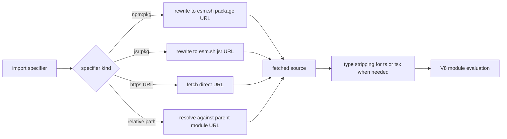

# Module Loading

`mcp-v8` runs user code as ES modules. External modules are disabled by
default, and become available only when the server is started with
`--allow-external-modules`.

When external loading is enabled, the system supports:

- `npm:` specifiers
- `jsr:` specifiers
- direct `http://` and `https://` URL imports
- relative imports that resolve against a fetched parent module



This is a networked runtime resolution model, not a local package-manager
model. There is no `npm install` phase inside the server. Modules are resolved
and fetched at execution time.

Conceptually, that means code can look like this:

```javascript
import { camelCase } from "npm:lodash-es@4.17.21";
import { camelCase as jsrCamelCase } from "jsr:@luca/cases@1.0.0";
import config from "https://example.com/config.js";
import { helper } from "./helper.ts";
```

Those examples illustrate four distinct paths:

- `npm:` specifiers are rewritten to `esm.sh` package URLs
- `jsr:` specifiers are rewritten to `esm.sh/jsr/...` URLs
- direct `https://` imports are fetched as-is
- relative imports are resolved against the parent module's fetched URL

TypeScript support fits into this same model. Type annotations are stripped
before execution, but there is no type checking. Invalid types are removed, not
validated.

For example, a fetched TypeScript helper module can still be imported directly:

```typescript
import { helper } from "./helper.ts";

const result: string = helper();
```

The annotations are removed before execution, but the runtime does not verify
that `result` is actually a string.

Policy can also sit in this path. If module policies are configured, imports
can be audited before the fetch happens.

See [Reference](../reference/cli-flags.md) for the enabling flags and
[Policy System](policy-system.md) for the gating model around imports.
