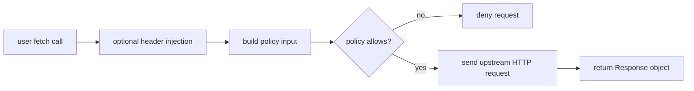

# Network Access

`mcp-v8` does not expose unrestricted network access by default. The
`fetch()` function becomes available only when the server is configured with
fetch policies.

Once enabled, the runtime follows the web-standard fetch model closely enough
for common HTTP workflows: requests produce `Response` objects, headers are
available through the standard accessors, and response bodies can be consumed
with `.text()` or `.json()`.

Header injection sits in this path. Rules can add static headers, or they can
acquire OAuth client-credentials tokens and inject them before the outbound
request is sent.

That makes network access more than a simple on or off capability. A request
may be shaped by:

- policy checks
- static or dynamic header injection
- precedence rules between injected headers and user-supplied headers

This page should help readers understand the runtime behavior. For setup, see
[Enable OPA Policies](../how-to/enable-opa-policies.md) and
[Configure Fetch Header Injection](../how-to/configure-fetch-header-injection.md).
