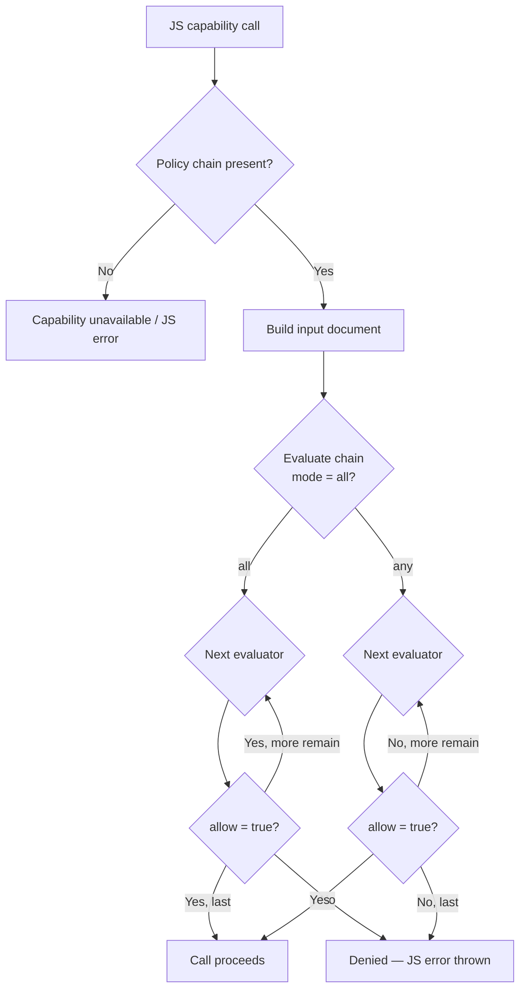

# Security policies (OPA/Rego)

mcp-v8 gates every host capability — network access, filesystem operations, subprocess execution, ES module imports, and upstream MCP tool calls — through an embedded policy engine. This page explains the design of that system, the trade-offs between local and remote evaluation, and the exact information each category of policy receives.

## The capability model

JavaScript code running inside a V8 isolate has no host access by default. Each capability is a distinct, opt-in channel:

| Capability | Enabled by | Policy category |
|---|---|---|
| `fetch()` | fetch policy present | `fetch` |
| `fs.*` | filesystem policy present | `filesystem` |
| `Deno.Command` / `child_process.exec` | subprocess policy present | `subprocess` |
| ES `import` | `--allow-external-modules` + optional policy | `modules` |
| `mcp.callTool()` | `--mcp-server` + MCP tools policy | `mcp_tools` |

Absent a policy for a category, the capability is unavailable. The JS globals (`fetch`, `fs`, `Deno.Command`, etc.) are not injected into the isolate at all when the corresponding policy chain is not configured. This means a capability cannot be reached even if malicious code attempts to access it by name.

## Default-deny within a category

When a policy chain is present, its evaluators return a boolean decision for each operation. The default rule in every well-formed Rego policy is:

```rego
default allow = false
```

Any request that does not match an explicit `allow` rule is denied. This means you only need to enumerate what is permitted, not what is forbidden.

## Policy chains and evaluation

A category's configuration holds an ordered list of **policy evaluators** (a policy chain) and an **evaluation mode**. Each evaluator is either a call to a remote OPA server or an evaluation of a local Rego engine (regorus). The chain is built once at startup from the `--policies-json` configuration.

### Evaluation modes

Two modes control how the chain's results are combined:

| Mode | Description |
|---|---|
| `"all"` (default) | Every evaluator in the chain must return `allow = true`. The first denial short-circuits the check. |
| `"any"` | The call is allowed if at least one evaluator returns `allow = true`. The first approval short-circuits. |

An empty policy chain (no evaluators) always allows, consistent with the principle that loading the capability at all is a deliberate act.

### Decision flow



## OPA vs embedded regorus

mcp-v8 supports two evaluation backends, selected by the `url` scheme in each policy source entry:

### Remote OPA (`http://` or `https://`)

The server makes an HTTP POST to `{url}/v1/data/{policy_path}` with a JSON body `{"input": <input_document>}` and reads `result.allow`. This is the standard OPA REST API. A timeout of 5 seconds is enforced per request.

**Trade-offs:**
- Policies can be updated without restarting mcp-v8.
- Adds a network round-trip to every capability call.
- Requires an OPA server to be running and reachable.
- Suitable for centralized, shared policy management.

### Embedded regorus (`file://`)

The policy (one `.rego` file or a directory of `.rego` files) is loaded into a [regorus](https://github.com/microsoft/regorus) engine at startup and evaluated in-process. The rule named by `rule` (default: `data.mcp.<category>.allow`) is evaluated against the input document.

**Trade-offs:**
- Zero network overhead; evaluation is synchronous and in-process.
- Policy changes require a server restart.
- Suitable for static policies baked into a deployment.

Both backends can be mixed in a single chain. For example: a fast local allowlist as the first evaluator, and a remote OPA as the authoritative decision-maker using `mode: "any"`.

## Per-category input documents

Each capability passes a different structured input document to the policy evaluators. Below is a summary of the key fields; the [reference page](../reference/policies.md) lists every field precisely.

### `fetch`

```json
{
  "operation": "fetch",
  "url": "https://api.example.com/v1/data",
  "method": "GET",
  "headers": {"Authorization": "Bearer <token>"},
  "url_parsed": {
    "scheme": "https",
    "host": "api.example.com",
    "port": null,
    "path": "/v1/data",
    "query": ""
  }
}
```

The `headers` map reflects all headers sent to the upstream server, including those injected by `--fetch-header` rules. Policies can inspect the full request context.

### `filesystem`

```json
{
  "operation": "readFile",
  "path": "/data/workspace/file.txt",
  "encoding": "utf8",
  "mcp_headers": {"session-id": "abc-123"}
}
```

`destination` is present only for `rename` and `copyFile`; it is omitted entirely for all other operations (not serialized as `null`). `encoding` is present for text reads (`"utf8"`) and buffer reads (`"buffer"`); it is omitted for write and directory operations. `mcp_headers` contains any `X-MCP-*` headers (with the `x-mcp-` prefix stripped) sent during session initialization — useful for per-user path restrictions.

### `subprocess`

```json
{
  "operation": "command_output",
  "command": "echo",
  "args": ["hello"],
  "cwd": "/tmp",
  "env": {"PATH": "/usr/bin"}
}
```

`operation` is `"command_output"` for `Deno.Command.output()` and `"exec"` for `child_process.exec`. For `exec`, `args[1]` is the shell command string.

### `modules`

```json
{
  "specifier": "https://esm.sh/lodash-es",
  "specifier_type": "npm",
  "resolved_url": "https://esm.sh/lodash-es",
  "url_parsed": {
    "scheme": "https",
    "host": "esm.sh",
    "path": "/lodash-es"
  }
}
```

`specifier_type` is `"npm"` for esm.sh-hosted npm packages, `"jsr"` for esm.sh-hosted JSR packages, and `"url"` for all other URL imports.

### `mcp_tools`

```json
{
  "operation": "mcp_call_tool",
  "server": "math",
  "tool": "add",
  "arguments": {"a": 1, "b": 2}
}
```

`arguments` is `null` when no arguments are provided.

## Security implications

- Policies run on every capability call, not just at startup. A policy that accidentally returns `true` for all inputs (e.g., missing a `default allow = false`) is an allow-all policy.
- For remote OPA, a network failure or a 5-second timeout is treated as a policy error, not a permit. The call is denied.
- The `file://` path must be an absolute path. Relative paths are not resolved.
- Directory loading picks up all `.rego` files in sorted order. Non-`.rego` files are silently ignored.

## See also

- [How-to: Security policies](../how-to/policies.md)
- [Reference: Security policies](../reference/policies.md)
- [Concepts: Network access with fetch](../concepts/fetch.md)
- [Concepts: Filesystem access](../concepts/filesystem.md)
- [Concepts: Subprocess execution](../concepts/subprocess.md)
- [Concepts: ES module imports](../concepts/module-imports.md)
- [Concepts: Calling upstream MCP servers](../concepts/mcp-client.md)
