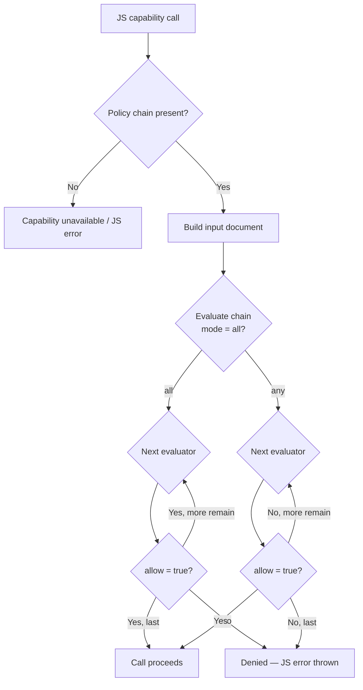

# Security policies (OPA/Rego)

mcp-v8 gates every host capability — network access, filesystem operations, subprocess execution, ES module imports, and upstream MCP tool calls — through an embedded policy engine. This page explains the design of that system, the trade-offs between local and remote evaluation, and the exact information each category of policy receives.

## The capability model

JavaScript code running inside a V8 isolate has no host access by default. Each capability is a distinct, opt-in channel:

| Capability | Enabled by | Policy category |
|---|---|---|
| `fetch()` | fetch policy present | `fetch` |
| `fs.*` | filesystem policy present | `filesystem` |
| `Deno.Command` / `child_process.exec` | subprocess policy present | `subprocess` |
| ES `import` | `--allow-external-modules` + optional policy | `modules` |
| `mcp.callTool()` | `--mcp-server` + MCP tools policy | `mcp_tools` |
| `run_js` `file` parameter | `--allow-run-js-file` or run_js_file policy | `run_js_file` |

Absent a policy for a category, the capability is unavailable. The JS globals (`fetch`, `fs`, `Deno.Command`, etc.) are not injected into the isolate at all when the corresponding policy chain is not configured. This means a capability cannot be reached even if malicious code attempts to access it by name.

The `run_js_file` category is slightly different from the others: rather than gating a JS global inside the isolate, it gates a **host-side file read** that happens *before* execution — when a `run_js` call supplies a `file` path instead of inline `code`, the server reads that path from its own filesystem. It is off by default; `--allow-run-js-file` allows any path, while a `run_js_file` policy authorizes paths individually (the path is canonicalized first, so `..` cannot escape an allowed directory).

## Default-deny within a category

When a policy chain is present, its evaluators return a boolean decision for each operation. The default rule in every well-formed Rego policy is:

```rego
default allow = false
```

Any request that does not match an explicit `allow` rule is denied. This means you only need to enumerate what is permitted, not what is forbidden.

## Policy chains and evaluation

A category's configuration holds an ordered list of **policy evaluators** (a policy chain) and an **evaluation mode**. Each evaluator is either a call to a remote OPA server or an evaluation of a local Rego engine (regorus). The chain is built once at startup from the `--policies-json` configuration.

### Evaluation modes

Two modes control how the chain's results are combined:

| Mode | Description |
|---|---|
| `"all"` (default) | Every evaluator in the chain must return `allow = true`. The first denial short-circuits the check. |
| `"any"` | The call is allowed if at least one evaluator returns `allow = true`. The first approval short-circuits. |

An empty policy chain (no evaluators) always allows, consistent with the principle that loading the capability at all is a deliberate act.

### Decision flow


```mermaid
flowchart TD
    A[JS capability call] --> B{Policy chain present?}
    B -- No --> C[Capability unavailable / JS error]
    B -- Yes --> D[Build input document]
    D --> E{Evaluate chain<br/>mode = all?}
    E -- all --> F{Next evaluator}
    F --> G{allow = true?}
    G -- Yes, more remain --> F
    G -- Yes, last --> H[Call proceeds]
    G -- No --> I[Denied — JS error thrown]
    E -- any --> J{Next evaluator}
    J --> K{allow = true?}
    K -- Yes --> H
    K -- No, more remain --> J
    K -- No, last --> I
```

## Pre/post hooks

Policies answer one question — allow or deny. **Hooks** generalize the gate: each category can also run an ordered list of `pre` hooks (which see the operation input and may deny it *or rewrite it*) and `post` hooks (which see the input and output and may deny the result or rewrite the output). Hooks use the same source vocabulary as policies (`file://` Rego via regorus, `http(s)://` OPA-style REST) plus JavaScript (`file://….js`), and are configured alongside them:

```json
{
  "fetch": {
    "policies": [{"url": "file:///etc/policies/fetch.rego"}],
    "pre":      [{"url": "file:///etc/policies/fetch_hooks.rego"}],
    "post":     [{"url": "file:///etc/policies/fetch_hooks.rego"}]
  }
}
```

Internally, **policies are pre hooks**: the configured policy chain runs as the *last* pre hook, so it always evaluates the effective (post-mutation) input. A pre hook can therefore rewrite a request into compliance, but never rewrite one out from under an approval the policy already gave.

### Hook result contract

A hook rule (default: `data.mcp.<category>.pre` / `.post`; remote default path: `mcp/<category>/pre` / `/post`) evaluates to either a bare boolean (pure policy behavior) or an object:

| Field | Meaning |
|---|---|
| `allow` (bool, default `true`) | Deny the operation when `false` |
| `reason` (string) | Human-readable denial reason, surfaced in the JS error |
| `input` (object, pre only) | Replacement operation input |
| `output` (object, post only) | Replacement operation output |

A Rego rule that is *undefined* for a given input abstains — allow, no mutation — so partial rules compose naturally. Hooks run in configured order, each seeing the previous hook's effective value.

```rego
package mcp.fetch

# pre: tag every request, and upgrade http:// to https://
pre := {"input": patched} if {
    startswith(input.url, "http://")
    patched := object.union(input, {
        "url": concat("", ["https://", substring(input.url, 7, -1)]),
    })
}

# post: refuse to hand oversized responses back to the isolate
post := {"allow": false, "reason": "response too large"} if {
    count(input.output.body) > 10000000
}
```

Pre hooks receive the same input document the category's policies see. Post hooks receive `{"input": <effective input>, "output": <operation output>}` — for fetch, the output is `{status, statusText, url, headers, body, bodyEncoding, redirected}` with `body` base64-encoded.

### JavaScript hooks

A hook source whose `file://` URL ends in `.js` is a JavaScript hook. The file defines global functions — `pre(input)` and/or `post(input, output)` (names overridable per source via `rule`) — with the same return semantics as Rego hooks: `undefined`/`null` abstains, a bool allows or denies, and `{allow, reason, input|output}` denies or rewrites.

```js
function pre(input) {
    if (input.url_parsed.query.toLowerCase().includes("api_key=")) {
        return { allow: false, reason: "credentials in query string" };
    }
    if (input.url.startsWith("http://")) {
        return { input: { ...input, url: "https://" + input.url.slice(7) } };
    }
}

function post(input, output) {
    if (output.status >= 500) return { allow: false, reason: "upstream error" };
}
```

Each JS hook file runs in its own **bare V8 isolate with no host capabilities** — no `fetch`, no `fs`, no ops of any kind; a hook is pure computation over its arguments. The isolate lives on a dedicated worker thread (never a sandbox's isolate thread) and stays warm across calls, so top-level state in the file persists — deliberately, for counters and caches; calls through one evaluator are serialized. Hooks must be synchronous (returning a Promise is an error), and each call is bounded by a timeout (`timeout_ms` per source, default 5000 ms) after which the script is terminated and the operation fails closed.

The `--policies-json` config for the example above is the same as any other hook source:

```json
{"fetch": {"pre": [{"url": "file:///etc/policies/fetch_hooks.js"}],
            "post": [{"url": "file:///etc/policies/fetch_hooks.js", "timeout_ms": 1000}]}}
```

### Per-category hook capabilities

Not every operation can honor a rewritten input, and not every operation produces a hookable output:

| Category | Pre hooks | Input mutation applied | Post hooks (output mutation) |
|---|---|---|---|
| `fetch` | ✓ | ✓ (`url`, `method`, `headers`) | ✓ (response) |
| `filesystem` | ✓ | ✓ (`path`, `destination`) | — |
| `subprocess` | ✓ | ✓ (`command`, `args`, `cwd`, `env`) | ✓ (`{code, stdout, stderr, success}`) |
| `mcp_tools` | ✓ | ✓ (`server`, `tool`, `arguments`) | ✓ (tool result) |
| `run_js_file` | ✓ | ✓ (`path`, re-canonicalized after rewrite) | — |
| `websocket` | ✓ (gate-only) | — | — |
| `http2` | ✓ (gate-only) | — | — |
| `modules` | ✓ (gate-only) | — | — |
| `fs_snapshot` | ✓ (gate-only) | — | — |

The rules fail closed: a pre hook that returns a replacement `input` for a gate-only category errors the operation rather than silently ignoring the rewrite, and configuring `post` hooks for a category without a hookable output is a startup error.

Two details worth knowing for `fetch`: derived fields are re-normalized after every mutation (`url_parsed` is recomputed from the rewritten `url`, so later hooks and the policy never see a stale parse), and `--fetch-header` credential injection runs *before* the hook chain, keyed on the URL as requested by JS — a pre hook that rewrites the URL host sees every header and owns the consequences (injection is not re-run for the new host). Similarly, `run_js_file` re-canonicalizes a rewritten path immediately, preserving the invariant that its policies only ever see canonicalized paths.

Hooks are operator configuration, loaded from the same trusted `--policies-json` as policies — they are not reachable or modifiable from sandboxed JS.

## OPA vs embedded regorus

mcp-v8 supports two evaluation backends, selected by the `url` scheme in each policy source entry:

### Remote OPA (`http://` or `https://`)

The server makes an HTTP POST to `{url}/v1/data/{policy_path}` with a JSON body `{"input": <input_document>}` and reads `result.allow`. This is the standard OPA REST API. A timeout of 5 seconds is enforced per request.

**Trade-offs:**
- Policies can be updated without restarting mcp-v8.
- Adds a network round-trip to every capability call.
- Requires an OPA server to be running and reachable.
- Suitable for centralized, shared policy management.

### Embedded regorus (`file://`)

The policy (one `.rego` file or a directory of `.rego` files) is loaded into a [regorus](https://github.com/microsoft/regorus) engine at startup and evaluated in-process. The rule named by `rule` (default: `data.mcp.<category>.allow`) is evaluated against the input document.

**Trade-offs:**
- Zero network overhead; evaluation is synchronous and in-process.
- Policy changes require a server restart.
- Suitable for static policies baked into a deployment.

Both backends can be mixed in a single chain. For example: a fast local allowlist as the first evaluator, and a remote OPA as the authoritative decision-maker using `mode: "any"`.

## Per-category input documents

Each capability passes a different structured input document to the policy evaluators. Below is a summary of the key fields.

### `fetch`

```json
{
  "operation": "fetch",
  "url": "https://api.example.com/v1/data",
  "method": "GET",
  "headers": {"Authorization": "Bearer <token>"},
  "url_parsed": {
    "scheme": "https",
    "host": "api.example.com",
    "port": null,
    "path": "/v1/data",
    "query": ""
  }
}
```

The `headers` map reflects all headers sent to the upstream server, including those injected by `--fetch-header` rules. Policies can inspect the full request context.

### `filesystem`

```json
{
  "operation": "readFile",
  "path": "/data/workspace/file.txt",
  "encoding": "utf8",
  "mcp_headers": {"session-id": "abc-123"}
}
```

`destination` is present only for `rename` and `copyFile`; it is omitted entirely for all other operations (not serialized as `null`). `encoding` is present for text reads (`"utf8"`) and buffer reads (`"buffer"`); it is omitted for write and directory operations. `mcp_headers` contains any `X-MCP-*` headers (with the `x-mcp-` prefix stripped) sent during session initialization — useful for per-user path restrictions.

### `subprocess`

```json
{
  "operation": "command_output",
  "command": "echo",
  "args": ["hello"],
  "cwd": "/tmp",
  "env": {"PATH": "/usr/bin"}
}
```

`operation` is `"command_output"` for `Deno.Command.output()` and `"exec"` for `child_process.exec`. For `exec`, `args[1]` is the shell command string.

### `modules`

```json
{
  "specifier": "https://esm.sh/lodash-es",
  "specifier_type": "npm",
  "resolved_url": "https://esm.sh/lodash-es",
  "url_parsed": {
    "scheme": "https",
    "host": "esm.sh",
    "path": "/lodash-es"
  }
}
```

`specifier_type` is `"npm"` for esm.sh-hosted npm packages, `"jsr"` for esm.sh-hosted JSR packages, and `"url"` for all other URL imports.

### `mcp_tools`

```json
{
  "operation": "mcp_call_tool",
  "server": "math",
  "tool": "add",
  "arguments": {"a": 1, "b": 2}
}
```

`arguments` is `null` when no arguments are provided.

## Security implications

- Policies run on every capability call, not just at startup. A policy that accidentally returns `true` for all inputs (e.g., missing a `default allow = false`) is an allow-all policy.
- For remote OPA, a network failure or a 5-second timeout is treated as a policy error, not a permit. The call is denied.
- The `file://` path must be an absolute path. Relative paths are not resolved.
- Directory loading picks up all `.rego` files in sorted order. Non-`.rego` files are silently ignored.

## See also

- [How-to: Security policies](../how-to/policies.md)
- [Concepts: Network access with fetch](../concepts/fetch.md)
- [Concepts: Filesystem access](../concepts/filesystem.md)
- [Concepts: Subprocess execution](../concepts/subprocess.md)
- [Concepts: ES module imports](../concepts/module-imports.md)
- [Concepts: Calling upstream MCP servers](../concepts/mcp-client.md)
