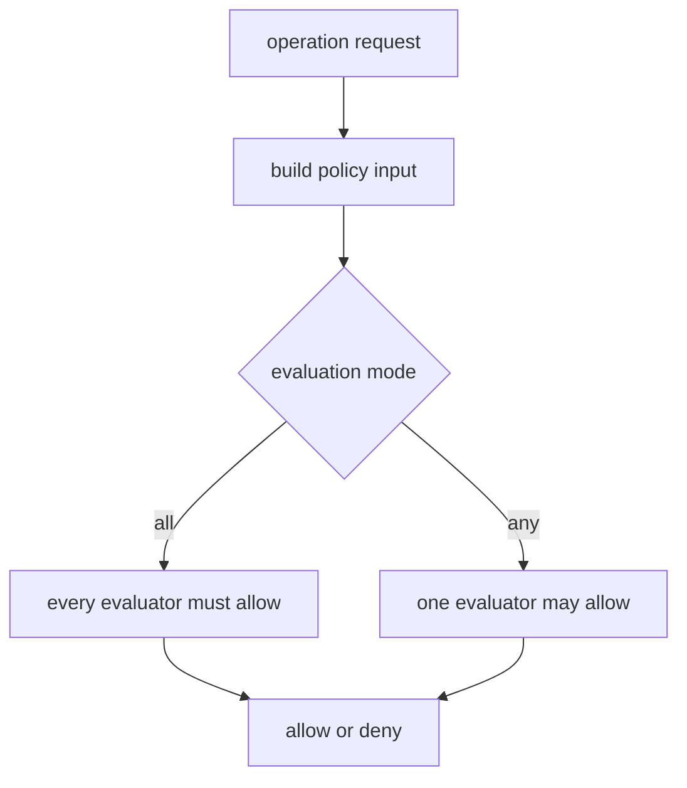

# Policy System

Optional capabilities in `mcp-v8` are policy-gated instead of enabled by
default. This keeps powerful operations available when needed without making
network, filesystem, or subprocess access part of the baseline runtime.

The policy system is driven by `--policies-json`, which defines policy chains
for operation namespaces such as fetch, modules, filesystem access,
`mcp.callTool()`, and subprocess execution.

Each policy chain can be evaluated in one of two modes:

- **`all`** means every configured evaluator must allow the operation
- **`any`** means any one evaluator may allow it

Evaluators can be:

- **local Rego** loaded from `file://` paths and evaluated with Regorus
- **remote OPA** reached through `http://` or `https://` endpoints

Operation namespaces matter because each capability has its own default rule
path and policy input shape. A fetch request is evaluated differently from a
filesystem write or a subprocess launch.

This page is the conceptual umbrella. For concrete policy configuration, see
[Policy Files](../reference/policy-files.md). For capability-specific policy
behavior, see [Network Access](network-access.md) and
[Filesystem Access](filesystem-access.md).
