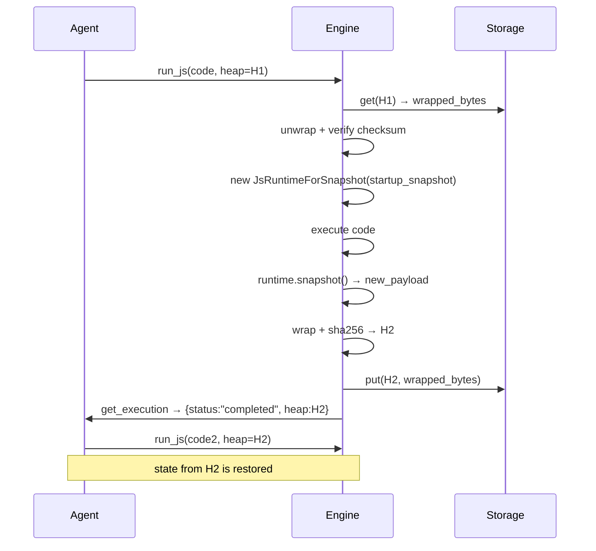

# Stateful sessions & heap snapshots

mcp-v8's stateful mode persists the V8 heap between `run_js` calls using content-addressed snapshots. This page explains the snapshot model, why state survives across executions, how sessions differ from heaps, and the guarantees that follow from the design.

## Content-addressed heap snapshots

After each stateful execution the server serialises the V8 isolate into a snapshot using deno_core's `JsRuntimeForSnapshot::snapshot()`. The raw payload is then wrapped in a framing format:

| Offset | Length | Content |
|--------|--------|---------|
| 0 | 10 bytes | Magic header `MCPV8SNAP\x00` |
| 10 | 32 bytes | SHA-256 of the V8 payload |
| 42 | variable | V8 snapshot payload (≥ 100 KiB) |

The **heap key** is the hex-encoded SHA-256 of the V8 payload — the same bytes that appear at offset 10 of the wrapped file. The server uses this hash as the storage key (a file name for the local filesystem backend, an S3 object key for the S3 backend). Because the key is derived from the content rather than assigned sequentially, identical snapshots always map to the same key.

On read, `unwrap_snapshot` verifies the magic header, recomputes the SHA-256, and rejects any file whose checksum does not match before handing the raw payload to V8.

## Why state survives across calls

When a `run_js` call includes a `heap` parameter the engine:

1. Fetches the wrapped snapshot bytes from storage using the provided hash.
2. Unwraps and verifies the checksum.
3. Passes the raw V8 payload as `startup_snapshot` to a new `JsRuntimeForSnapshot`.
4. Runs the new code inside that isolate.
5. Calls `runtime.snapshot()` to capture the new state, wraps it, and derives a new content hash.
6. Stores the new wrapped snapshot under the new hash.
7. Returns the new hash as the `heap` field of the completed execution.

A call without a `heap` parameter starts a fresh isolate. In both cases the V8 state after execution is persisted and its hash is made available via `get_execution`.



## Sessions vs heaps

These are two distinct, complementary concepts:

| | Session | Heap |
|---|---|---|
| Identity | A string name supplied by the caller | A 64-char hex SHA-256 hash derived from content |
| Lifetime | Persists in the sled metadata DB until explicitly cleared | Persists in heap storage (local FS or S3) indefinitely |
| Purpose | Ordered audit log of which heaps were produced | The actual V8 state bytes |
| Created by | `X-MCP-Session-Id` header on `initialize`, or `session` field in REST `POST /api/exec` | Every stateful execution |

A session does not own its heaps. Multiple sessions can reference the same heap hash, and a heap hash is valid without any session association. Sessions are primarily useful for tracing the evolution of state over time and for finding which heap key to resume from.

## The session log

Each stateful execution that has a session name writes a `SessionLogEntry` to the sled metadata database (at `--session-db-path`, default `/tmp/mcp-v8-sessions`):

```
SessionLogEntry {
    input_heap:  Option<String>,   // heap hash passed to this execution, or null
    output_heap: String,           // heap hash produced by this execution
    code:        String,           // JavaScript source that was executed
    timestamp:   String,           // RFC 3339 UTC timestamp
}
```

Entries are appended in execution order and exposed through `list_session_snapshots`. In cluster mode, entries are replicated to all peers via Raft. The `index` field in the returned JSON reflects insertion order within the session (a monotonically increasing integer).

## Immutability and deduplication

Heap snapshots are immutable by definition: the key is derived from the content. Writing the same V8 state twice produces the same key and results in an idempotent storage write — no duplicate data is created. This property holds across nodes in a cluster because all nodes share the same storage backend.

Tags (key-value metadata stored in sled under the `heap_tags` tree, keyed by `ht:<hash>`) are mutable and are not part of the content hash. Replacing tags on a heap does not produce a new heap.

## Security and integrity

The SHA-256 checksum in the snapshot header provides tamper detection. A snapshot loaded from an untrusted source whose checksum does not match the stored hash is rejected before the bytes reach V8. This prevents a corrupted or maliciously modified file from being executed.

## Stateful vs stateless mode

Session and heap features are only available in stateful mode. In `--stateless` mode the engine holds no `HeapStorage`, `SessionLog`, or `HeapTagStore`; the heap-related tools are not exposed and `run_js` does not accept a `heap` parameter.

## See also

- [Tutorial: sessions & heap snapshots](../tutorials/sessions-and-heaps.md)
- [How-to: sessions & heap snapshots](../how-to/sessions-and-heaps.md)
- [Reference: sessions & heap snapshots](../reference/sessions-and-heaps.md)
- [Storage backends](../concepts/storage-backends.md)
- [Running JavaScript & TypeScript](../concepts/js-execution.md)
- [Asynchronous execution & output](../concepts/async-execution.md)
