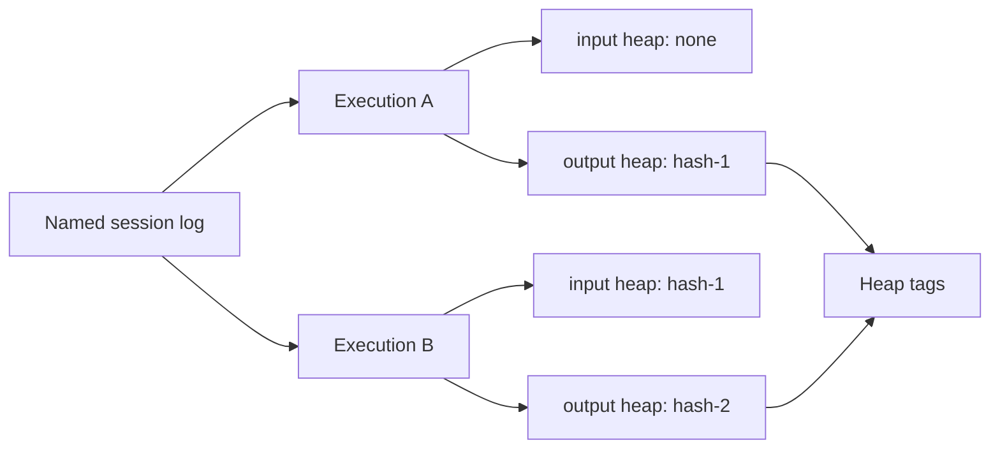

# Sessions and Heaps

In stateful mode, `mcp-v8` persists JavaScript state by heap snapshot hash,
not by a mutable server-side session object. A completed execution can produce
an output heap key, and a later execution can resume from that exact snapshot.

That gives the system three useful properties:

- snapshots are immutable once written
- identical state can be reused by hash
- concurrent workflows do not need to coordinate around a single mutable
  session blob

The relationship between executions, heaps, and named sessions looks like
this:

Named sessions are related, but separate. Session logging records a history of
executions under a human-meaningful session name, including the code that ran
and the input and output heap hashes involved in each step.

Heap tags add another layer. They make snapshots easier to search and organize
without changing the underlying content-addressed storage model.

This also explains the stateless versus stateful tradeoff:

- **stateless mode** skips heap persistence entirely and starts from a fresh
  isolate every time
- **stateful mode** preserves state across runs and makes sessions, history,
  and heap reuse possible

See [Use Local Storage](../how-to/use-local-storage.md) and
[Use S3 Storage](../how-to/use-s3-storage.md) for storage setup, and
[MCP Tools](../reference/mcp-tools.md) for the stateful-only session and heap
tool surfaces.
