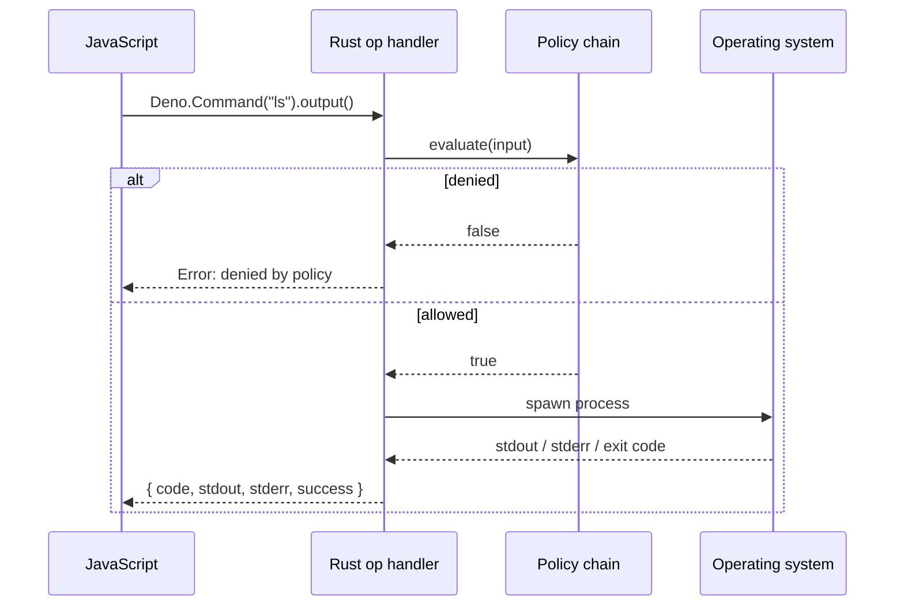

# Subprocess execution

An explanation of how subprocess support works in mcp-v8, why it is disabled by default, the security model, and how policy checks are enforced on every call.

## Subprocess is off unless a policy exists

The subprocess capability follows an explicit-opt-in design: **if no `subprocess` key is present in the policies JSON, the capability does not exist**.  Any JavaScript code that calls `Deno.Command` or `child_process.exec` receives an immediate runtime error.

This differs from a "default deny" policy approach.  There is no policy chain to query; the entire operation is unavailable at the engine level.  The presence of the `subprocess` key in `--policies-json` is the switch that installs the `SubprocessConfig` into the V8 runtime.  Without it, the op handlers cannot retrieve a policy chain and the call fails before reaching the policy evaluator.

## The two JS APIs and what they do under the hood

mcp-v8 exposes two JavaScript globals:

**`Deno.Command`** executes a binary directly.  The `command` argument is passed to the OS as the process name; `args` are passed as the argument vector.  No shell is involved.  This is the lower-level, more predictable interface.

**`child_process.exec`** wraps the command string in a shell invocation (`/bin/sh -c <command>` on POSIX, `cmd /C <command>` on Windows).  It is convenient for compound shell expressions but carries the usual shell-injection risks if the command string is built from untrusted input.

Both are implemented as async Deno ops that spawn a `tokio::process::Command`, collect stdout and stderr, and return once the process exits.  There is no streaming or interactive I/O; the process runs to completion and all output is buffered.

`Deno.Command.outputSync()` and `Deno.Command.spawn()` are not implemented; calling them throws.

## Per-call policy enforcement

Every invocation — not just the first — is checked against the policy chain before the process is spawned.

The input document sent to OPA contains:

| Field | Value for `Deno.Command` | Value for `child_process.exec` |
|-------|--------------------------|-------------------------------|
| `operation` | `"command_output"` | `"exec"` |
| `command` | the binary (e.g. `"ls"`) | the shell (`"/bin/sh"`) |
| `args` | the args array | `["-c", "<shell command string>"]` |
| `cwd` | string or omitted | string or omitted |
| `env` | object or omitted | object or omitted |

The entrypoint evaluated is `data.mcp.subprocess.allow`.

## Security model and risks

**Subprocess is a high-privilege capability.**  A process spawned by the server inherits the server's OS credentials, file descriptors, and environment variables (unless overridden via `env`).  An LLM agent with subprocess access can read arbitrary files, exfiltrate data over the network, and modify the host filesystem, subject only to the OS user's permissions and the Rego policy.

Key risks to consider:

- **Shell injection** — `child_process.exec` passes the full command string to `/bin/sh -c`.  If an agent can influence that string with user-supplied data, it can break out of any prefix-based allow-list.  Prefer `Deno.Command` when the binary and arguments are known at policy-write time.
- **Env var leakage** — the spawned process inherits the server's environment.  If the server holds secrets in environment variables (e.g. `AWS_SECRET_ACCESS_KEY`), those are visible to the child unless the policy or the calling code takes steps to scrub them.
- **Transitive access** — a subprocess that itself can execute further processes (e.g. a shell, `xargs`, `make`) can bypass a command allow-list unless the allow-list accounts for this.
- **Resource exhaustion** — there is no built-in CPU or memory limit on spawned processes; `--execution-timeout` covers the JavaScript execution context, not the child process itself.

Recommended mitigations:

1. Use `Deno.Command` with an exact allow-list rather than `child_process.exec`.
2. Set `cwd` in the policy to a known safe directory.
3. Run the server under a dedicated low-privilege OS user.
4. Prefer remote OPA for policy evaluation so allow-lists can be updated without restarting the server.

## Relationship to other capabilities

Subprocess, filesystem, and fetch all follow the same pattern: disabled unless a policy chain is wired, and every call is checked.  The subprocess capability does not depend on the filesystem capability, but a subprocess can read and write the filesystem via the spawned process regardless of the filesystem policy.

## See also

- [How-to: Subprocess execution](../how-to/subprocess.md)
- [Reference: Subprocess execution](../reference/subprocess.md)
- [Security policies (OPA/Rego)](../concepts/policies.md)
- [Filesystem access](../concepts/filesystem.md)
- [CLI flags reference](../reference/cli-flags.md)
