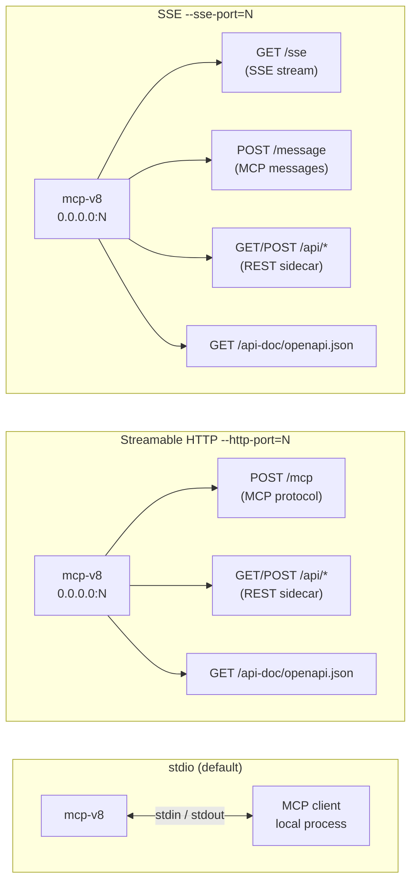

# Transports: stdio, HTTP, SSE

mcp-v8 supports three transport modes. The choice determines how MCP clients discover and communicate with the server, what additional HTTP endpoints are exposed, and whether multi-node clustering is possible.

## The three transports

### stdio

stdio is the default. The server binary reads newline-delimited MCP JSON-RPC messages from stdin and writes responses to stdout. The MCP client is responsible for spawning the process as a child and piping stdio. No port is opened; no network is involved.

This transport is ideal for local development and for LLM clients (such as Claude Desktop) that manage tool servers as subprocesses. Because the process lifetime is tied to the client, there is no need for network authentication or keep-alive management.

Tracing and diagnostic output goes to stderr and does not interfere with the protocol stream.

### Streamable HTTP (`--http-port`)

When `--http-port=N` is passed the server binds an Axum HTTP listener on `0.0.0.0:N`. The MCP protocol runs over `POST /mcp` using the Streamable HTTP framing defined in the MCP specification — a single endpoint that handles both request/response exchanges and optional server-sent event streams.

In addition to the MCP endpoint, the same port serves the REST sidecar (all `/api/*` routes) and the bundled OpenAPI spec at `GET /api-doc/openapi.json`. An SSE keep-alive ping is sent every 15 seconds to prevent intermediary proxies from closing idle connections.

Use Streamable HTTP when you need to expose the server over a network, when multiple clients will connect concurrently, or when you want the REST sidecar for direct HTTP access to execution and session state.

### SSE (`--sse-port`)

When `--sse-port=N` is passed the server binds on `0.0.0.0:N` using the older SSE-based MCP transport. Two endpoints are registered:

- `GET /sse` — the client subscribes here and receives a long-lived SSE event stream.
- `POST /message` — the client sends MCP messages here.

The same port also serves `/api/*` and `GET /api-doc/openapi.json`. Keep-alive pings are sent every 15 seconds, identical to the Streamable HTTP transport.

SSE was the original HTTP transport in the MCP specification before Streamable HTTP was introduced. Prefer Streamable HTTP for new deployments. Use SSE when a client or SDK does not yet support Streamable HTTP.

## MCP protocol vs the REST sidecar

The REST sidecar (`/api/*`) is a parallel, non-MCP interface to the same engine. It is only available when either `--http-port` or `--sse-port` is used. It provides endpoints such as `POST /api/exec`, `GET /api/executions/{id}`, and `GET /api/executions/{id}/output` for use cases where HTTP is more convenient than the MCP tool protocol — for example, a CI job that submits code and polls for results, or an integration that needs paginated output streaming.

The MCP and REST interfaces share the same underlying engine instance. An execution started over MCP is visible in the REST API and vice versa.

## Which transport to choose

| Situation | Recommended transport |
|---|---|
| LLM agent client (Claude Desktop, etc.) managing the process locally | stdio |
| Remote or containerised deployment, multiple concurrent clients | Streamable HTTP |
| Client/SDK that does not support Streamable HTTP | SSE |
| Multi-node Raft cluster | Streamable HTTP or SSE (stdio unsupported) |

## Why cluster mode requires HTTP or SSE

Raft cluster nodes communicate over their own TCP port (`--cluster-port`). However, the cluster also needs to expose the MCP endpoint over a network so that load balancers and remote clients can reach any node. stdio, by definition, does not open a network socket; there is no address a peer or client can connect to. The server rejects startup with a clear error if `--cluster-port` is set but neither `--http-port` nor `--sse-port` is provided.

## Endpoint map

## See also

- [Tutorial](../tutorials/transports.md)
- [How-to guide](../how-to/transports.md)
- [Reference](../reference/transports.md)
- [Concepts: async execution](../concepts/async-execution.md)
- [Concepts: authentication](../concepts/authentication.md)
- [Concepts: clustering](../concepts/clustering.md)
- [CLI flags reference](../reference/cli-flags.md)
