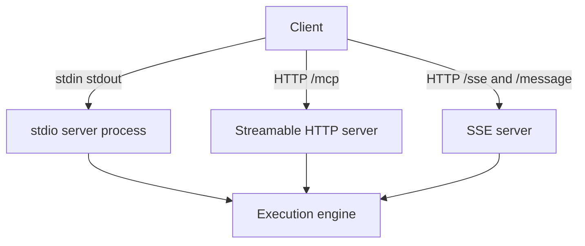

# Transports

Transport changes how clients talk to `mcp-v8`, but not what the execution
engine does once code reaches V8.

The server supports three transport shapes:

- **stdio** for subprocess-oriented MCP clients
- **Streamable HTTP** for networked MCP clients and the plain REST API
- **SSE** for the older HTTP plus event-stream MCP transport

Stdio is the default. It is the best fit when an MCP host launches `mcp-v8`
as a local subprocess and keeps the connection inside one machine.

Streamable HTTP is the most operationally flexible mode. It exposes the MCP
endpoint at `/mcp`, the REST API under `/api/...`, and the OpenAPI document at
`/api-doc/openapi.json`. This mode fits remote deployments, load balancers,
and debugging workflows.

That distinction matters in the docs:

- Streamable HTTP carries both MCP traffic and plain HTTP API traffic
- stdio keeps the integration local to one process boundary

SSE remains useful for clients that still expect the older event-stream shape,
but it is conceptually older and operationally less central than Streamable
HTTP.

Cluster mode only applies to the network transports. Stdio is explicitly not a
cluster transport because it is process-local.

See [Run with stdio](../how-to/run-with-stdio.md),
[Run with HTTP](../how-to/run-with-http.md), and
[Run with SSE](../how-to/run-with-sse.md) for setup procedures.
