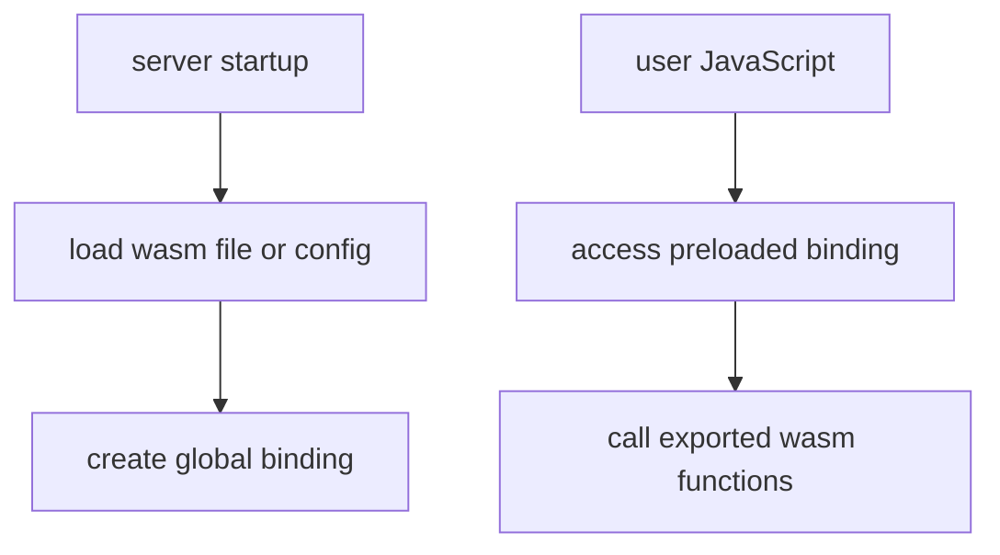

# WASM and Native Modules

`mcp-v8` supports WebAssembly through the standard JavaScript `WebAssembly`
API and can also pre-load `.wasm` modules as globals when the server starts.

That gives the runtime two distinct WASM shapes:

- code that loads or compiles WebAssembly inside JavaScript
- modules preloaded by the server through `--wasm-module` or `--wasm-config`

The most important conceptual boundary is memory. WASM memory limits are
separate from the V8 heap limit. A page that talks about `--heap-memory-max`
is not automatically describing the ceiling for preloaded native memory.

This is why `--wasm-default-max-memory` and per-module limits matter. They
control native WASM memory, while the V8 heap limit controls JavaScript heap
allocation.

The SQLite WASM example in the README is a good illustration of the model:
WASM can be preloaded as a reusable runtime capability, then called from
ordinary JavaScript without rebuilding the concept of storage inside V8 itself.

See [Reference](../reference/cli-flags.md) for the exact WASM flags.
