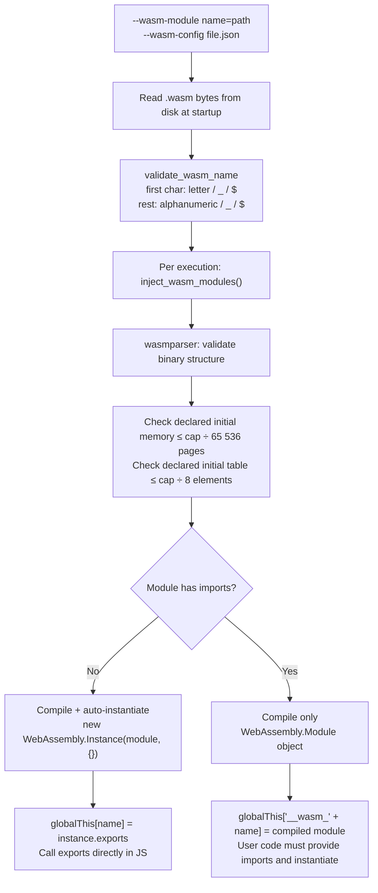

# WebAssembly modules — concepts

An explanation of how mcp-v8 loads WebAssembly modules, exposes them to
JavaScript, and enforces memory budgets.

## Why embed WASM in an MCP server

V8 can execute WebAssembly directly, and compiled C or Rust libraries — SQLite,
compression codecs, numeric kernels — can be packaged as `.wasm` files and loaded
once at server startup. This lets LLM-generated scripts call into well-tested,
binary-safe native code without requiring filesystem access or subprocess
execution. The entire execution stays within the V8 isolate.

## The module injection pipeline

mcp-v8 reads `.wasm` bytes from disk at startup (flag parsing), then injects each
module into the V8 isolate before user code runs. The diagram below shows the full
path from flag to JavaScript global.



## Auto-instantiation vs. manual instantiation

Before compiling, the engine scans the module's import section:

**No imports** — the module is compiled and immediately instantiated with an empty
import object. The `exports` property of the resulting `WebAssembly.Instance` is
assigned to `globalThis[name]`. JavaScript code accesses exports as plain
properties:

```js
const result = math.add(1, 2);
```

**Has imports** — the module cannot be instantiated without caller-supplied
bindings. The compiled `WebAssembly.Module` object is instead assigned to
`globalThis["__wasm_" + name]`. JavaScript code is responsible for calling
`new WebAssembly.Instance(__wasm_name, importObject)` with a suitable import
object. This is the pattern used by the SQLite example, which needs a set of WASI
function stubs.

The separation is intentional: forcing the user to construct the import object
makes the binding explicit and avoids silent mismatches between what the module
expects and what is provided.

## The memory cap model

The cap controlled by `--wasm-default-max-memory` and the per-module `:max_memory`
flag suffix is a **structural pre-execution check**, not a runtime allocator limit.

Before compiling a module into V8, mcp-v8 parses the binary with `wasmparser` and
inspects the `MemorySection`, `TableSection`, and `ImportSection`:

- Declared initial memory pages (`mem.initial`) must not exceed
  `cap_bytes / 65 536`.
- Declared initial table elements must not exceed `cap_bytes / 8`.
- Both the module's own sections and any imported memory or table are checked
  against the same budget.

If the check fails, the execution returns an error before any V8 code runs. If the
check passes, the module is compiled and no further runtime limit is installed on
the WebAssembly linear memory. Modules compiled with `ALLOW_MEMORY_GROWTH=1` can
grow beyond their declared initial size at runtime; the cap does not prevent this.

The default cap is 16 MiB (256 pages). The SQLite example builds with
`INITIAL_MEMORY=16777216` (exactly 256 pages), which exactly meets the default
cap — 256 pages declared against a 256-page budget, passing the `initial > max`
check with zero pages to spare.

## Snapshot persistence in stateful mode

In stateful mode mcp-v8 persists V8 heap state across calls as a content-addressed
snapshot. WASM module injection follows the snapshot lifecycle:

- **First execution on a new heap (no snapshot)**: modules are injected and the
  resulting globals are baked into the V8 heap before the snapshot is taken. The
  snapshot captures the compiled `WebAssembly.Module` objects and any
  auto-instantiated `exports` objects.
- **Subsequent executions (snapshot exists)**: the snapshot is restored and
  `inject_wasm_modules` is **not** called again. The globals are already present
  in the restored heap.

This makes stateful mode efficient: WASM modules are compiled once per heap, not
once per call. The trade-off is that existing heap snapshots are bound to the
modules that were loaded when those heaps were first created. If you restart the
server with different `--wasm-module` flags, only new heaps (created after the
restart) pick up the changed modules.

In stateless mode (`--stateless`) there is no snapshot. The module bytes are
re-validated and re-compiled from disk on every execution.

## Name validation

Module names must satisfy a restricted identifier grammar:

| Position | Allowed characters |
|----------|--------------------|
| First | ASCII letter (`a`–`z`, `A`–`Z`), underscore `_`, dollar sign `$` |
| Rest | ASCII alphanumeric, underscore, dollar sign |

Names that fail this check are rejected at startup before any module file is read.
The restriction ensures the name is directly usable as a JavaScript global
identifier without quoting or escaping.

## See also

- [How to use WebAssembly modules](../how-to/wasm-modules.md)
- [WebAssembly modules reference](../reference/wasm-modules.md)
- [Running JavaScript & TypeScript — concepts](../concepts/js-execution.md)
- [ES module imports — concepts](../concepts/module-imports.md)
