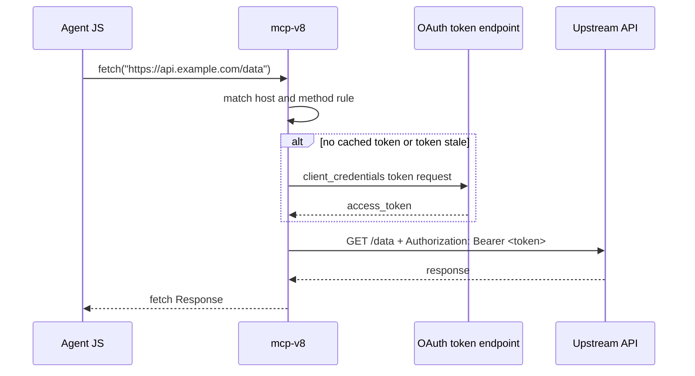

# Configure Fetch Header Injection

Create a minimal fetch policy first, because header injection requires
`fetch()` to be enabled:

```bash
cat > fetch.rego <<'EOF'
package mcp.fetch

default allow = false

allow if {
  input.method == "GET"
}
EOF
```

```bash
POLICY_PATH="$(pwd)/fetch.rego"
cat > policies.json <<EOF
{
  "fetch": {
    "policies": [
      {
        "url": "file://${POLICY_PATH}",
        "rule": "data.mcp.fetch.allow"
      }
    ]
  }
}
EOF
```

Add a static header rule on the command line:

```bash
mcp-v8 \
  --stateless \
  --http-port 3000 \
  --policies-json ./policies.json \
  --fetch-header 'host=api.github.com,header=Authorization,value=Bearer TOKEN,methods=GET'
```

Or load rules from a JSON file:

```bash
cat > fetch-headers.json <<'EOF'
[
  {
    "host": "api.github.com",
    "methods": ["GET"],
    "headers": {
      "Authorization": "Bearer TOKEN",
      "X-GitHub-Api-Version": "2022-11-28"
    }
  }
]
EOF
```

```bash
mcp-v8 \
  --stateless \
  --http-port 3000 \
  --policies-json ./policies.json \
  --fetch-header-config ./fetch-headers.json
```

## What agent code looks like

The agent does not need to hold the credential itself. It can write an ordinary
`fetch()` call:

```javascript
const resp = await fetch("https://api.github.com/user", {
  method: "GET",
  headers: {
    "Accept": "application/vnd.github+json"
  }
});

const body = await resp.json();
console.log(body);
```

With the static rule shown above, `mcp-v8` sends the request as if the agent
had written:

```http
GET /user HTTP/1.1
Host: api.github.com
Accept: application/vnd.github+json
Authorization: Bearer TOKEN
X-GitHub-Api-Version: 2022-11-28
```

The `Authorization` and `X-GitHub-Api-Version` headers come from the server's
injection rules, not from the JavaScript source.

## Dynamic client-credentials injection

Dynamic rules let the agent keep writing the same simple `fetch()` call while
the server acquires and caches the bearer token:

```bash
mcp-v8 \
  --stateless \
  --http-port 3000 \
  --policies-json ./policies.json \
  --fetch-header 'host=api.example.com,header=Authorization,token_url=https://issuer.example.com/oauth2/token,client_id=my-client,client_secret=${CLIENT_SECRET},scope=read:all,methods=GET'
```

The agent request can stay minimal:

```javascript
const resp = await fetch("https://api.example.com/data", {
  method: "GET"
});

console.log(await resp.text());
```

At request time, `mcp-v8` performs this flow:



From the agent's point of view, it wrote a plain unauthenticated `fetch()`
call. The upstream API receives an authenticated request because `mcp-v8`
injected the bearer token before the HTTP call was made.

## When injection is skipped

Headers set directly in JavaScript still win. If the agent provides its own
`Authorization` header, the rule is skipped for that request:

```javascript
await fetch("https://api.example.com/data", {
  headers: {
    "Authorization": "Bearer my-own-token"
  }
});
```

In that case, `mcp-v8` does not overwrite the header, and dynamic token lookup
does not happen.

For the runtime behavior behind these rules, see
[Network Access](../concepts/network-access.md).
