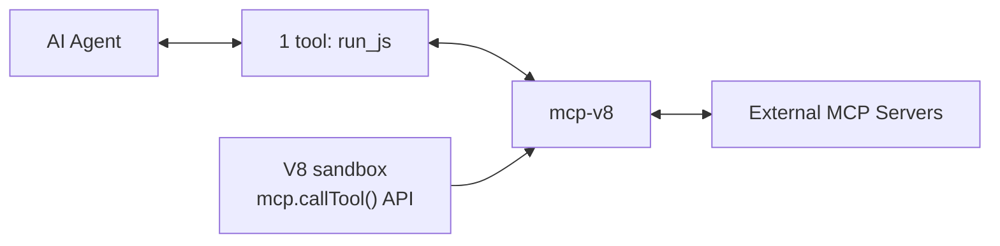

# Programmatic Tool Calling

mcp-v8 can connect to external MCP servers at startup and expose their tools to JavaScript code running inside the V8 sandbox. This lets an AI agent call `run_js` once and have the JavaScript orchestrate multiple tool calls — instead of the model making one tool call per round trip.

## How It Works



The `--mcp-server` flag tells mcp-v8 to connect to an external MCP server and make its tools available inside the JavaScript runtime via a `globalThis.mcp` object:

```js
mcp.servers                                    // string[] — connected server names
mcp.listTools("server")                        // list tools with schemas
await mcp.callTool("server", "tool", { ... })  // call a tool and get results
```

The AI model sees only `run_js`. It writes JavaScript that discovers and calls external tools programmatically — no extra round trips to the model needed.

## Case Study: Building a Constraint-Solving Agent

This walkthrough builds a [PydanticAI](https://ai.pydantic.dev/) agent that connects to mcp-v8, which proxies the [MiniZinc MCP server](https://github.com/r33drichards/minizinc-mcp) — a constraint solver exposing a single `solve_constraint` tool. The agent solves three problems of increasing complexity by writing JavaScript that calls the solver through the V8 sandbox.

### Prerequisites

- mcp-v8 installed ([install instructions](../README.md#installation))
- MiniZinc MCP server running locally or hosted
- Python 3.11+ with `uv`
- `ANTHROPIC_API_KEY` set (or configure a different [PydanticAI model](https://ai.pydantic.dev/models/))

### Step 1: Start the MiniZinc MCP Server

```bash
git clone https://github.com/r33drichards/minizinc-mcp
cd minizinc-mcp
pip install -r requirements.txt
python main.py
```

This starts the MiniZinc MCP server on `http://localhost:8000` with SSE transport.

### Step 2: Start mcp-v8 with the MiniZinc Server Connected

```bash
mcp-v8 --stateless --http-port 3000 \
    --mcp-server 'minizinc=sse:http://localhost:8000/sse'
```

You should see:

```
MCP server 'minizinc': 1 tool(s) available
  - minizinc.solve_constraint
All MCP servers connected. JS code can use mcp.callTool(), mcp.listTools(), mcp.servers
Streamable HTTP server listening on 0.0.0.0:3000
```

### Step 3: Build the Agent

The full script is at [`tutorials/solve_with_agent.py`](solve_with_agent.py). The key parts:

```python
from pydantic_ai import Agent
from pydantic_ai.mcp import MCPServerStreamableHTTP

SYSTEM_PROMPT = (
    "You are a constraint-solving assistant with access to run_js, "
    "which executes JavaScript in a V8 sandbox connected to the MiniZinc MCP server:\n\n"
    "  mcp.servers\n"
    "  mcp.listTools('minizinc')\n"
    "  await mcp.callTool('minizinc', 'solve_constraint', { problem: { model: '...' } })\n\n"
    "Write JavaScript to call the MiniZinc solver, then report the solution clearly."
)

server = MCPServerStreamableHTTP("http://localhost:3000/mcp")
agent = Agent("anthropic:claude-sonnet-4-6", system_prompt=SYSTEM_PROMPT, toolsets=[server])
```

The agent connects to mcp-v8 via Streamable HTTP MCP. The model sees only `run_js` — it never knows about the MiniZinc server directly. When asked to solve a constraint problem, Claude writes JavaScript that calls `mcp.callTool("minizinc", ...)` inside the sandbox.

### Step 4: Run the Agent

```bash
uv run tutorials/solve_with_agent.py
```

The script sends three prompts to the agent in sequence. For each one, Claude generates JavaScript, executes it via `run_js`, and reports the solution.

#### N-Queens (n=4)

Prompt: *"Place 4 queens on a 4×4 chessboard so no two threaten each other."*

Claude writes JavaScript that builds the MiniZinc model and calls the solver:

```js
const result = await mcp.callTool("minizinc", "solve_constraint", {
  problem: {
    model: `
      int: n = 4;
      array[1..n] of var 1..n: queens;
      include "alldifferent.mzn";
      constraint alldifferent(queens);
      constraint alldifferent(i in 1..n)(queens[i] + i);
      constraint alldifferent(i in 1..n)(queens[i] - i);
      solve satisfy;
    `
  }
});
console.log(JSON.stringify(result));
```

Result: queens at rows `[3, 1, 4, 2]` — no two share a row, column, or diagonal.

#### Knapsack Optimization

Prompt: *"5 items with weights [2,3,4,5,9] and values [3,4,8,8,10], capacity=20. Maximize value."*

Claude constructs the MiniZinc maximize objective. Result: items 1, 3, 4, 5 selected (total weight = 20, total value = 29) — provably optimal.

#### Graph Coloring

Prompt: *"Color 5 nodes with at most 3 colors, no adjacent nodes sharing a color."*

Claude encodes the edges as `!=` constraints. Result: `[2, 3, 1, 2, 3]` — a valid 3-coloring.

## Why Programmatic Tool Calling Matters

### Token Efficiency

When an AI agent connects directly to an MCP server with many tools, every tool schema is sent to the model on every turn. The [token comparison case study](token-comparison/README.md) measured this effect using the GitHub MCP server (26 tools):

| Metric | Direct MCP (26 tools) | mcp-v8 proxy (1 tool) |
|--------|----------------------|----------------------|
| Avg input tokens | 121,450 | 114,763 |
| Avg total tokens | 122,056 | 117,826 |
| vs. Direct | — | -3% |

The savings increase with the number of tools exposed. With a single `run_js` tool, the model context stays small regardless of how many external tools are connected behind mcp-v8.

### Batching Multiple Tool Calls

Without programmatic tool calling, each tool call requires a full round trip: model generates a tool call → client executes it → result sent back to model → model generates next call. With mcp-v8, JavaScript can chain multiple tool calls in a single `run_js` invocation:

```js
// One run_js call, multiple tool calls — no extra model round trips
const tools = mcp.listTools("github");
const repos = await mcp.callTool("github", "search_repositories", { query: "user:r33drichards" });
const issues = await mcp.callTool("github", "list_issues", { owner: "r33drichards", repo: "mcp-js" });
console.log(JSON.stringify({ repos, issues }));
```

### Connecting Multiple Servers

mcp-v8 can connect to multiple MCP servers simultaneously. Specify `--mcp-server` multiple times:

```bash
mcp-v8 --stateless --http-port 3000 \
    --mcp-server 'minizinc=sse:http://localhost:8000/sse' \
    --mcp-server 'github=stdio:npx:-y:@modelcontextprotocol/server-github'
```

The agent prompt can then ask Claude to call tools on any connected server:

```js
mcp.servers;  // ["minizinc", "github"]
await mcp.callTool("minizinc", "solve_constraint", { problem: { model: "..." } });
await mcp.callTool("github", "search_repositories", { query: "..." });
```

### OPA Policy Gating

When mcp-v8 is started with policy configuration, every `mcp.callTool()` invocation is evaluated against a Rego policy before the call is forwarded. This lets you restrict which tools the agent can call and with what arguments:

```rego
package mcp.tools

default allow = false

# Only allow calling solve_constraint on the minizinc server
allow if {
    input.operation == "mcp_call_tool"
    input.server == "minizinc"
    input.tool == "solve_constraint"
}
```

## Configuration Reference

### CLI Flags

| Flag | Description |
|------|-------------|
| `--mcp-server NAME=TRANSPORT:...` | Connect to an MCP server. Stdio: `name=stdio:command:arg1:arg2`. SSE: `name=sse:url`. Can be repeated. |
| `--mcp-config PATH` | JSON config file for MCP server connections. |

### JSON Config Format (`--mcp-config`)

```json
[
  {
    "name": "minizinc",
    "transport": "sse",
    "url": "http://localhost:8000/sse"
  },
  {
    "name": "github",
    "transport": "stdio",
    "command": "npx",
    "args": ["-y", "@modelcontextprotocol/server-github"],
    "env": {
      "GITHUB_PERSONAL_ACCESS_TOKEN": "ghp_..."
    }
  }
]
```

### JavaScript API

| API | Description |
|-----|-------------|
| `mcp.servers` | `string[]` — names of connected MCP servers |
| `mcp.listTools(server?)` | List tools with `name`, `description`, and `inputSchema`. Pass a server name to filter, or omit for all. |
| `await mcp.callTool(server, tool, args?)` | Call a tool. Returns `{ content: [...], isError: boolean }`. |
