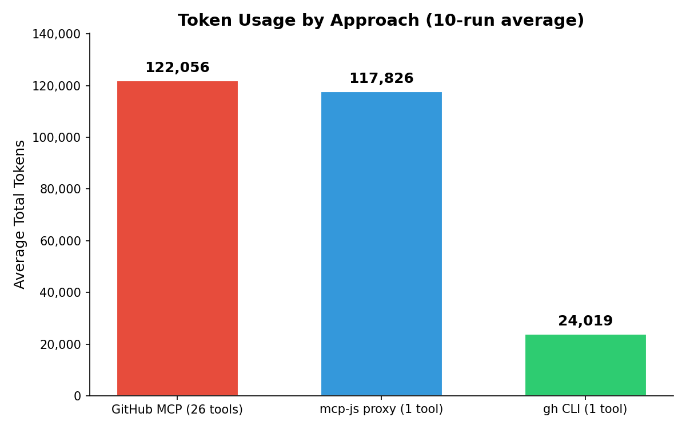
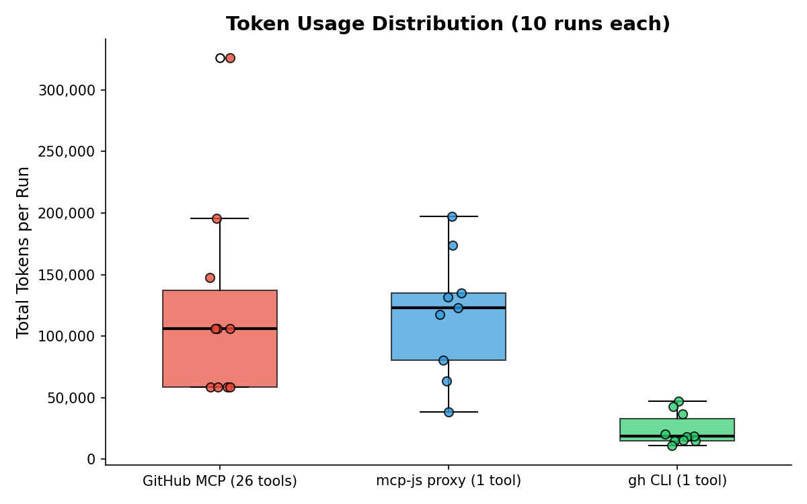
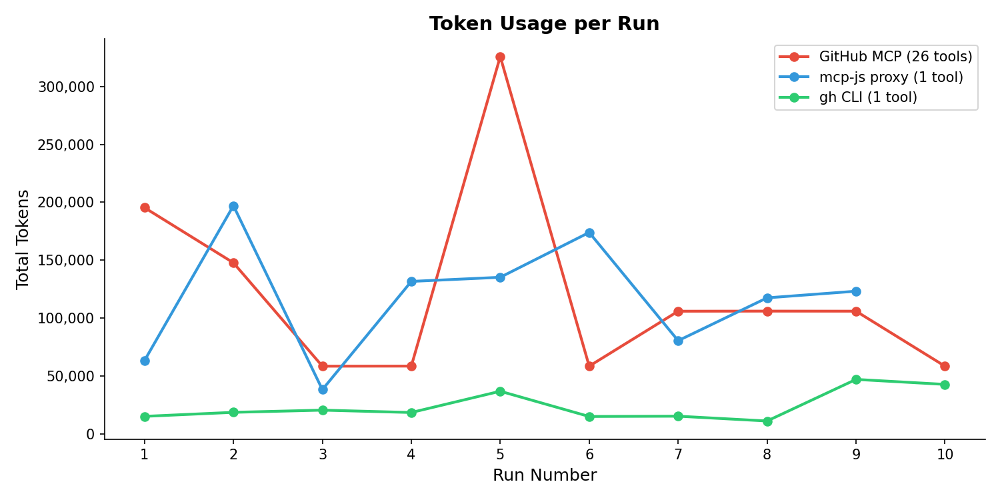
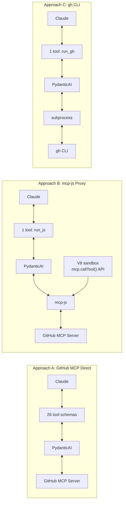

# Token Usage Case Study: MCP Tool Calling Approaches

Compares three approaches for building an AI agent that answers *"What repos has r33drichards committed to in the past 24 hours?"* using GitHub data.

All approaches use **PydanticAI** with **Claude Sonnet 4 on AWS Bedrock**.

## Results

Average token usage over 10 runs (March 2, 2026):

| Metric | Approach A: GitHub MCP (26 tools) | Approach B: mcp-js proxy (1 tool) | Approach C: gh CLI (1 tool) |
|--------|----------------------------------|----------------------------------|----------------------------|
| Avg input tokens | 121,450 | 114,763 | 22,981 |
| Avg output tokens | 606 | 3,063 | 1,038 |
| Avg total tokens | 122,056 | 117,826 | 24,019 |
| Avg API requests | 3.9 | 5.9 | 9.2 |
| vs. Approach A | — | -3% | -80% |







## The Three Approaches

### Approach A: GitHub MCP Server Direct

PydanticAI connects to the GitHub MCP server via stdio. All 26 tool definitions are sent to the model on every turn.

```python
server = MCPServerStdio("npx", args=["-y", "@modelcontextprotocol/server-github"], ...)
agent = Agent("bedrock:us.anthropic.claude-sonnet-4-20250514-v1:0", toolsets=[server])
result = await agent.run(prompt)
```

### Approach B: mcp-js Programmatic Tool Calling

PydanticAI connects to mcp-js via Streamable HTTP MCP. The model sees only the tools mcp-js exposes (primarily `run_js`). Claude writes JavaScript that calls `mcp.callTool()` inside the V8 sandbox.

```python
server = MCPServerStreamableHTTP("http://localhost:3000/mcp")
agent = Agent("bedrock:us.anthropic.claude-sonnet-4-20250514-v1:0", toolsets=[server])
result = await agent.run(prompt)
```

### Approach C: gh CLI Tool

PydanticAI with a single custom tool that runs `gh` CLI commands. No MCP.

```python
agent = Agent("bedrock:us.anthropic.claude-sonnet-4-20250514-v1:0")

@agent.tool_plain
def run_gh(command: str) -> str:
    result = subprocess.run(["gh"] + command.split(), capture_output=True, text=True)
    return result.stdout[:4000]

result = await agent.run(prompt)
```

## How It Works



## Running the Scripts

### Prerequisites

```bash
# uv handles Python dependencies automatically via inline script metadata
# https://docs.astral.sh/uv/guides/scripts/
export AWS_REGION=us-east-1
export GITHUB_PERSONAL_ACCESS_TOKEN=$(gh auth token)
```

### Approach A

```bash
uv run tutorials/token-comparison/approach_a_github_mcp.py
```

### Approach B

```bash
# Start mcp-js with GitHub MCP server connected
mcp-v8 --stateless --http-port 3000 \
    --mcp-server 'github=stdio:npx:-y:@modelcontextprotocol/server-github'

# In another terminal
uv run tutorials/token-comparison/approach_b_mcpjs.py
```

### Approach C

```bash
gh auth login  # must be authenticated
uv run tutorials/token-comparison/approach_c_gh_cli.py
```

## Running the Benchmark

```bash
# Ensure mcp-js is running for Approach B (see above)
uv run tutorials/token-comparison/run_benchmark.py --runs 10
```
